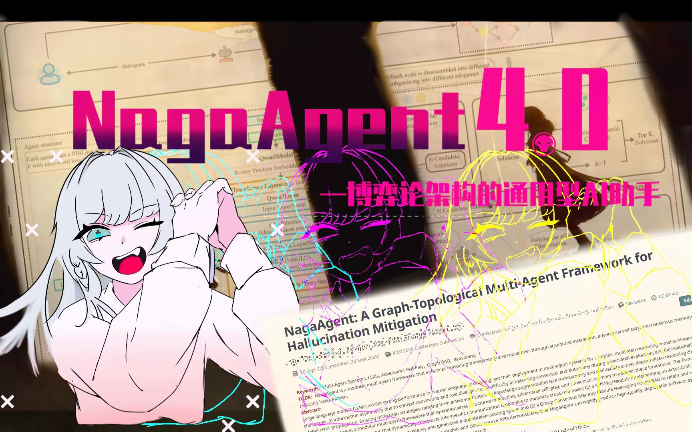

<div align="center">

# NagaAgent

**Four-Service AI Desktop Assistant — Streaming Tool Calls · Knowledge Graph Memory · Live2D · Voice**

[简体中文](README.md) | [繁體中文](README_tw.md) | [English](README_en.md)


[](https://github.com/Xxiii8322766509/NagaAgent)
[](https://github.com/Xxiii8322766509/NagaAgent)
[](https://github.com/Xxiii8322766509/NagaAgent/issues)

**[QQ Bot Integration: Undefined QQbot](https://github.com/69gg/Undefined/)**



</div>

---

## Overview

NagaAgent consists of four independent microservices:

| Service | Port | Responsibilities |
|---------|------|-----------------|
| **API Server** | 8000 | Chat, streaming tool calls, document upload, auth proxy, memory API, config management |
| **Agent Server** | 8001 | Background intent analysis, task scheduling with compressed memory |
| **MCP Server** | 8003 | MCP tool registration / discovery / parallel dispatch |
| **Voice Service** | 5048 | TTS (Edge-TTS) + ASR (FunASR) + Realtime voice (Qwen Omni) |

`main.py` orchestrates all services as daemon threads. Frontend options: Electron + Vue 3 desktop or PyQt5 native GUI.

---

## Updates

| Date | Changes |
|------|---------|
| **2026-02-19** | Core Architecture Refactoring: Introduced Autonomous SDLC framework (with Lease/Fencing); Native structured tool_calls fully take over the execution layer |
| **2026-02-14** | 5.0.0 Release: Remote memory microservice (NagaMemory Cloud + Local GRAG fallback), MindView 3D rewrite, startup title animation |
| **2026-02-14** | Captcha integration, registration flow (username + email + captcha), CAS session expiration dialog, voice input button, file parsing button |
| **2026-02-14** | Removed local ChromaDB dependency (-1119 lines), complete cloud migration of game guide, added login gating to guide function |
| **2026-02-13** | Floating ball mode (4 state animations: classic / ball / compact / full), automatic switching of multimodal visual model for screenshots |
| **2026-02-13** | Skill workshop refactor + Live2D emotion channel independent + naga-config skill |
| **2026-02-12** | NagaCAS authentication + NagaModel gateway routing + login dialog + user menu |
| **2026-02-12** | Live2D 4-channel orthogonal animation (body state / actions / emotions / tracking), window-level gaze tracking with calibration |
| **2026-02-12** | Agentic Tool Loop: streaming tool extraction + multi-round auto-execution + parallel MCP/Native/Live2D dispatch |
| **2026-02-12** | Arknights-style splash screen + progress tracking + view preloading + mouse parallax effect |
| **2026-02-12** | Game guide MCP integration (auto-screenshot + vision model + Neo4j import + 6 game RAG processors) |
| **2026-02-11** | Backend packaging optimization, auto-generate config from template on startup |
| **2026-02-10** | Backend packaging optimization, skill workshop MCP status fix, frontend bug fixes |
| **2026-02-09** | Frontend refactor, Live2D eye tracking disable, AgentServer naming alignment |

---

## Core Modules

### Streaming Tool Call Loop (Structured tool_calls & Local-first Native)

The primary pipeline of NagaAgent is now completely driven by **structured `tool_calls` channels**:
The LLM no longer triggers tools by emitting ` ```tool ` code blocks. Instead, it natively outputs a list of structured tool intent objects. AgenticLoop consumes these independently of standard conversation text, severely reducing formatting drift and parser failures.

**Core Mechanism:**

```text
LLM Stream Output (content/reasoning) ──SSE──▶ Real-time Frontend Display
            │
            ├─ delta.tool_calls increments
            ▼
      LLMService merges tool_calls, emitting type=tool_calls stream into Loop
            │
            ▼
AgenticLoop converts calls into actionable execution arrays (with concurrency limits)
    ├─ mcp      → MCPManager.unified_call()
    ├─ native   → Local-first NativeToolExecutor (Intercepts e.g., 'cd' to 'get_cwd', enforcing Sandbox rules)
    └─ live2d   → UI Fire-and-forget signal
            │
            ▼
 Tool results inject into the message list, triggering the next inference round
```

Source: [`apiserver/llm_service.py`](apiserver/llm_service.py), [`apiserver/agentic_tool_loop.py`](apiserver/agentic_tool_loop.py), [`apiserver/native_tools.py`](apiserver/native_tools.py)

---

### GRAG Knowledge Graph Memory

GRAG (Graph-RAG) automatically extracts quintuples `(subject, subject_type, predicate, object, object_type)` from conversations, stores them in Neo4j, and retrieves relevant memories as LLM context during chat.

**Extraction pipeline**:

1. **Structured output** (preferred): Calls `beta.chat.completions.parse()` with Pydantic model `QuintupleResponse`, `temperature=0.3`, up to 3 retries
2. **JSON fallback**: Prompts LLM to return a JSON array; on parse failure, extracts content between the first `[` and last `]`
3. **Filtering rules**: Only factual information (behaviors, entity relations, states, preferences); filters metaphors, hypotheticals, emotions, chitchat
4. **Entity types**: person / location / organization / item / concept / time / event / activity

**Task manager**:

- 3 asyncio worker coroutines consuming from `asyncio.Queue(maxsize=100)`
- SHA-256 deduplication: identical text with PENDING/RUNNING tasks is skipped
- Hourly auto-cleanup of tasks older than 24h
- Configurable timeout (default 12s) and retry count (default 2)

**Dual storage**:

- Local file `logs/knowledge_graph/quintuples.json` (JSON array, set-based dedup)
- Neo4j graph: `Entity` nodes + typed `Relationship` edges, `graph.merge()` upsert

**RAG retrieval**:

1. Extract keywords from user question (LLM-generated)
2. Cypher query: `MATCH (e1:Entity)-[r]->(e2:Entity) WHERE e1.name CONTAINS '{kw}' ... LIMIT 5`
3. Format as `subject(type) —[predicate]→ object(type)` and inject into LLM context

**Remote memory** (new in 5.0.0):

- `summer_memory/memory_client.py` interfaces with NagaMemory cloud service
- Logged-in users automatically use cloud storage; falls back to local GRAG on logout or offline
- API Server adds `/api/memory/*` proxy endpoints for frontend access

Source: [`summer_memory/`](summer_memory/)

---

### MCP Tool System

A pluggable tool architecture based on the [Model Context Protocol](https://modelcontextprotocol.io/), with each tool running as an independent agent.

**Built-in agents**:

| Agent | Directory | Function |
|-------|-----------|----------|
| `weather_time` | `mcpserver/agent_weather_time/` | Weather queries/forecasts, system time, auto city/IP detection |
| `open_launcher` | `mcpserver/agent_open_launcher/` | Scan installed apps, launch programs via natural language |
| `game_guide` | `mcpserver/agent_game_guide/` | Game strategy Q&A, damage calculation, team building, auto-screenshot injection |
| `online_search` | `mcpserver/agent_online_search/` | Web search via SearXNG |
| `crawl4ai` | `mcpserver/agent_crawl4ai/` | Web content extraction via Crawl4AI |
| `playwright_master` | `mcpserver/agent_playwright_master/` | Browser automation via Playwright |
| `vision` | `mcpserver/agent_vision/` | Screenshot analysis and visual Q&A |
| `mqtt_tool` | `mcpserver/agent_mqtt_tool/` | IoT device control via MQTT |
| `office_doc` | `mcpserver/agent_office_doc/` | docx/xlsx content extraction |

**Registration & discovery**:

```
mcpserver/
├── agent_weather_time/
│   ├── agent-manifest.json    ← Declares name, entryPoint.module/class, capabilities
│   └── weather_time_agent.py
├── agent_online_search/
│   ├── agent-manifest.json
│   └── ...
└── mcp_registry.py            ← scan_and_register_mcp_agents() globs **/agent-manifest.json
                                   importlib.import_module(module).ClassName() dynamic instantiation
```

- `MCPManager.unified_call(service_name, tool_call)` routes to the agent's `handle_handoff()`
- MCP Server `POST /schedule` supports batch calls via `asyncio.gather()` for parallel execution
- **Skill Market**: Frontend skill workshop supports one-click installation of community skills (Agent Browser, Brainstorming, Context7, Firecrawl Search, etc.), backend uses `/skills/import` for custom skill import

Source: [`mcpserver/`](mcpserver/)

---

### Electron Desktop

Built with Electron + Vue 3 + Vite + UnoCSS + PrimeVue.

#### Live2D Rendering & Animation

Uses **pixi-live2d-display** + **PixiJS WebGL** to render Cubism Live2D models. SSAA super-sampling: Canvas rendered at `width * ssaa`, CSS `transform: scale(1/ssaa)` for sharper output.

**4-channel orthogonal animation system** (`live2dController.ts`):

| Channel | Description | Parameters |
|---------|-------------|------------|
| **Body State** | Keyframe loop animation (idle/thinking/talking), hermite-smooth interpolation | Loaded from `naga-actions.json` |
| **Actions** | Queue-based head actions (nod/shake), FIFO single execution | AngleX/Y, EyeBallX/Y |
| **Emotions** | `.exp3.json` expression files, three blend modes (Add/Multiply/Overwrite) | Exponential decay transitions |
| **Tracking** | Pointer-following gaze, configurable start delay (`tracking_hold_delay_ms`) | Angle ±30, EyeBall ±1, BodyAngle ±10 |

Merge order: body state → mouth → actions → manual override → emotion blend → tracking blend.

#### Mind Sea Visualization (MindView)

Canvas 2D with hand-rolled 3D projection (not WebGL/SVG). Spherical coordinate camera `(theta, phi, distance)`, perspective division `700 / depth`.

**7-layer rendering**: Background gradient → floor grid → water surface → volumetric light (3 god rays) → particle system (3 layers, 125 particles) → bioluminescent plankton (10 with trails) → knowledge graph nodes and edges (depth-sorted painter's algorithm).

Quintuple-to-graph mapping: `subject`/`object` → nodes, `predicate` → directed edges, degree centrality → node height weight (high-degree nodes float higher), 100-node limit.

Interactions: click-drag to orbit, middle/shift-drag to pan, scroll to zoom, node drag/select, keyword search, touch gestures.

#### Floating Ball Mode

4-state animated window system: `classic` (normal) → `ball` (100×100 circle) → `compact` (420×100 collapsed) → `full` (420×N expanded).

easeOutCubic easing (`1 - (1 - t)^3`), 160ms / 60FPS transitions. Smart positioning: expands rightward from ball position, auto-clamps to screen bounds.

#### Splash Animation

1. **Title phase**: Black overlay + 40 golden rising particles + title image 2.4s CSS keyframe (fade in → hold → fade out)
2. **Progress phase**: Neural network particle background + Live2D cutout frame + gold progress bar (`requestAnimationFrame` interpolation, minimum speed 0.5 floor)
3. **Stall detection**: 3 seconds with no progress change shows restart hint, health polling every 1s after 25% to prevent signal loss
4. **Awaken**: Progress 100% shows pulsing "Click to Awaken" prompt

Source: [`frontend/`](frontend/)

---

### Voice Interaction

**TTS (Text-to-Speech)**:

- Edge-TTS engine, OpenAI-compatible endpoint `/v1/audio/speech`
- 3-thread pipeline: sentence queue → TTS API calls (Semaphore(2) concurrency) → pygame playback
- Live2D lip sync: `AdvancedLipSyncEngineV2` at 60FPS extracting 5 parameters (mouth_open / mouth_form / mouth_smile / eye_brow_up / eye_wide)
- Supports mp3 / aac / wav / opus / flac, optional FFmpeg transcoding

**ASR (Speech Recognition)**:

- FunASR local server with VAD endpoint detection and WebSocket real-time streaming
- Three-mode auto-switch: LOCAL (FunASR) → END_TO_END (Qwen Omni) → HYBRID (Qwen ASR + API Server)

**Realtime Voice Chat** (requires DashScope API Key):

- Full-duplex WebSocket voice interaction via Qwen Omni
- Echo suppression, VAD detection, audio chunking (200ms), session cooldown, max speech duration control

Source: [`voice/`](voice/)

---

### Agent Server & Autonomous (The Rise of the SDLC Agent)

**Background Context**:
The Agent Server (`BackgroundAnalyzer`) now focuses on background intent analysis and task scheduling. Execution is unified through structured `tool_calls` with native/MCP dispatch.

**Brand-New Autonomous Module** (Located in `autonomous/`):
This supersedes legacy routing with a robust, highly-automated SDLC (Software Development Life Cycle) architecture tailored for complex software engineering:

- **Single Active Lease**: Utilizes a highly consistent DB lock (`workflow.db`) and Fencing epochs, guaranteeing exactly one Active Orchestrator modifies the codebase at a time.
- **State Machine Engine**: Robust idempotency mechanisms that drive modification tasks through a flawless loop: `GoalAccepted` -> `PlanDrafted` -> `Implementing` (utilizing Claude/Codex adapters) -> `Verifying`.
- **Evaluator & Reworker**: Fails verification? If CLI Native tests fail, the system proactively uses Codex MCP (`ask-codex`) to formulate structured code remediation instead of blind retries.
- **Release Controller (Gray Release)**: Updates aren't directly applied to prod. They enter a Canary execution pool. AI dictates if a release is Promoted or trigger Auto-Rollback based strictly on P95 latency and runtime Error Rate.

This transforms Naga from an assistant into a smart development server capable of unsupervised marathon execution.

Source: [`autonomous/`](autonomous/)

---

## Architecture

```
┌──────────────────────────────────────────────────────────┐
│                 Electron / PyQt5 Frontend                 │
│  Vue 3 + Vite + UnoCSS + PrimeVue + pixi-live2d-display  │
└────────────┬────────────┬────────────┬───────────────────┘
             │            │            │
     ┌───────▼──────┐ ┌──▼──────┐ ┌──▼──────┐
     │  API Server  │ │ Agent   │ │  Voice  │
     │   :8000      │ │ Server  │ │  :5048  │
     │              │ │  :8001  │ │         │
     │ - Dialog/SSE │ │ - Task  │ │ - TTS   │
     │ - Native Dpt │ │   Auton │ │ - ASR   │
     │ - Doc Upload │ │   Agent │ │ - Real- │
     │ - Auth Proxy │ │ - Git   │ │   time  │
     │ - Memory API │ │   CntrL │ │   Voice │
     │ - Skill Mrkt │ │ - Open  │ │         │
     │ - Config Mgr │ │   Claw  │ │         │
     └──────┬───────┘ └────┬────┘ └─────────┘
            │              │
     ┌──────▼──────┐  ┌───▼──────────┐
     │ MCP Server  │  │  Autonomous  │
     │   :8003     │  │  Subsystem   │
     │             │  │   (SDLC)     │
     │ - Tool Reg  │  └──────────────┘
     │ - Agent Dsc │
     │ - Parallel  │
     └──────┬──────┘
            │
    ┌───────┴──────────────────────┐
    │  MCP Agents (Pluggable)      │
    │ Weather | Search | Scrape    │
    │ Launcher| Guide  | Doc |MQTT │
    └──────────────────────────────┘
            │
     ┌──────▼──────┐
     │   Neo4j     │
     │   :7687     │
     │  Knowledge  │
     │   Graph     │
     └─────────────┘
```

### Directory Structure

```
NagaAgent/
├── apiserver/            # API Server — Dialogue, Native tools, Auth, Config
│   ├── api_server.py     #   FastAPI Main App
│   ├── agentic_tool_loop.py  #   Multi-round native tool call loop
│   ├── native_tools.py   #   Local-First interception tools
│   ├── llm_service.py    #   LiteLLM Unified Caller & tool_calls stream
│   └── streaming_tool_extractor.py  #   Stream segmentation + TTS dispatch
├── agentserver/          # Agent Server — Legacy Compatibility layer
│   ├── agent_server.py   #   FastAPI Main App
│   └── task_scheduler.py #   Task orchestration + Compression memory
├── autonomous/           # All-new Autonomous SDLC Agent
│   ├── system_agent.py   #   Single Active Orchestrator
│   ├── planner.py        #   Strategy decomposition
│   ├── dispatcher.py     #   CLI Exec Wrapper
│   ├── evaluator.py      #   Scoring Verification System
│   └── release/          #   Fallback and Canary Releases
├── mcpserver/            # MCP Server — Tool reg & dispatchration & dispatch
│   ├── mcp_server.py     #   FastAPI main app
│   ├── mcp_registry.py   #   Manifest scanning + dynamic registration
│   ├── mcp_manager.py    #   unified_call() routing
│   ├── agent_weather_time/
│   ├── agent_open_launcher/
│   ├── agent_game_guide/
│   ├── agent_online_search/
│   ├── agent_crawl4ai/
│   ├── agent_playwright_master/
│   ├── agent_vision/
│   ├── agent_mqtt_tool/
│   └── agent_office_doc/
├── summer_memory/        # GRAG knowledge graph
│   ├── quintuple_extractor.py  #   Quintuple extraction (structured output + JSON fallback)
│   ├── quintuple_graph.py      #   Neo4j + file dual storage
│   ├── quintuple_rag_query.py  #   Cypher keyword RAG retrieval
│   ├── task_manager.py         #   3-worker async task manager
│   ├── memory_manager.py       #   GRAG orchestrator
│   └── memory_client.py        #   NagaMemory remote client
├── voice/                # Voice service
│   ├── output/           #   TTS (Edge-TTS) + lip sync
│   └── input/            #   ASR (FunASR) + realtime voice (Qwen Omni)
├── guide_engine/         # Game guide engine — cloud RAG service
├── frontend/             # Electron + Vue 3 frontend
│   ├── electron/         #   Main process (window mgmt, floating ball, backend, hotkeys)
│   └── src/              #   Vue 3 app
│       ├── views/        #     MessageView / MindView / SkillView / ModelView / MemoryView / ConfigView
│       ├── components/   #     Live2dModel / SplashScreen / LoginDialog / ...
│       ├── composables/  #     useAuth / useStartupProgress / useVersionCheck / useToolStatus
│       └── utils/        #     live2dController (4-channel animation) / encoding / session
├── ui/                   # PyQt5 GUI (MVC)
├── system/               # Config loader, env checker, system prompts, background analyzer
├── main.py               # Unified entry point, orchestrates all services
├── config.json           # Runtime config (copy from config.json.example)
└── pyproject.toml        # Project metadata & dependencies
```

---

## Quick Start

### Requirements

- Python 3.11 (`>=3.11, <3.12`)
- Optional: [uv](https://github.com/astral-sh/uv) (faster dependency installation)
- Optional: Neo4j (knowledge graph memory)

### Installation

```bash
git clone https://github.com/Xxiii8322766509/NagaAgent.git
cd NagaAgent

# Option 1: Setup script (auto-detects env, creates venv, installs deps)
python setup.py

# Option 2: Using uv
uv sync

# Option 3: Manual
python -m venv .venv
source .venv/bin/activate  # Windows: .\.venv\Scripts\activate
pip install -r requirements.txt
```

### Configuration

Copy `config.json.example` to `config.json` and fill in your LLM API credentials:

```json
{
  "api": {
    "api_key": "your-api-key",
    "base_url": "https://api.deepseek.com/v1",
    "model": "deepseek-v3.2"
  }
}
```

Works with any OpenAI-compatible API (DeepSeek, Qwen, OpenAI, Ollama, etc.).

### Launch

```bash
python main.py             # Full launch (API + Agent + MCP + Voice + GUI)
uv run main.py             # Using uv
python main.py --headless  # Headless mode (for Electron frontend)
```

All services are orchestrated by `main.py`. For development, each can be started independently:

```bash
uvicorn apiserver.api_server:app --host 127.0.0.1 --port 8000 --reload
uvicorn agentserver.agent_server:app --host 0.0.0.0 --port 8001
```

### Electron Frontend Development

```bash
cd frontend
npm install
npm run dev    # Dev mode (Vite + Electron)
npm run build  # Production build
```

---

## Optional Configuration

<details>
<summary><b>Knowledge Graph Memory (Neo4j)</b></summary>

Install Neo4j ([Docker](https://hub.docker.com/_/neo4j) or [Neo4j Desktop](https://neo4j.com/download/)), then configure:

```json
{
  "grag": {
    "enabled": true,
    "neo4j_uri": "neo4j://127.0.0.1:7687",
    "neo4j_user": "neo4j",
    "neo4j_password": "your-password"
  }
}
```
</details>

<details>
<summary><b>Voice Interaction</b></summary>

```json
{
  "system": { "voice_enabled": true },
  "tts": { "port": 5048, "default_voice": "zh-CN-XiaoxiaoNeural" }
}
```

Realtime voice chat (requires Qwen DashScope API Key):

```json
{
  "voice_realtime": {
    "enabled": true,
    "provider": "qwen",
    "api_key": "your-dashscope-key",
    "model": "qwen3-omni-flash-realtime"
  }
}
```
</details>

<details>
<summary><b>Live2D Avatar</b></summary>

```json
{
  "live2d": {
    "enabled": true,
    "model_path": "path/to/your/model.model3.json"
  }
}
```

Electron frontend Live2D config:

```json
{
  "web_live2d": {
    "ssaa": 2,
    "model": {
      "source": "./models/your-model/model.model3.json",
      "x": 0.5,
      "y": 1.3,
      "size": 6800
    },
    "face_y_ratio": 0.13,
    "tracking_hold_delay_ms": 100
  }
}
```
</details>

<details>
<summary><b>MQTT IoT</b></summary>

```json
{
  "mqtt": {
    "enabled": true,
    "broker": "mqtt-broker-address",
    "port": 1883,
    "topic": "naga/agent/topic"
  }
}
```
</details>

---

## Ports

| Service | Port | Description |
|---------|------|-------------|
| API Server | 8000 | Main interface: chat, config, auth, Skill Market |
| Agent Server | 8001 | Intent analysis, task scheduling |
| MCP Server | 8003 | MCP tool registration & dispatch |
| Voice Service | 5048 | TTS / ASR |
| Neo4j | 7687 | Knowledge graph (optional) |

---

## Updating

```bash
python update.py  # Auto git pull + dependency sync
```

---

## Troubleshooting

| Issue | Solution |
|-------|----------|
| Python version mismatch | Use Python 3.11, or use uv (manages Python versions automatically) |
| Port in use | Check if ports 8000, 8001, 8003, 5048 are available |
| Neo4j connection failed | Ensure Neo4j is running, verify config.json connection parameters |
| Progress bar stuck | Check API key config; restart hint appears after 3s; Electron auto-polls backend health |

```bash
python main.py --check-env --force-check  # Environment diagnostics
python main.py --quick-check              # Quick check
```

---

## Building

```bash
python build.py  # Build Windows one-click runner package, output to dist/
```

---

## Contributing

Issues and Pull Requests are welcome.

---

## License

[MIT License](LICENSE)

---

## Star History

[](https://www.star-history.com/#Xxiii8322766509/NagaAgent&type=date&legend=top-left)
