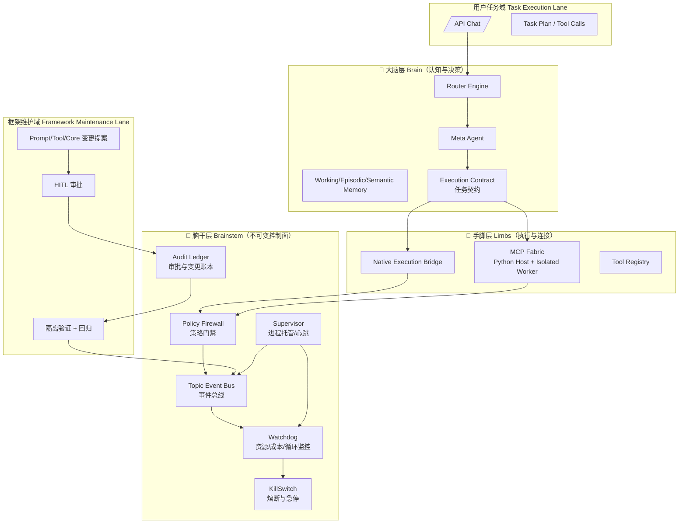
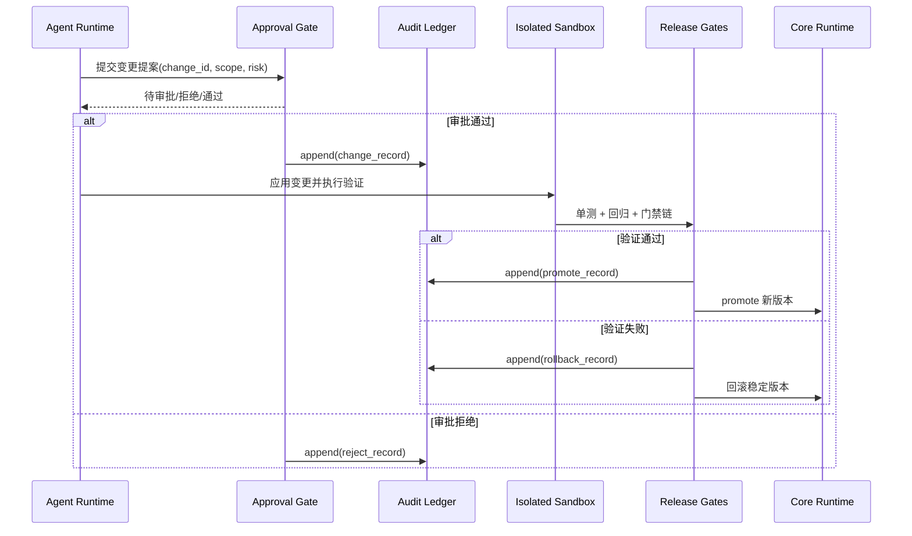

---
**文档类型**：🎯 目标态架构设计（Target Architecture）
**架构版本**：Embla System v2.0 (Pythonic Secure Edition)
**实施状态**：目标态蓝图（用于 WS28+ 持续落地）
**最后更新**：2026-02-28
**技术基线**：Python 3.11+ / FastAPI / Pydantic / asyncio / multiprocessing
**核心原则**：三层架构不变（脑干/大脑/手脚），执行与进化强隔离，审计先行
---

# Embla System v2.0 架构设计蓝图（纯 Python 化 + 安全门禁升级）

## 0. 文档定位与改造目标

本文档是 Embla System v2.0 的目标态架构蓝图，重点解决两类历史问题：

1. 技术栈统一：全量采用 Python 工程体系，不再引入 JS/TS 运行时依赖。
2. 安全边界重建：将“用户任务执行域”与“框架维护/自进化域”做物理隔离，并引入审批账本与可追溯门禁链。

本蓝图保留原有三层逻辑优势：

- 脑干层（Brainstem）：守护、门禁、熔断、审计。
- 大脑层（Brain）：路由、记忆、规划、反思。
- 手脚层（Limbs）：工具执行与外部连接。

## 1. 总体架构：三层 + 双域隔离



### 1.1 两条硬边界

- 任务执行域（User Lane）：只允许完成用户目标，不允许直接修改框架核心代码与核心策略。
- 框架维护域（Maintenance Lane）：仅处理 Prompt、工具、策略、核心模块升级，必须经过审批账本与隔离验证。

跨域必须同时满足：

1. 变更提案（Change Proposal）结构化落盘。
2. 审批票据（Approval Ticket）存在且有效。
3. Audit Ledger 链路可追溯（谁、何时、改了什么、为什么、证据是什么）。

## 2. 工程目录与节点树（Python 包结构）

> 说明：目录树已统一为 Python-first，不再保留历史 `src/` 与 `Embla_System/` 双栈分裂模型。

```text
Embla_System/
├── pyproject.toml
├── requirements.txt
├── embla_system.yaml                   # 全局静态配置（预算/风险策略/门禁阈值）
│
├── core/                               # ═══ 脑干层 Brainstem (全Python实现)
│   ├── __init__.py
│   ├── event_bus/
│   │   ├── __init__.py
│   │   ├── topic_bus.py                # PubSub + Replay + Cron topic
│   │   ├── event_store.py              # JSONL/SQLite 事件持久化
│   │   └── consumers.py                # posture/incident/release 等消费者
│   │
│   ├── supervisor/
│   │   ├── __init__.py
│   │   ├── brainstem_supervisor.py     # 主守护循环、心跳、子进程托管
│   │   ├── watchdog_daemon.py          # 资源/成本/异常速率监控
│   │   └── process_guard.py            # PID 存活、僵尸清理、重启节流
│   │
│   ├── security/
│   │   ├── __init__.py
│   │   ├── policy_firewall.py          # 参数白名单/命令拦截/风险分级
│   │   ├── lease_fencing.py            # 单活锁、世代令牌、防双写
│   │   ├── killswitch.py               # 物理熔断
│   │   ├── budget_guard.py             # 成本与配额守卫
│   │   ├── approval_gate.py            # HITL 审批门
│   │   └── audit_ledger.py             # 🌟 不可篡改审批账本（hash chain + signature）
│   │
│   └── mcp/
│       ├── __init__.py
│       ├── host.py                     # Python 原生 MCP 宿主
│       ├── registry.py                 # 工具注册与 schema 校验
│       ├── isolated_worker.py          # multiprocessing/subprocess 隔离执行
│       └── contract.py                 # MCP 输入输出契约（Pydantic）
│
├── agents/                             # ═══ 大脑层 Brain
│   ├── __init__.py
│   ├── meta_agent.py
│   ├── router_engine.py
│   ├── contract_runtime.py             # 任务契约、阶段状态机、完成提交门
│   ├── tool_loop.py                    # 结构化 tool-calling 主循环
│   └── memory/
│       ├── __init__.py
│       ├── working_memory.py
│       ├── episodic_memory.py
│       ├── semantic_graph.py
│       └── gc_pipeline.py
│
├── system/prompts/                     # ═══ Prompt 资产（canonical）
│   ├── dna/                            # 身份 DNA（shell_persona/core_values）
│   ├── core/dna/                       # 表达编排 / 工具调用契约 DNA
│   ├── core/routing/                   # conversation_analyzer / tool_dispatch
│   ├── agents/                         # shell/core_exec runtime blocks
│   ├── roles/                          # 专家角色块
│   └── specs/                          # prompt_registry.spec / prompt_acl.spec
│
├── workspace/                          # ═══ 资产与工作区 (受控读写)
│   ├── tools_registry/                 # 动态工具注册表（版本化）
│   │   ├── builtins/
│   │   ├── plugins/
│   │   └── registry_manifest.yaml
│   ├── evidence/                       # 证据、报告、快照引用
│   └── tmp/                            # 受限临时目录
│
├── apiserver/                          # API 层（FastAPI）
│   ├── api_server.py
│   ├── schemas.py                      # API Pydantic model
│   └── deps.py
│
├── scripts/                            # 发布与测试门禁脚本
│   ├── release_closure_chain_full_m0_m12.py
│   ├── manage_brainstem_control_plane_ws28_017.py
│   ├── run_watchdog_daemon_ws28_025.py
│   └── ...
│
├── tests/
├── doc/
└── scratch/
```

## 3. 技术实现基线（Pythonic 约束）

### 3.1 配置与依赖

- 统一配置入口：`embla_system.yaml` + `pyproject.toml`。
- 运行参数、策略参数、门禁参数统一映射到 Pydantic Settings。
- 不引入 JavaScript 运行时，不依赖 Node 包管理。

### 3.2 类型系统与契约

- 全链路使用 Pydantic 进行输入/输出/事件/策略契约校验。
- API 契约、Tool 契约、审批契约、事件契约必须显式版本号。
- 所有跨进程消息必须可序列化为 JSON，并带 `schema_version`。

### 3.3 执行隔离

- 工具执行默认走受控桥：`Native Execution Bridge`。
- 高风险/不可信插件执行必须进入 `multiprocessing` 或 `subprocess` worker。
- 主进程只持有调度与审计权限，不直接执行高风险外部命令。

### 3.4 文件热加载

- Prompt 与工具注册变化的监听统一由 Python `watchdog` 完成。
- 热加载必须通过契约校验与风险门禁，失败即回滚到上个稳定版本。

## 4. 安全模型升级：任务域 vs 维护域

## 4.1 任务执行域（User Lane）

允许能力：

- 读写工作区业务文件。
- 调用已批准工具。
- 生成补丁、测试、报告。

禁止能力：

- 直接修改 `core/` 脑干层代码。
- 直接修改 `system/prompts/dna/*` 或 `system/prompts/core/dna/*`。
- 绕过审批链注册高风险工具。

## 4.2 框架维护域（Maintenance Lane）

必须流程：

1. 生成变更提案（变更对象、风险级别、回滚方案、验收标准）。
2. 进入审批门（HITL + 策略校验）。
3. 写入 `audit_ledger.py` 管理的账本链。
4. 在隔离沙箱执行验证（单测 + 回归 + 门禁脚本）。
5. 通过后再进入主链，失败自动回滚并记录 incident。

## 4.3 审计账本（Audit Ledger）最小字段

- `change_id`
- `requested_by`
- `approved_by`
- `scope`（prompt/tool/core/policy）
- `risk_level`
- `before_hash` / `after_hash`
- `evidence_refs`（测试报告、回归报告）
- `timestamp`
- `signature`
- `prev_ledger_hash` / `ledger_hash`

账本要求：追加写、不可回改、可验链。

## 5. 关键运行机制

## 5.1 统一执行收口（Tool Loop）

- 模型所有动作通过结构化 tool-calling 进入执行桥。
- “任务完成”必须由显式状态提交工具确认（例如 `SubmitResult_Tool`）。
- 无工具调用不再等价于完成，必须经过状态门判定。

## 5.2 Runtime Posture 聚合

`/v1/ops/runtime/posture` 至少聚合：

- supervisor 心跳
- watchdog 状态
- global mutex 租约
- 安全门禁状态
- 最新 incident 摘要

## 5.3 Incident 闭环

- 所有阻断、熔断、审批拒绝、回滚事件必须 topic 化。
- `/v1/ops/incidents/latest` 提供统一摘要（含 reason_code 与证据路径）。

## 6. 自我进化（Self-Evolution）重定义

自我进化不再是“运行中直接改自己”，而是“受控维护流水线”：

1. 提案（Proposal）
2. 审批（Approval）
3. 隔离验证（Sandbox Verify）
4. 有证据上线（Promote with Evidence）
5. 失败回滚（Rollback with Incident）



## 7. 事件与契约规范（最小集合）

建议统一事件主题：

- `runtime.heartbeat`
- `runtime.watchdog`
- `security.policy.blocked`
- `security.approval.required`
- `security.approval.granted`
- `change.proposed`
- `change.promoted`
- `change.rolled_back`
- `incident.opened`
- `incident.resolved`

每条事件必须包含：

- `event_id`, `topic`, `generated_at`
- `schema_version`
- `session_id`（如有）
- `reason_code`
- `payload`
- `evidence_ref`（可选）

## 8. 与当前仓库的对齐迁移建议

短期（P0-P1）：

1. 以 `core/` 命名空间收敛脑干组件的导入路径（先做 wrapper，后做迁移）。
2. 将审批记录统一接入 `audit_ledger`，并把关键门禁脚本输出回填账本。
3. 将 Prompt/Tool 热加载监听统一为 Python `watchdog` 管理。

中期（P2）：

1. 完成任务域/维护域的策略拆分与默认拒绝策略。
2. 将高风险插件执行切换到独立 worker 进程池。
3. 将 runtime posture 与 incident 视图做全链一致化。

长期（P3）：

1. 完成 `core/agents/workspace` 的物理目录收口。
2. 发布门禁默认使用“账本证据 + 回归通过”双条件。
3. 实现可外部审计的变更链验签工具。

## 9. 验收标准（Definition of Done）

满足以下条件，才可认定架构重构完成：

1. 文档中不存在任何 JS/TS 运行时依赖作为主链前提。
2. 目录树完全以 Python 包结构为主，且与仓库迁移路径可映射。
3. 自我进化流程必须经过审批账本，不能直接写核心层。
4. “用户任务执行”与“框架维护”具备明确策略边界与拒绝策略。
5. 关键运维视图可观察到脑干心跳、门禁状态、incident 摘要。

---

本版为 Pythonic + Security-first 的目标态设计基线。后续 WS 任务卡应以本文件作为一致性源，避免再出现“逻辑先进、工程落地撕裂”的设计偏差。
