---
**文档类型**：🎯 目标态架构设计（Target Architecture）
**实施状态**：Phase 3 目标态对齐中（当前系统为 Phase 0 + 增量能力混合态）
**最后更新**：2026-02-26
**当前替代方案**：见 `00-mvp-architecture-design.md` (CLI Tools + Codex-first)
**实施路径**：Phase 0 (CLI) → M0-M5 (治理与稳态) → M6-M7 (Phase3 接管) → Phase3 Full（本文档）
---

本文档是 **Omni-Operator v2.0** 的全景架构设计蓝图，面向研发落地交付。包含完整架构拓扑图、交互时序图、系统树节点结构、数据模型、模块化原子规范与开发 Gantt 排期。可直接作为技术评审（TR）与敏捷开发的基线文档。

> [!IMPORTANT]
> **文档定位**：本文档描述 **Phase 3 目标态架构**，非当前实现。
>
> **当前实现**（截至 2026-02-26）：
> - 执行模型：CLI Adapter + `SystemAgent` 主循环（过渡桥接态，非目标态终局）
> - 子代理：`Sub-Agent Runtime v1` 已落地并支持灰度接管（WS22）
> - 脚手架：`Scaffold Engine v1` 已落地（契约门禁 + 事务回滚）
> - 事件链：`Topic Event Bus v1 + WorkflowStore/EventLog` 已支持事件落盘、回放与 topic 化消费
>
> **演进路径**：
> - Phase 0 (✅ 已实现)：CLI Tools + System Agent
> - M0-M5 (✅ 已收口)：76 项任务完成（契约/安全/治理/发布基线）
> - M6-M7 (✅ 已收口)：WS21/WS22 完成（Runtime/Scaffold/调度桥接）
> - Phase3 Full (🟡 进行中)：补齐脑干层独立化与插件隔离等目标态能力
>
> **参考文档**：
> - 当前实现：`00-mvp-architecture-design.md`
> - SDLC 对齐：`07-autonomous-agent-sdlc-architecture.md`
> - Phase3 Full 任务清单：`doc/task/23-phase3-full-target-task-list.md`
>
> **阶段边界说明**：
> - 全局阶段仅定义 `Phase 0` 到 `Phase 3`。
> - 文档中 `P4` 或局部 “Phase 4” 如未明确声明“全局阶段”，不等价于全局里程碑。

---

# Omni-Operator v2.0 全景架构设计蓝图（Phase 3 目标态）

## 1. 核心系统架构：三层"脑干-大脑-手脚"拓扑

系统采用 **三层进程隔离模型**：脑干层（不可变守护进程）、大脑层（认知路由与记忆）、手脚层（MCP 动态工具协议）。结合 **事件驱动总线 + 分布式微 Agent + 自我编译循环** 设计模式。

安全盲区与强制加固基线见：`./13-security-blindspots-and-hardening.md`。

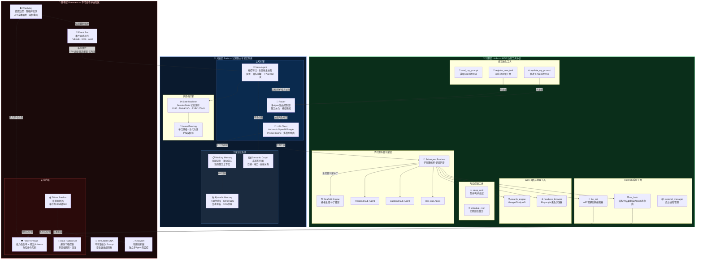

---

## 2. 工程目录与节点树结构 (Directory Tree Node)

脑干层（`src/core/`）编译后打包为不可变二进制；工作空间（`workspace/`）对 Agent 具有读写权限。同时保留并扩展现有 NagaAgent `autonomous/` 骨架结构。

```text
omni-operator-v2/
├── package.json
├── tsconfig.json
├── omni.config.json                    # [全局静态配置] 预算上限·黑名单正则·白名单目录
│
├── src/                                # ═══ 脑干层 ═══ (不可变代码，由人类工程师维护)
│   ├── index.ts                        # 进程入口 (初始化 EventBus, 启动 Watchdog)
│   │
│   ├── core/
│   │   ├── event_bus.ts                # 事件驱动总线 (PubSub + Cron + Alert 订阅)
│   │   ├── mcp_host.ts                 # MCP 协议宿主，动态解析工具 Schema
│   │   ├── llm_client.ts               # 多模型 SDK 封装 (Anthropic/OpenAI/Google)
│   │   ├── state_machine.ts            # SessionState 状态机 (IDLE→THINKING→EXECUTING)
│   │   ├── router.ts                   # 多Agent路由控制器 (任务分类·模型选择)
│   │   └── lease_manager.ts            # Lease/Fencing 单活多备管理器
│   │
│   ├── security/
│   │   ├── policy_firewall.ts          # 命令能力白名单 + 参数Schema + 动态入口拦截
│   │   ├── token_breaker.ts            # 账单熔断器 (单次任务>$5 强制kill)
│   │   ├── blast_radius.ts             # 爆炸半径控制 (多后端快照管理)
│   │   ├── kill_switch.ts              # 物理熔断 (异常IO/网络外发 → 全杀)
│   │   └── human_approval.ts           # 人类核准旁路 (Slack/手机推送)
│   │
│   ├── memory/
│   │   ├── sqlite_driver.ts            # 结构化数据 CRUD (Session日志·Token统计)
│   │   ├── chroma_driver.ts            # ChromaDB 向量检索 (RAG)
│   │   ├── graph_driver.ts             # 系统拓扑图 (JSON-Graph / Neo4j)
│   │   └── gc_engine.ts                # 上下文垃圾回收 (压缩·归档·截断)
│   │
│   └── watchdog/
│       ├── resource_monitor.ts         # CPU/RAM/Disk 资源监控
│       ├── loop_detector.ts            # 死循环检测 (连续错误计数)
│       ├── cost_monitor.ts             # API 成本实时追踪
│       └── daily_checkpoint.ts         # 日结归档 (24h全局Summarization)
│
├── workspace/                          # ═══ 大脑+手脚层 ═══ (Agent可修改区)
│   ├── prompts/                        # Agent 角色设定区 (支持热加载)
│   │   ├── immutable_dna.md            # [只读] 绝对底层安全规则
│   │   ├── meta_agent.md               # 元控节点决策逻辑
│   │   ├── router_agent.md             # 路由Agent决策逻辑
│   │   ├── sys_admin.md                # 运维Agent工具链说明
│   │   ├── developer.md                # 开发Agent角色规范
│   │   └── researcher.md               # 搜索研究Agent角色
│   │
│   ├── tools/                          # MCP 动态工具区
│   │   ├── built_in/                   # 内置基础工具
│   │   │   ├── os_bash.ts              # 结构化结果封装的 Bash 执行器
│   │   │   ├── file_ast.ts             # AST 精确文件编辑器
│   │   │   ├── web_scraper.ts          # Playwright 无头浏览器
│   │   │   ├── search_engine.ts        # Google/Tavily 搜索
│   │   │   ├── sleep_until.ts          # 条件/时间挂起
│   │   │   ├── schedule_cron.ts        # 定期巡检调度
│   │   │   ├── snapshot_manager.ts     # 快照创建/恢复
│   │   │   ├── systemd_manager.ts      # 后台进程管理
│   │   │   └── git_operator.ts         # Git 操作封装
│   │   └── plugins/                    # Agent 自主生成的扩展工具 (隔离 worker 加载)
│   │       └── .gitkeep
│   │
│   ├── evolution/                      # 自我进化沙盒
│   │   ├── dev_sandbox/                # 隔离开发目录 (Docker/tmpfs)
│   │   ├── test_suite/                 # 自我验证测试用例
│   │   └── version_control/            # prompt/tool 版本历史 (git)
│   │
│   └── storage/                        # 运行期持久化数据
│       ├── omni_sqlite.db
│       ├── vector_db/
│       ├── graph_db/
│       └── daily_logs/                 # 日结归档日志
│
└── NagaAgent/                          # ═══ 现有项目集成层 ═══
    ├── autonomous/                     # 🟢 System Agent 自治闭环 (Phase 0 已实现)
    │   ├── system_agent.py             # 主循环：感知 → 规划 → 执行 → 评估
    │   ├── sensor.py / planner.py      # 感知器 / 规划器
    │   ├── evaluator.py / dispatcher.py # 评估器 / 派发器
    │   ├── monitor.py                  # 子代理执行监控器
    │   ├── release/controller.py       # 发布灰度控制器
    │   ├── state/workflow_store.py     # 工作流持久化 + Lease/Fencing
    │   ├── tools/
    │   │   ├── cli_adapter.py          # 🟢 CLI 统一适配器 (Phase 0 当前实现)
    │   │   ├── codex_adapter.py        # 🟡 Codex CLI/MCP 过渡执行器（外部黑盒代理桥接）
    │   │   ├── claude_adapter.py       # 🟡 Claude Code 过渡降级执行器
    │   │   └── gemini_adapter.py       # 🟡 Gemini CLI 过渡降级执行器
    │   └── tools/subagent_runtime.py   # 🟡 Sub-Agent Runtime v1（依赖调度 + 原子脚手架提交）
    ├── apiserver/                      # API 服务层 (FastAPI)
    ├── mcpserver/                      # MCP 工具注册与调度
    ├── memory/                         # 记忆 schema 与投影
    └── policy/                         # 策略引擎配置
```

**图例说明**：
- 🟢 **已实现**：当前代码可运行，且有回归证据
- 🟡 **部分实现**：能力已落地部分或采用过渡实现，与目标态仍有差距
- 🔴 **目标待落地**：目标态能力在当前系统尚未具备
- ⚪ **已弃用**：保留兼容但不推荐使用

**Phase 0 → Phase 3 实施路径映射**：

| 目标态组件 (Phase 3) | 当前实现（混合态） | 实施阶段 | 状态 |
|---------------------|-------------------|---------|------|
| **Sub-Agent Runtime** | `autonomous/tools/subagent_runtime.py` + CLI Adapter | Phase 3 增量 | 🟡 Runtime v1 已实现（依赖调度/契约协商前置/事件回放锚点/原子提交） |
| Frontend Sub-Agent | Codex CLI（外部黑盒代理桥接） | Phase 0 过渡 | 🟡 中间态：可用但不具备内生子代理进程级可控性 |
| Backend Sub-Agent | Codex CLI（外部黑盒代理桥接） | Phase 0 过渡 | 🟡 中间态：可用但不具备内生子代理进程级可控性 |
| Ops Sub-Agent | Codex CLI（外部黑盒代理桥接） | Phase 0 过渡 | 🟡 中间态：可用但不具备内生子代理进程级可控性 |
| **Scaffold Engine** | `autonomous/scaffold_engine.py` | Phase 3 增量 | 🟡 Scaffold v1 已实现（契约门禁 + 可插拔校验链 + 事务回滚） |
| **Execution Bridge** | CLI Adapter（兼容桥接层） | Phase 0 过渡 | 🟡 中间态：用于兼容接入，目标态需收敛到内建可审计执行桥 |
| **Event Bus** | `Topic Event Bus v1` + Event Log 回读兼容 | Phase 3 增量 | 🟢 Topic 化总线已落地（含 Replay/Cron/Alert） |
| **Meta-Agent** | System Agent | Phase 0 | 🟡 单实例主循环 |
| **Router** | CLI Selector | Phase 0 | 🟡 CLI 选择策略 |
| **Watchdog** | `system/watchdog_daemon.py` + `system/brainstem_supervisor.py` | Phase 2 增量 | 🟡 监控守护已实现（尚未独立进程化托管） |
| **Immutable DNA** | Prompt 文件 | Phase 0 | 🟡 静态 Prompt |
| **Security Kernel** | Native Executor | Phase 0 | 🟡 基础沙箱 |

说明：

1. `CLI Adapter/Codex CLI` 在当前文档中一律视为“兼容桥接实现”，不等价于 Phase 3 目标态能力达成。
2. 目标态要求子代理执行面具备内生进程级可控性、统一契约审计与策略强约束，不能依赖外部黑盒代理作为最终形态。

### 2.1 当前实现证据矩阵（2026-02-26）

| 目标态能力 | 当前落地状态 | 代码锚点 | 测试证据 | 主要缺口（走向 Phase3 Full） |
|---|---|---|---|---|
| Sub-Agent Runtime 依赖调度 | 🟢 Runtime v1 + 写路径强制收敛已上线（WS26-001） | `autonomous/tools/subagent_runtime.py`, `autonomous/system_agent.py` | `autonomous/tests/test_subagent_runtime_ws21_002.py`, `autonomous/tests/test_subagent_runtime_chaos_ws21_006.py`, `autonomous/tests/test_subagent_runtime_spec_validation_ws22_005.py`, `autonomous/tests/test_system_agent_write_path_ws26_001.py` | 下一步进入 WS26-003/004：fail-open 预算超限自动降级、锁泄漏清道夫联动 |
| SystemAgent 灰度接管 | 🟢 M7 桥接 + WS26 运行时稳态观测/预算自动降级 + M11 门禁链已可用 | `autonomous/system_agent.py`, `scripts/export_slo_snapshot.py`, `scripts/export_ws26_runtime_snapshot_ws26_002.py`, `autonomous/ws26_release_gate.py` | `autonomous/tests/test_system_agent_subagent_bridge_ws22_001.py`, `autonomous/tests/test_system_agent_subagent_rollout_ws22_006.py`, `autonomous/tests/test_system_agent_lease_guard_ws22_004.py`, `autonomous/tests/test_system_agent_longrun_baseline_ws22_004.py`, `autonomous/tests/test_system_agent_fail_open_budget_ws26_003.py`, `autonomous/tests/test_ws26_release_gate.py`, `tests/test_slo_snapshot_export.py`, `tests/test_export_ws26_runtime_snapshot_ws26_002.py` | 下一步进入 WS27：72h 长稳、全量 cutover 与放行签署链 |
| Scaffold 事务提交与验证 | 🟢 v1 已可用 | `autonomous/scaffold_engine.py`, `autonomous/scaffold_verify_pipeline.py` | `autonomous/tests/test_scaffold_engine_ws21_001.py`, `autonomous/tests/test_scaffold_verify_pipeline_ws21_005.py`, `tests/test_workspace_txn_e2e_regression.py` | 尚未做到所有代码改动默认强制经 Scaffold 提交 |
| Event Log / Replay | 🟢 Topic Event Bus v1 + Cron/Alert + Replay 幂等锚点 + 关键证据保真 + M10 质量门禁已上线（WS25-001~006） | `autonomous/event_log/topic_event_bus.py`, `autonomous/event_log/event_store.py`, `autonomous/event_log/cron_alert_producer.py`, `autonomous/event_log/replay_tool.py`, `autonomous/ws25_event_gc_quality_baseline.py`, `autonomous/ws25_release_gate.py`, `system/tool_contract.py`, `system/episodic_memory.py`, `apiserver/native_tools.py`, `autonomous/state/workflow_store.py`, `system/brainstem_event_bridge.py`, `autonomous/system_agent.py` | `autonomous/tests/test_topic_event_bus_ws25_001.py`, `autonomous/tests/test_cron_alert_producer_ws25_002.py`, `autonomous/tests/test_system_agent_cron_alert_ws25_002.py`, `autonomous/tests/test_topic_event_bus_replay_idempotency_ws25_003.py`, `autonomous/tests/test_ws25_event_gc_quality_baseline.py`, `autonomous/tests/test_ws25_release_gate.py`, `tests/test_run_event_gc_quality_baseline_ws25_005.py`, `tests/test_release_closure_chain_m10_ws25_006.py`, `tests/test_tool_contract.py`, `tests/test_native_tools_ws11_003.py`, `tests/test_episodic_memory.py`, `autonomous/tests/test_event_store_ws18_001.py`, `autonomous/tests/test_event_replay_tool_ws18_003.py`, `autonomous/tests/test_workflow_store.py`, `autonomous/tests/test_system_agent_outbox_bridge_ws23_005.py` | 下一步推进 WS26-003~006：预算自动降级 + 锁泄漏/双重派生回收 + M11 混沌门禁 |
| Policy Firewall + Native Guard | 🟢 安全门禁已上线 | `system/policy_firewall.py`, `system/native_executor.py`, `system/sleep_watch.py`, `system/killswitch_guard.py` | `tests/test_policy_firewall.py`, `tests/test_native_executor_guards.py`, `tests/test_native_tools_runtime_hardening.py`, `tests/test_process_lineage.py` | 需继续补齐 M9 混沌攻防演练与发布门禁联动（WS24-005/006） |
| Global Mutex / Lock Scavenger | 🟢 WS26-004/005 + WS26-006 门禁已完成（锁泄漏/logrotate/double-fork） | `system/global_mutex.py`, `system/lock_scavenger.py`, `apiserver/agentic_tool_loop.py`, `system/process_lineage.py`, `scripts/run_ws26_m11_runtime_chaos_suite_ws26_006.py` | `tests/test_global_mutex.py`, `tests/test_chaos_lock_failover.py`, `tests/test_agentic_loop_contract_and_mutex.py`, `tests/test_process_lineage.py`, `tests/test_chaos_sleep_watch.py`, `tests/test_run_ws26_m11_runtime_chaos_suite_ws26_006.py` | 下一步进入 WS27：长稳耐久与磁盘配额治理 |
| Artifact 双通道与回读 | 🟢 已可用 | `system/tool_contract.py`, `system/artifact_store.py`, `system/gc_reader_bridge.py` | `tests/test_tool_contract.py`, `tests/test_native_tools_artifact_and_guard.py`, `tests/test_gc_reader_bridge.py` | 需要把 Artifact 生命周期与配额策略接入统一运维看板 |
| Immutable DNA | 🟡 已实现校验与审计 | `system/immutable_dna.py`, `system/dna_change_audit.py` | `tests/test_immutable_dna_ws18_006.py`, `tests/test_dna_change_audit_ws18_007.py` | 还需与发布门禁深度联动（审批单自动校验） |
| Watchdog / Loop-Cost Guard | 🟡 能力已具备 | `system/watchdog_daemon.py`, `system/loop_cost_guard.py`, `system/brainstem_supervisor.py` | `tests/test_watchdog_daemon_ws18_004.py`, `tests/test_loop_cost_guard_ws18_005.py`, `tests/test_brainstem_supervisor_ws18_008.py` | 尚未形成真正“不可变脑干进程”部署形态 |
| Brain Core（Meta/Router/Memory） | 🟡 主干能力已上线 | `autonomous/meta_agent_runtime.py`, `autonomous/router_engine.py`, `autonomous/working_memory_manager.py`, `system/semantic_graph.py`, `system/episodic_memory.py` | `autonomous/tests/test_meta_agent_runtime_ws19_001.py`, `autonomous/tests/test_router_engine_ws19_002.py`, `autonomous/tests/test_working_memory_manager_ws19_004.py`, `tests/test_semantic_graph.py`, `tests/test_episodic_memory.py` | 还需完成多模型路由经济性与跨任务全局优化 |
| 发布收口自动化（M0-M12） | 🟢 已接入（M8/M9/M10/M11/M12 门禁链） | `scripts/release_phase3_closure_chain_ws22_004.py`, `scripts/release_closure_chain_m0_m5.py`, `scripts/release_closure_chain_m8_ws23_006.py`, `scripts/release_closure_chain_m9_ws24_006.py`, `scripts/release_closure_chain_m10_ws25_006.py`, `scripts/release_closure_chain_m11_ws26_006.py`, `scripts/release_closure_chain_full_m0_m7.py`, `scripts/release_closure_chain_full_m0_m12.py`, `scripts/validate_m8_closure_gate_ws23_006.py`, `scripts/validate_m9_closure_gate_ws24_006.py`, `scripts/validate_m10_closure_gate_ws25_006.py`, `scripts/validate_m11_closure_gate_ws26_006.py`, `scripts/validate_m12_doc_consistency_ws27_005.py`, `scripts/generate_phase3_full_release_report_ws27_006.py`, `scripts/release_phase3_full_signoff_chain_ws27_006.py` | `tests/test_release_phase3_closure_chain_ws22_004.py`, `tests/test_release_closure_chain_m0_m5.py`, `tests/test_release_closure_chain_m8_ws23_006.py`, `tests/test_release_closure_chain_m9_ws24_006.py`, `tests/test_release_closure_chain_m10_ws25_006.py`, `tests/test_release_closure_chain_m11_ws26_006.py`, `tests/test_release_closure_chain_full_m0_m7.py`, `tests/test_release_closure_chain_full_m0_m12.py`, `tests/test_ws27_005_m12_doc_consistency.py`, `tests/test_ws27_006_phase3_release_report.py`, `tests/test_release_phase3_full_signoff_chain_ws27_006.py` | 严格放行仍依赖真实 72h 墙钟验收报告通过 |
| `register_new_tool` 隔离插件宿主 | 🟢 第三版已落地（WS24-001~006） | `mcpserver/plugin_worker.py`, `mcpserver/plugin_worker_runtime.py`, `mcpserver/plugin_manifest_policy.py`, `mcpserver/mcp_registry.py`, `mcpserver/mcp_manager.py`, `scripts/run_plugin_isolation_chaos_suite_ws24_005.py`, `autonomous/ws24_release_gate.py` | `tests/test_mcp_plugin_isolation_ws24_001.py`, `tests/test_run_plugin_isolation_chaos_suite_ws24_005.py`, `autonomous/tests/test_ws24_release_gate.py` | 下一阶段转入 WS25：Topic 化 Event Bus 与 Replay 幂等增强 |

---

## 3. 核心机制交互时序图 (Sequence Diagrams)

### 3.1 事件驱动任务全链路 — 从系统事件到工具执行

定义事件总线接收告警后，Meta-Agent 拆解目标、Router 分发子Agent、工具执行与安全拦截的完整链路。

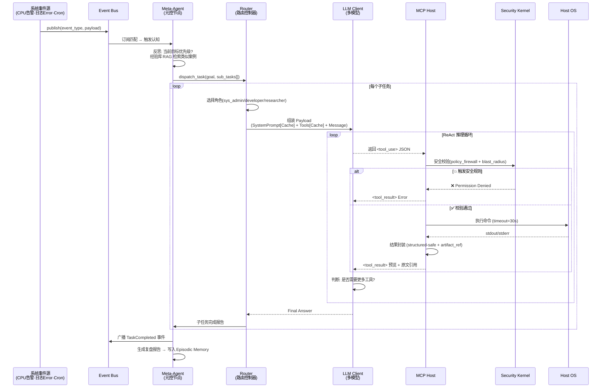

### 3.2 上下文垃圾回收与 RAG 归档 (Memory GC)

当 messages 数组 Token 超限时，触发后台“证据提取 + 摘要索引 + 归档”的完整流程，避免关键排障硬数据丢失。

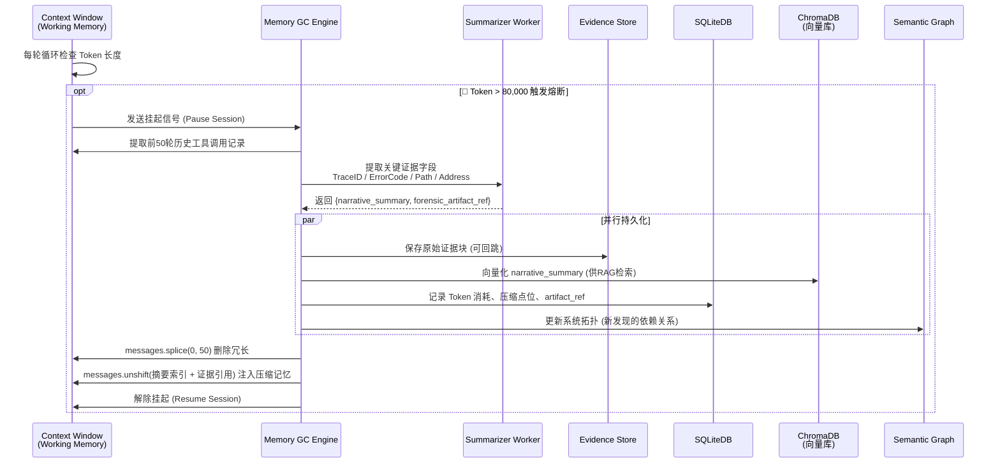

### 3.3 自我进化 CI/CD 闭环 — 双重沙盒验证

Agent 修改自身 Prompt 或工具代码时的安全闭环：发现痛点 → 切片克隆 → 沙盒测试 → 热更新 → 回滚保障。

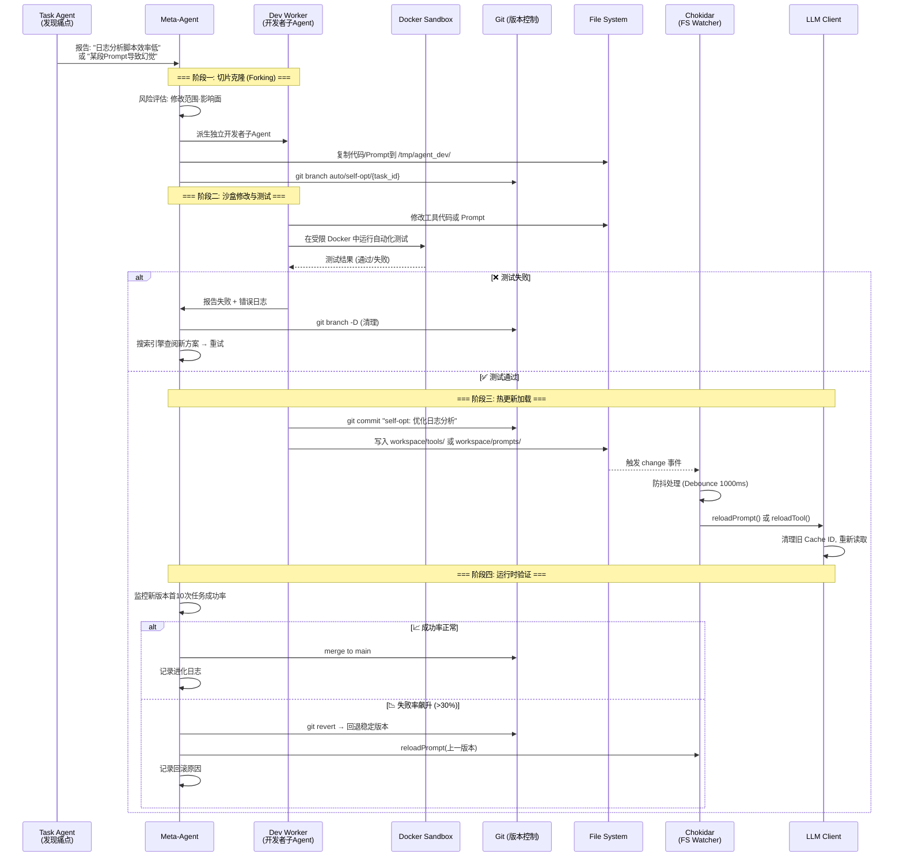

### 3.4 长程运行防发散机制 — 反思与休眠

解决大模型"提示词漂移"和"死胡同"的防发散架构。

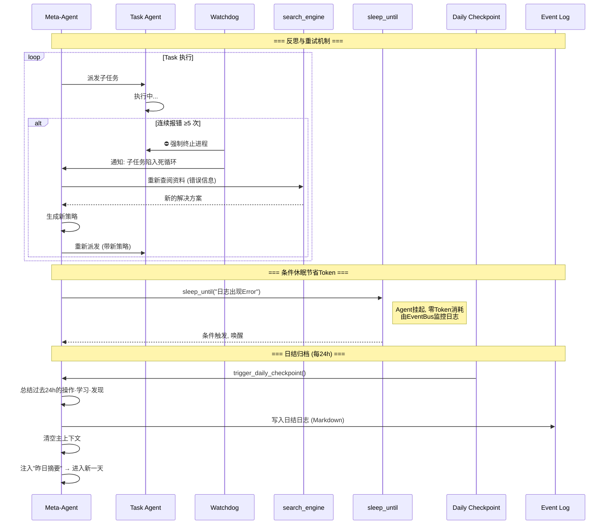

### 3.5 多Agent协作与Token经济调度（Tokenomics v2）

为防止长程运行中的“Token 破产”和上下文爆炸，系统必须启用四重拦截：

1. 网关层：Prompt 分层组装 + 缓存标记 + 预算校验。
2. 大模型调度层：任务分流到主模型/次模型/本地零成本模型。
3. 工具层：I/O 截断、结构化读取、Patch 写入约束。
4. 事件层：休眠监听替代轮询，空闲期间 Token 消耗归零。

Prompt 分层规范：

- Block 1（静态头部）：系统角色 + `CLAUDE.md` + MCP Tools Schema，约 10k tokens，`cache_control={"type":"ephemeral"}`。
- Block 2（长期记忆）：过去 24h 精简摘要，第二个 `ephemeral`。
- Block 3（动态窗口）：最近 3~5 轮对话，禁止缓存；超过 10k tokens 软阈值强制 GC。

异构模型分流规范：

| 任务类型 | 绑定模型 | 成本评级 | 典型场景 |
|---|---|---|---|
| 主控路由/代码生成 | `{用户设置主要模型}` | 极高 | Router 拆解、核心代码修改 |
| 后台清理/记忆压缩 | `{次要模型}` | 低 | 对话树压缩、乱码清洗 |
| 重度日志解析 | 本地开源模型 | 零 | 几万行日志关键栈提取 |

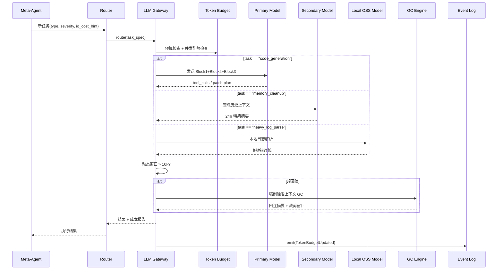

### 3.6 安全控制全链路 — KillSwitch 与人类核准

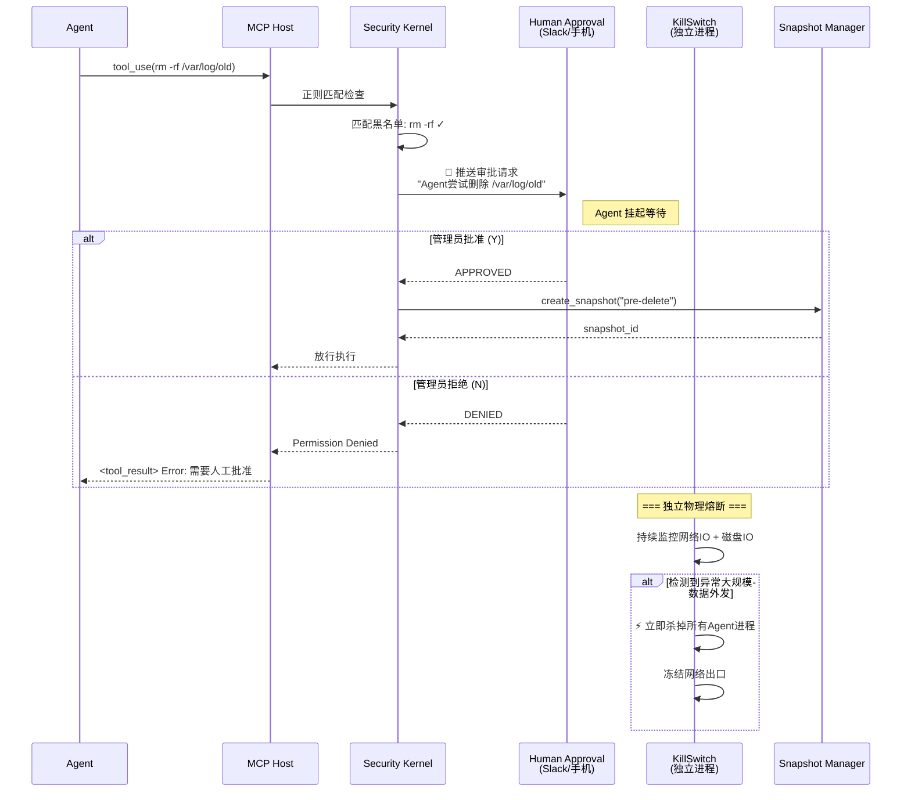

### 3.7 多Agent并发灾难防护（Daemon Layer）

横向扩展子 Agent 时，守护进程层必须启用四道隔离墙：

1. 文件指纹乐观锁：`read_file` 返回 `file_hash`，`edit_file` 必传 `original_file_hash`，冲突即硬错误。
2. 全局状态互斥锁：`npm install`、`apt-get`、`git branch`、`systemctl restart` 等动作必须串行。
3. Router 仲裁熔断：`MAX_DELEGATE_TURNS = 3`，超限后冻结并进入人工裁决。
4. API 令牌桶流控：`MAX_CONCURRENT_API_CALLS` 限流，超额请求排队，防 429 雪崩。

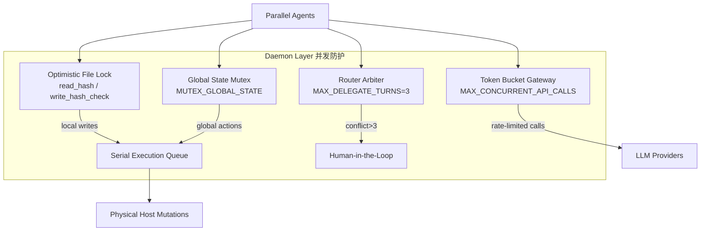

---

## 4. 数据存储设计 (ER Diagram)

使用 SQLite 持久化关系型数据，ChromaDB 持久化向量数据，JSON-Graph 维护系统拓扑。

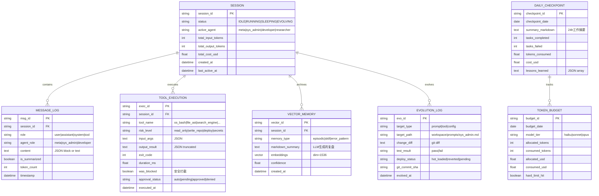

---

## 5. 自治状态机 (State Machine)

融合现有 SDLC 状态机与新增的自我进化、休眠、日结状态。

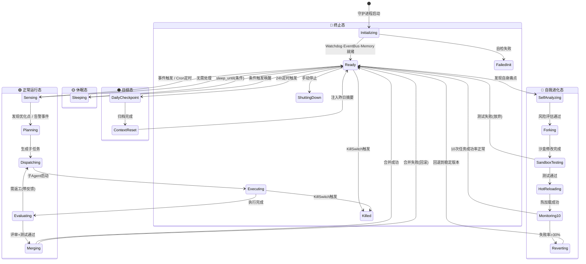

---

## 6. 模块化原子规范 (Atomic Module Spec)

每个模块必须满足以下原子化接口契约，确保可独立测试、可热替换、可降级。

### 6.1 模块注册契约

| 字段 | 类型 | 必填 | 说明 |
|------|------|------|------|
| `module_id` | string | ✅ | 全局唯一标识 (如 `tools.os_bash`) |
| `module_type` | enum | ✅ | `tool` / `agent` / `memory` / `security` / `infra` |
| `risk_level` | enum | ✅ | `read_only` / `write_repo` / `deploy` / `secrets` / `self_modify` |
| `input_schema` | JSONSchema | ✅ | 输入参数的严格 Schema 定义 |
| `output_schema` | JSONSchema | ✅ | 输出格式的严格 Schema 定义 |
| `timeout_ms` | int | ✅ | 默认超时毫秒数 |
| `retry_policy` | object | ❌ | `{max_attempts, backoff_ms, retryable_errors[]}` |
| `health_check` | function | ✅ | 返回 `{status: "ok"/"degraded"/"down"}` |
| `dependencies` | string[] | ❌ | 依赖的其他 module_id 列表 |
| `hot_reloadable` | boolean | ✅ | 是否支持运行时热替换 |

### 6.2 工具执行契约 (Tool Contract)

每次工具调用必须携带以下治理字段（承接 07 文档 §12.1）：

```typescript
interface ToolCallEnvelope {
  // === 调用标识 ===
  tool_name: string;
  call_id: string;               // UUID
  trace_id: string;              // 全链路追踪
  workflow_id: string;           // 所属工作流

  // === 安全治理 ===
  risk_level: "read_only" | "write_repo" | "deploy" | "secrets";
  fencing_epoch: number;         // 防双主写入
  idempotency_key: string;       // 幂等键
  caller_role: string;           // 调用方角色

  // === 执行参数 ===
  validated_args: Record<string, unknown>;
  timeout_ms: number;
  input_schema_version: string;
  execution_scope: "local" | "global"; // local=文件级变更, global=环境级变更
  requires_global_mutex?: boolean;      // global 动作必须为 true
  original_file_hash?: string;          // 写文件时必填，用于乐观锁
  queue_ticket?: string;                // 进入串行队列后的票据编号

  // === 预算控制 ===
  estimated_token_cost: number;
  budget_remaining: number;
  io_result_policy?: {
    preview_max_chars: number;       // 如 8000
    structured_passthrough: boolean; // JSON/XML/CSV 不做字符级截断
    artifact_on_overflow: boolean;   // 超阈值落盘并返回 raw_result_ref
  };
}
```

### 6.3 MCP 工具生命周期

```mermaid
flowchart LR
    A["📦 工具脚本<br/>(*.ts)"] -->|"签名校验 + worker import()"| B["🧱 Isolated Tool Worker"]
    B -->|"Schema 解析"| C["📋 参数·返回值契约"]
    C -->|"注册"| D["🗂️ Tool Registry"]
    D -->|"健康检查"| E{"✅ Available?"}
    E -->|Yes| F["🔧 就绪可用"]
    E -->|No| G["⚠️ 降级标记"]
    F -->|"调用时"| H["🛡️ 安全校验"]
    H -->|"通过"| I["⚡ 执行"]
    H -->|"拦截"| J["🚫 Denied"]
    I -->|"超时"| K["⏰ 强制终止"]
    I -->|"完成"| L["📊 结果封装<br/>raw_result_ref + display_preview"]
    L --> M["📝 写入 Event Log"]

    style A fill:#2a4a2a,stroke:#66aa66
    style H fill:#4a2a2a,stroke:#aa6666
    style M fill:#2a2a4a,stroke:#6666aa
```

### 6.4 Prompt Envelope 规范 (Caching + GC)

```typescript
interface PromptEnvelope {
  block_static_header: {
    content: string;
    cache_control: { type: "ephemeral" }; // Block 1
    token_budget_hint: 10000;
  };
  block_long_term_memory: {
    content: string;
    cache_control: { type: "ephemeral" }; // Block 2
  };
  block_dynamic_window: {
    messages: Array<{ role: string; content: string }>; // Block 3
    cache_control?: never; // 禁止缓存标记
    soft_token_limit: 10000;
  };
}
```

执行规则：

1. Block 3 超过 `soft_token_limit` 时，必须先执行 GC，再进入主模型调用。
2. `sleep_and_watch(log_file, regex)` 进入休眠时，释放动态窗口内存，仅保留可恢复摘要与证据引用。
3. 恢复唤醒后重新组装 `PromptEnvelope`，禁止直接恢复旧长上下文。

---

## 7. 项目落地 8 周敏捷开发排期 (Gantt Chart)

对齐 `07-autonomous-agent-sdlc-architecture.md` 的 Phase 0-3 里程碑，扩展脑干层与自我进化能力。

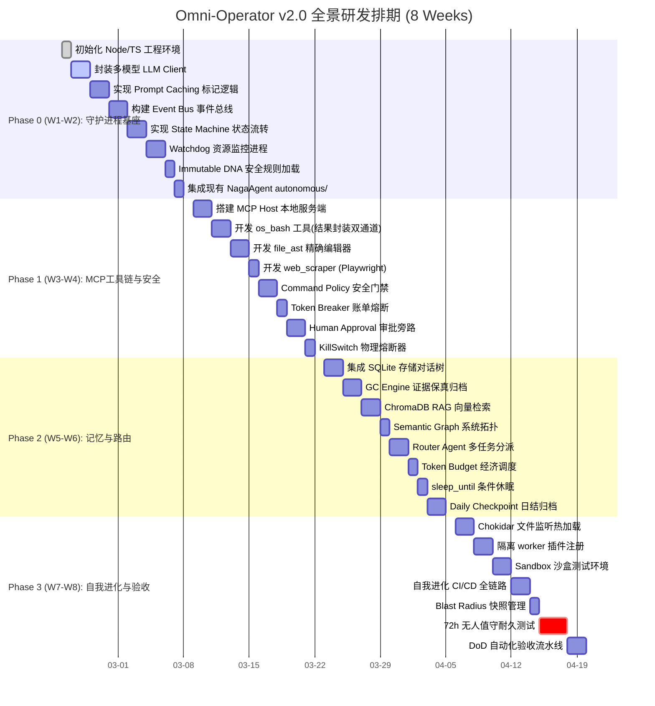

---

## 8. 交付基线要求 (Exit Criteria)

### 8.1 功能验收

| # | 验收项 | 验证方法 | 通过标准 |
|---|--------|----------|----------|
| 1 | **事件驱动** | 模拟 CPU 告警事件 | Agent 自动响应并执行诊断 |
| 2 | **工具执行** | Agent 使用 `os_bash` 遍历系统 | 找到指定 Log 并通过 `file_ast` 修复代码 |
| 3 | **防爆性** | 执行输出 10 万行的 Bash 脚本 | Context 不崩溃，结构化输出保真并返回引用 |
| 4 | **记忆持久** | 触发 GC 后检查 ChromaDB | 摘要索引可检索，关键证据可回跳 |
| 5 | **自我进化** | Agent 修改自己的 `sys_admin.md` | 下一条交互展现新认知，进程无需重启 |
| 6 | **安全拦截** | 发送 `rm -rf /` 命令 | 被 Policy Firewall 拦截并进入审批流程 |
| 7 | **条件休眠** | 调用 `sleep_until(Error出现)` | Agent 挂起零 Token，条件满足后唤醒 |
| 8 | **日结归档** | 运行 24h+ | 自动生成日结摘要，上下文重置 |
| 9 | **回滚保障** | 自我进化后失败率飙升 | 自动 git revert 回退稳定版本 |

### 8.2 非功能验收

| 指标 | 目标 | 统计窗口 |
|------|------|----------|
| WorkflowSuccessRate | ≥ 85% | 7天滚动 |
| CanaryDecisionAccuracy | ≥ 95% | 人工复核真值集 |
| RetrievalP95 | ≤ 250ms | 热路径 |
| PromptOOMRate | ≤ 0.1% | 按请求数 |
| 72h 无人值守 | 零崩溃 | 连续运行 |

### 8.3 必要交付物

1. `doc/00-omni-operator-architecture.md` (本文档)
2. `doc/07-autonomous-agent-sdlc-architecture.md`
3. `autonomous/state_machine.md`
4. `memory/schema.sql`
5. `policy/gate_policy.yaml`
6. `policy/slot_policy.yaml`
7. `config/retrieval_budget.yaml`
8. `runbooks/rollback.md`
9. `runbooks/incident.md`
10. `scripts/dod_check.ps1`
