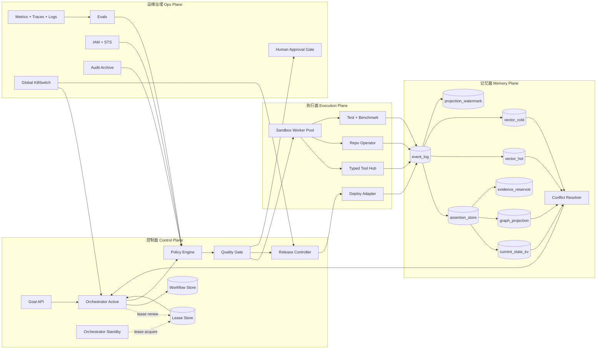
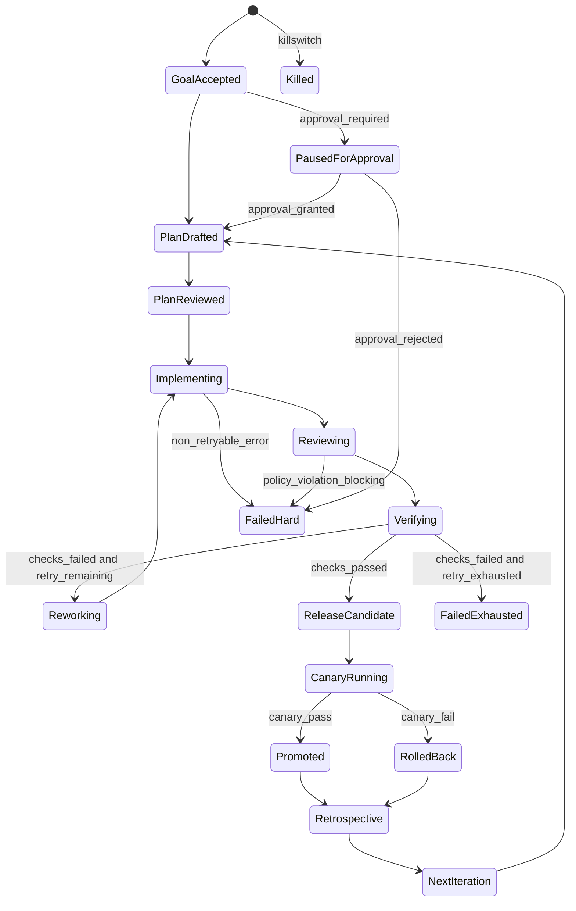

# NagaAgent 自治 SDLC 全面架构开发文档（v2）

文档状态：Draft -> Implementable  
版本：2.0.0  
最后更新：2026-02-19

## 1. 文档目标

本文定义 NagaAgent 的自治 SDLC（Software Development Life Cycle）完整架构与落地开发规范，目标是让系统在长时无人值守场景下稳定完成以下闭环：

1. 需求接收与计划分解
2. 方案评审与风险治理
3. 代码实现与测试验证
4. 灰度发布与自动回滚
5. 复盘归档与策略回灌

本文不是概念宣言，而是开发合同。每一节都要对应可实现对象：表结构、状态机、接口契约、策略文件、runbook、监控指标和自动化验收规则。

## 2. 范围与非目标

范围：

1. 控制面（Control Plane）和执行面（Execution Plane）架构
2. 事件真值模型、投影模型、检索模型
3. 多租户隔离与权限边界
4. 发布治理、SLO 判定和回滚闭环
5. 安全合规、可观测、评测回归
6. 开发阶段拆分、交付目录、DoD 验收标准

非目标：

1. 不绑定单一外部 Agent 框架库
2. 不定义 UI 视觉设计规范
3. 不替代企业审批制度，只定义系统技术控制点

### 2.1 文档分层与同步规则

1. 本文是目标态（Target Architecture）合同，定义 8 周完整闭环。
2. `doc/架构与时序设计.md` 是 MVP 实施文档（Phase 0，2 周），仅描述最小可运行路径。
3. 两文档冲突时，以本文为准；MVP 临时偏离必须记录 ADR，并注明回归目标态的最晚 Phase。
4. 文档同步要求：目标态结构调整需同步更新 MVP 文档的“差异/降级”章节；MVP 新增降级路径需回写本文 Gate 与 DoD 条目。

## 3. 术语与角色映射

术语：

1. `Event`：不可变业务事实，追加写入。
2. `Projection`：由事件派生的可查询视图（Current/Graph/Vector）。
3. `Assertion`：可关闭、可替代的时态断言。
4. `Watermark`：投影已处理到的事件位点。
5. `LSN`：Log Sequence Number，全局可比较的单调递增事件序号。
6. `Fencing Token`：防双主并发写的世代令牌。

角色到组件映射：

1. `Orchestrator` -> `autonomous/orchestrator/`
2. `Planner` -> `autonomous/planner/`
3. `Builder` -> `autonomous/builder/`
4. `Reviewer` -> `autonomous/reviewer/`
5. `Verifier` -> `autonomous/verifier/`
6. `Release Agent` -> `autonomous/release/`
7. `Memory Agent` -> `memory/`

## 4. 约束性设计原则

1. 事件为真：`event_log` 只追加，禁止更新、禁止物理覆盖。
2. 顺序可比较：所有投影、恢复、回放基于 `event_seq`，不基于 UUID 比较先后。
3. 单活多备：编排器运行时必须是 Single Active + Warm Standby，不允许双主。
4. 多租户强隔离：所有核心表必须包含 `tenant_id + project_id`。
5. 幂等优先：所有副作用命令必须携带 `idempotency_key` 并去重。
6. 先 gate 后执行：高风险动作必须经策略引擎判定后才能执行。
7. 默认可回滚：发布、索引、状态变更都必须定义补偿路径。
8. 预算硬限制：超 token、超时、超成本必须降级或失败，禁止静默超限。

## 5. 总体架构



## 6. 控制面高可用设计（Single Active）

### 6.1 目标

1. 保留“单主控执行”的确定性优势。
2. 消除单点故障，支持秒级主控接管。
3. 防止脑裂造成双写和重复执行。

### 6.2 Lease 与 Fencing 协议

实现要求：

1. 使用强一致存储维护 `orchestrator_lease`。
2. 仅持有有效 lease 的实例可执行写操作。
3. 每次主控切换递增 `fencing_epoch`。
4. 所有写命令必须携带 `fencing_epoch`，由下游验证“只接受最新 epoch”。

`orchestrator_lease` 最小字段：

1. `lease_name` (PK, 固定值 `global_orchestrator`)
2. `owner_id`
3. `fencing_epoch` (bigint, 单调递增)
4. `lease_expire_at`
5. `updated_at`

### 6.3 接管时序

1. Active 每 2s 续租，租期 TTL 10s。
2. Standby 每 2s 尝试获取 lease。
3. 若当前 lease 过期，Standby CAS 获取成功后成为新 Active。
4. 新 Active 读取未完成工作流，按幂等命令恢复推进。
5. 旧 Active 即使短时“复活”，因 `fencing_epoch` 过旧无法写入。

### 6.4 KillSwitch 抢占规则

1. `KillSwitch` 状态来自强一致存储。
2. 任意状态读取到 `kill=true` 后必须立刻停止新命令派发。
3. 当前 in-flight 命令只允许执行“安全结束”或“补偿回滚”。

## 7. 自治状态机（可收敛）



状态机硬约束：

1. 每次转移写入 `workflow_event`，并生成唯一 `transition_id`。
2. 每个有副作用步骤都需要 `idempotency_key`。
3. 必须存在终态：`Promoted`、`RolledBack`、`FailedExhausted`、`FailedHard`、`Killed`。
4. 任意非终态超过 `state_timeout_s` 必须进入恢复流程。

## 8. 命令执行一致性（Outbox/Inbox/Saga）

### 8.1 命令生命周期

每个副作用动作抽象为 `workflow_command`：

1. `command_id`
2. `workflow_id`
3. `step_name`
4. `command_type`
5. `idempotency_key`
6. `fencing_epoch`
7. `status` (`pending/running/succeeded/failed/compensated`)
8. `attempt`
9. `max_attempt`
10. `last_error`
11. `created_at/updated_at`

### 8.2 原子边界

同一数据库事务内必须完成：

1. 更新 `workflow_command` 状态
2. 写入 `event_log`（结果事件）
3. 写入 `outbox_event`（供异步分发）

这样避免：

1. 副作用成功但无事件可追踪
2. 事件存在但外部系统未执行

### 8.3 去重与重放

1. 消费端维护 `inbox_dedup (consumer, message_id)`。
2. 重启恢复后只重试 `pending/running` 且未超过上限的命令。
3. `idempotency_key` 采用 `workflow_id + step_name + semantic_hash(args)`。

### 8.4 补偿策略

1. `write_repo` 失败：恢复工作区到命令前快照，记录 `repo_reverted` 事件。
2. `deploy` 失败：触发 `rollback_release` 命令并阻断后续晋升。
3. `index_projection` 失败：标记投影降级，读取策略退回 `current_state + graph`。

## 9. 数据模型（强隔离 + 可比较顺序）

### 9.1 `event_log`

```sql
CREATE TABLE event_log (
  tenant_id         TEXT NOT NULL,
  project_id        TEXT NOT NULL,
  event_seq         BIGINT NOT NULL, -- 单调递增 LSN（分区内）
  event_id          UUID NOT NULL,
  workflow_id       TEXT NOT NULL,
  event_type        TEXT NOT NULL,
  payload_json      JSONB NOT NULL,
  event_time        TIMESTAMPTZ NOT NULL,
  system_time       TIMESTAMPTZ NOT NULL DEFAULT now(),
  producer          TEXT NOT NULL,
  idempotency_key   TEXT NOT NULL,
  fencing_epoch     BIGINT NOT NULL,
  PRIMARY KEY (tenant_id, project_id, event_seq),
  UNIQUE (tenant_id, project_id, event_id),
  UNIQUE (tenant_id, project_id, idempotency_key)
);
```

约束：

1. `event_seq` 只增不减，禁止回填覆盖。
2. 同一租户项目下 `idempotency_key` 唯一。

### 9.2 `assertion_store`

```sql
CREATE TABLE assertion_store (
  tenant_id         TEXT NOT NULL,
  project_id        TEXT NOT NULL,
  assertion_id      UUID NOT NULL,
  subject_id        TEXT NOT NULL,
  slot              TEXT NOT NULL,
  value_json        JSONB NOT NULL,
  status            TEXT NOT NULL, -- active/closed/superseded
  valid_from        TIMESTAMPTZ NOT NULL,
  valid_to          TIMESTAMPTZ NULL,
  confidence        NUMERIC(5,4) NOT NULL,
  source_event_seq  BIGINT NOT NULL,
  source_event_id   UUID NOT NULL,
  PRIMARY KEY (tenant_id, project_id, assertion_id),
  CHECK (status IN ('active','closed','superseded'))
);

CREATE INDEX idx_assertion_subject_slot_status
ON assertion_store(tenant_id, project_id, subject_id, slot, status);
```

### 9.3 `current_state_kv`

```sql
CREATE TABLE current_state_kv (
  tenant_id           TEXT NOT NULL,
  project_id          TEXT NOT NULL,
  subject_id          TEXT NOT NULL,
  slot                TEXT NOT NULL,
  assertion_id        UUID NOT NULL,
  version_event_seq   BIGINT NOT NULL,
  updated_at          TIMESTAMPTZ NOT NULL DEFAULT now(),
  PRIMARY KEY (tenant_id, project_id, subject_id, slot)
);
```

### 9.4 `evidence_reservoir`

```sql
CREATE TABLE evidence_reservoir (
  tenant_id         TEXT NOT NULL,
  project_id        TEXT NOT NULL,
  assertion_id      UUID NOT NULL,
  evidence_ref      TEXT NOT NULL,
  score             NUMERIC(6,5) NOT NULL,
  rank              INT NOT NULL,
  sample_method     TEXT NOT NULL, -- recent/diverse/high_confidence
  source_event_seq  BIGINT NOT NULL,
  PRIMARY KEY (tenant_id, project_id, assertion_id, evidence_ref)
);
```

### 9.5 `projection_watermark`

```sql
CREATE TABLE projection_watermark (
  tenant_id          TEXT NOT NULL,
  project_id         TEXT NOT NULL,
  projection_name    TEXT NOT NULL, -- graph/vector_hot/vector_cold/current_state
  last_event_seq     BIGINT NOT NULL,
  last_event_time    TIMESTAMPTZ NOT NULL,
  updated_at         TIMESTAMPTZ NOT NULL DEFAULT now(),
  PRIMARY KEY (tenant_id, project_id, projection_name)
);
```

读取屏障规则：

1. `read_barrier_seq = min(last_event_seq by required projections)`
2. 查询只能读取 `<= read_barrier_seq` 的可见数据。

## 10. 投影管线与索引治理

### 10.1 投影更新流程

1. 消费 `event_log` 新事件。
2. 依次更新 `assertion_store`、`current_state_kv`、`graph_projection`、`vector_*`。
3. 每个投影成功后更新该投影的 `projection_watermark`。

### 10.2 向量索引失效控制

必须支持 tombstone/upsert：

1. 向量文档元数据至少包含：`tenant_id/project_id/assertion_id/status/valid_from/valid_to/source_event_seq`。
2. `status != active` 的文档默认不得进入 current 查询结果。
3. 查询引擎先按元数据过滤，再做相似度排序。

### 10.3 热冷分层策略

1. `vector_hot` 保存最近窗口和高频实体证据。
2. `vector_cold` 保存历史归档证据。
3. 降级顺序：`current_state -> graph -> vector_hot -> vector_cold`。

## 11. 检索、冲突裁决、上下文组装

### 11.1 检索流程

1. 意图路由：`current_state/history/code/architecture/hybrid`。
2. 多源召回：Current + Graph + VectorHot + VectorCold。
3. 冲突裁决：在 prompt 拼装之前。
4. 成本感知重排：语义、时效、置信度、来源可靠性、冲突风险、I/O 成本联合评分。
5. 预算组装：严格执行 token/片段/调用上限。

### 11.2 冲突裁决规则

硬规则：

1. `intent=current_state` 时排除 `closed/superseded`。
2. `intent=history` 时允许冲突事实并按时间排序输出。
3. 未带 `tenant_id/project_id` 的候选一律丢弃。

评分函数（默认权重，可在线学习微调）：

```text
score = 0.30 * semantic_sim
      + 0.20 * freshness
      + 0.20 * confidence
      + 0.15 * source_reliability
      - 0.10 * contradiction_risk
      - 0.05 * io_cost
```

### 11.3 预算契约（硬限制）

1. `max_context_tokens = 200000`
2. `max_graph_facts = 20`
3. `max_evidence_chunks = 12`
4. `max_history_chunks = 6`
5. `max_total_io_fetch = 40`

溢出处理顺序：

1. 先摘要低排名证据。
2. 再丢弃最老且低置信事实。
3. 最后触发“回答降级模板”，禁止静默超预算。

## 12. 工具执行治理

### 12.1 Tool Contract（强制）

每次调用必须包含：

1. `tool_name`
2. `input_schema_version`
3. `validated_args`
4. `risk_level` (`read_only/write_repo/deploy/secrets`)
5. `timeout_ms`
6. `idempotency_key`
7. `fencing_epoch`
8. `caller_role`
9. `trace_id`

### 12.2 Gate 策略矩阵

1. `read_only`：沙箱自动执行，默认允许。
2. `write_repo`：需 `unit_test + lint + static_scan` 全通过。
3. `deploy`：需 `integration_test + perf_smoke + canary_plan + approval(optional)`。
4. `secrets`：仅短期凭据，强制审计，禁止明文输出。

### 12.3 高风险命令双确认

以下命令强制二次门禁：

1. 生产环境部署
2. 外网写操作
3. 依赖升级跨主版本
4. 大规模代码删除或迁移

### 12.4 验证阶段 CLI 降级（Codex MCP）

触发条件：

1. 主 CLI 不可用（安装缺失、鉴权失败或健康检查失败）。
2. CLI 在 `Verifying` 阶段重试耗尽。
3. 当前仅需要审阅/诊断/修复建议，不要求直接改写仓库。

执行规则：

1. 降级链路仅用于 `Verifying`，默认 read-only，不替代主执行链路。
2. 通过 MCP 调用 `codex-cli` 服务的 `ask-codex` 工具，输入需包含 `git diff`、失败测试日志、目标文件列表。
3. 降级输出必须结构化为 `issue/evidence/suggested_fix/risk` 并写入 `workflow_event`。
4. 降级结果必须经过本地 `unit_test + lint + static_scan` 二次验证后才可晋升。
5. 若 Codex MCP 也不可用，工作流进入 `Reworking` 或 `FailedExhausted`，禁止跳过验证直接发布。

## 13. 发布、灰度与自动回滚

### 13.1 灰度判定输入

指标：

1. 错误率
2. 延迟 p95/p99
3. 资源成本（CPU、Token、外部调用）
4. 关键业务 KPI（按任务域定义）

### 13.2 判定规则（必须量化）

1. `canary_window_min >= 15`
2. `min_sample_count >= 200`（低流量可按请求类型修正）
3. 采用双窗口 burn-rate（短窗 5m，长窗 30m）
4. 需满足抖动抑制：连续 `N=3` 个判定窗口健康才晋升
5. 任一关键指标越阈且持续 `M=2` 个窗口即回滚

### 13.3 发布状态机

1. `canary_started`
2. `canary_observing`
3. `promotion_pending`
4. `promoted` 或 `rolled_back`
5. `incident_opened`（回滚后自动创建）

## 14. 安全与合规基线（Agent 特有）

### 14.1 威胁模型

1. Prompt Injection（用户输入和检索证据污染）
2. Tool Output Injection（工具回包携带恶意指令）
3. Supply Chain（依赖与构建产物污染）
4. Secret Exfiltration（敏感信息泄露）

### 14.2 控制措施

1. 所有外部输入打 `untrusted` 标签，进入模型前执行策略过滤。
2. 工具输出默认不可信，必须过 schema 验证与危险片段扫描。
3. 构建产物必须包含 provenance（来源、commit、构建环境摘要）。
4. secrets 仅通过 STS 短期令牌发放，禁止持久密钥落盘。
5. 网络出口白名单和命令白名单双重限制。

### 14.3 审计要求

1. `deploy`、`secrets`、`policy_override` 事件必须完整留痕。
2. 审计日志需要不可篡改存储（WORM 或等效机制）。
3. 每次回滚关联根因和修复 commit。

## 15. 可观测与评测回归

### 15.1 必采指标

1. 工作流状态转移耗时、失败率、重试耗尽率
2. 命令执行成功率、幂等冲突率、补偿触发率
3. 检索 fanout、token 使用、截断率、冲突泄漏率
4. 灰度窗口判定结果、误报率、漏报率
5. 主控 lease 续约成功率、故障切换耗时

### 15.2 Trace 与日志

1. 所有步骤携带统一 `trace_id/span_id/workflow_id`。
2. 日志分级：`INFO/WARN/ERROR/AUDIT`。
3. `AUDIT` 日志必须包含 `actor/action/target/evidence_hash`。

### 15.3 评测体系

1. 离线回归：标准任务集（正确率、时延、成本）。
2. 在线 shadow：新旧策略并行对照。
3. 混沌演练：依赖超时、索引延迟、网络抖动、lease 抖动。
4. 无人值守耐久测试：连续 72h 以上稳定性验证。

## 16. SLO 与 Error Budget（可计算）

核心 SLO：

1. `WorkflowSuccessRate >= 85%`（限定任务域，7 天滚动窗口）。
2. `CanaryDecisionAccuracy >= 95%`（以人工复核真值集评估）。
3. `ConflictLeakageRate <= 1%`（current intent）。
4. `RetrievalP95 <= 250ms`（热路径）。
5. `PromptOOMRate <= 0.1%`（按请求数计）。

每项必须定义：

1. 分子分母
2. 统计窗口
3. 数据来源
4. 告警阈值
5. 失效后的自动动作

## 17. 开发阶段与里程碑（8 周）

### Phase 0（2 周，前置可选）：System Agent + CLI 工具化落地

1. 采用单 System Agent 常驻模式，先不启用 Standby 抢占。
2. 打通 CLI Adapter（Codex/Claude/Gemini）与执行监控，形成可运行闭环。
3. 在 `Verifying` 阶段接入 Codex MCP 降级链路（`codex-cli:ask-codex`）。

里程碑产物：

1. `doc/架构与时序设计.md`
2. `autonomous/tools/cli_adapter.py`
3. `autonomous/monitor.py`
4. `autonomous/config/autonomous_config.yaml`

### Phase 1（第 1-2 周）：控制面最小闭环

1. 完成状态机、`workflow_command`、`event_log`、`outbox_event`。
2. 完成 Single Active lease/fencing（将 Phase 0 单实例升级为 Warm Standby）。
3. 打通 Planner -> Builder -> Reviewer -> Verifier 基础链路。

里程碑产物：

1. `autonomous/state_machine.md`
2. `memory/schema.sql`（含事件与命令核心表）
3. `policy/gate_policy.yaml`

### Phase 2（第 3-4 周）：记忆治理与检索裁决

1. 实现 `assertion_store/current_state_kv/projection_watermark`。
2. 上线冲突裁决器和预算组装器。
3. 建立向量索引 tombstone/upsert 流程。

里程碑产物：

1. `memory/retrieval/`
2. `config/retrieval_budget.yaml`
3. `tests/retrieval_conflict_cases.yaml`

### Phase 3（第 5-6 周）：发布治理与自愈

1. 打通 canary、双窗口 burn-rate、自动回滚。
2. 建立事故工作流和复盘自动模板。
3. 接入审计归档与安全策略。

里程碑产物：

1. `autonomous/release/`
2. `runbooks/rollback.md`
3. `runbooks/incident.md`

### Phase 4（第 7-8 周）：稳态优化与验收

1. 完成 72h 无人值守压测。
2. 优化重排权重和补偿策略。
3. 完成 DoD 自动化验收流水线。

里程碑产物：

1. `evals/long_run/`
2. `observability/dashboards/`
3. `scripts/dod_check.ps1`

## 18. 代码与文档目录规范

```text
NagaAgent/
  autonomous/
    orchestrator/
    planner/
    builder/
    reviewer/
    verifier/
    release/
    state_machine.md
  memory/
    schema.sql
    event_log/
    assertions/
    current_state/
    retrieval/
  policy/
    gate_policy.yaml
    slot_policy.yaml
  config/
    retrieval_budget.yaml
  observability/
    dashboards/
    alerts/
  evals/
    offline/
    online/
    long_run/
  runbooks/
    rollback.md
    incident.md
  doc/
    07-autonomous-agent-sdlc-architecture.md
    架构与时序设计.md
```

## 19. 配置模板（可直接落库）

### 19.1 `policy/slot_policy.yaml`

```yaml
slots:
  work_city:
    cardinality: SINGLE_ACTIVE
    history_enabled: true
  employer:
    cardinality: SINGLE_ACTIVE
    history_enabled: true
  likes:
    cardinality: SET_ACTIVE
    history_enabled: true
  purchase_event:
    cardinality: EVENT_ONLY
    history_enabled: true
```

### 19.2 `config/retrieval_budget.yaml`

```yaml
budget:
  max_context_tokens: 200000
  max_graph_facts: 20
  max_evidence_chunks: 12
  max_history_chunks: 6
  max_total_io_fetch: 40
  overflow_policy:
    summarize_low_rank_first: true
    allow_silent_overflow: false
```

### 19.3 `policy/gate_policy.yaml`

```yaml
gates:
  read_only:
    auto_allow: true
  write_repo:
    required_checks: [unit_test, lint, static_scan]
  deploy:
    required_checks: [integration_test, perf_smoke, canary_plan]
    canary_window_min: 15
    min_sample_count: 200
    burn_rate_windows: [5m, 30m]
    healthy_windows_for_promotion: 3
    bad_windows_for_rollback: 2
  secrets:
    require_short_lived_token: true
    require_audit_log: true
```

## 20. DoD（Definition of Done）与自动验收

交付物必须存在：

1. `doc/07-autonomous-agent-sdlc-architecture.md`
2. `autonomous/state_machine.md`
3. `memory/schema.sql`
4. `policy/gate_policy.yaml`
5. `policy/slot_policy.yaml`
6. `config/retrieval_budget.yaml`
7. `runbooks/rollback.md`
8. `runbooks/incident.md`
9. `scripts/dod_check.ps1`

验收规则：

1. `schema.sql` 包含 `tenant_id/project_id/event_seq` 关键字段。
2. 状态机包含 `FailedExhausted/FailedHard/Killed` 终态。
3. Gate 策略包含 `deploy` 的样本量与 burn-rate 参数。
4. 回滚 runbook 包含触发条件、执行步骤、验证步骤、恢复步骤。
5. CI 必须能执行 `dod_check.ps1` 并返回 0。
6. Verifier 流程必须定义 CLI 降级到 Codex MCP 的触发条件、审计事件和回退路径。

## 21. 结论

该版本将“自治 SDLC”从概念文档提升为可执行架构合同，核心改进点：

1. 用 `Single Active + Lease/Fencing` 消除单点和双主风险。
2. 用 `event_seq + projection_watermark` 建立严格一致读取屏障。
3. 用 `Outbox/Inbox/Saga` 封闭副作用与事件裂缝。
4. 用多租户强隔离字段避免跨租户污染。
5. 用量化 canary 判定和 Agent 安全基线提升生产可控性。

后续开发必须严格按本文件执行；任何偏离都需要补充 ADR（Architecture Decision Record）并通过评审。
