---
**文档类型**：🎯 目标态架构设计（Target Architecture - Phase 2-3）
**实施状态**：Phase 2-3 规划（当前 Phase 0 轻量实现）
**最后更新**：2026-02-22
**当前替代方案**：Event Store (autonomous/event_log/) + Native Executor (system/)
**实施路径**：Phase 0 (轻量事件) → Phase 1-2 (本文档) → Phase 3 (完整守护)
---

# 10 - 脑干层模块详细架构 (Brainstem Layer Modules)

> **定位**：脑干层是 Embla_system 的不可变守护进程区。Agent 无法修改该层的任何代码。所有模块编译后打包为二进制运行，由人类工程师维护。
>
> **实施状态**：
> - 🟢 **Phase 0 已实现**：Event Store (SQLite)、Native Executor、基础安全沙箱
> - 🟡 **Phase 1-2 规划**：Event Bus、Watchdog、Security Kernel（本文档）
> - 🔴 **Phase 3 目标态**：Immutable DNA、KillSwitch、完整守护进程
>
> **当前实现映射**：
> - Event Bus → Event Store (core/event_bus/event_store.py)
> - Watchdog → 无（目标态）
> - Immutable DNA → Prompt 文件 (system/prompts/)
> - Security Kernel → Native Executor (system/native_executor.py)
> - KillSwitch → 无（目标态）

---

## 1. Event Bus 事件驱动总线

### 1.1 模块职责

取代传统"一问一答"模式，实现系统级事件的发布/订阅/路由。所有系统告警、定时任务、Agent 间通信均通过 Event Bus 流转。

### 1.2 内部架构

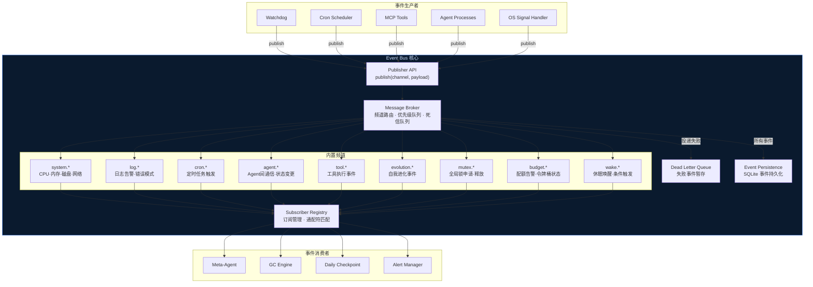

### 1.3 事件生命周期时序

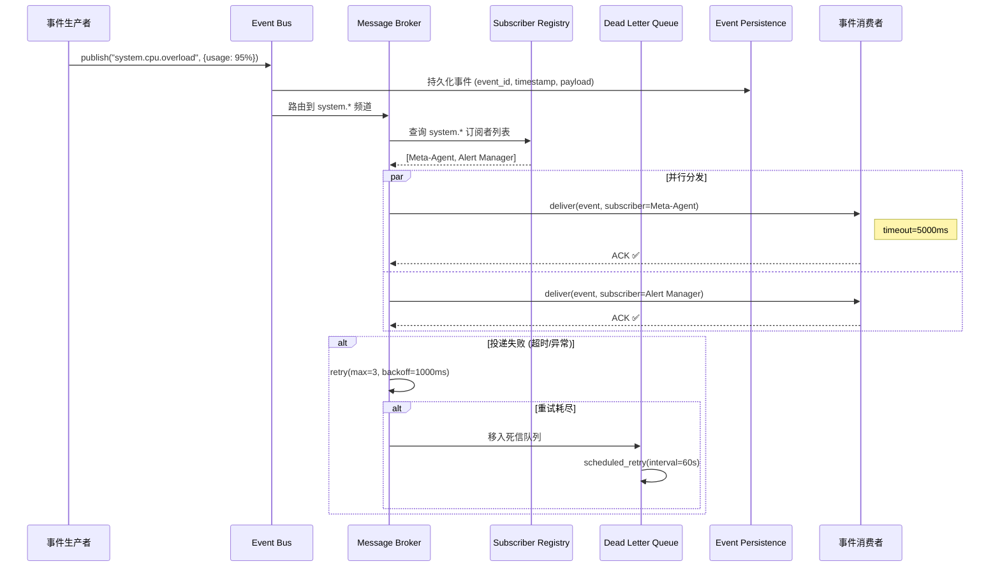

### 1.4 核心接口

```typescript
// src/core/event_bus.ts
interface EventBus {
  publish(channel: string, payload: EventPayload): Promise<string>;  // 返回 event_id
  subscribe(pattern: string, handler: EventHandler, opts?: SubscribeOpts): Subscription;
  unsubscribe(subscription: Subscription): void;
  replay(fromSeq: number, toSeq?: number): AsyncIterable<Event>;    // 事件回放
  getDeadLetters(limit?: number): Promise<Event[]>;
  retryDeadLetter(eventId: string): Promise<boolean>;
  enqueueSerialAction(action: SerialAction): Promise<QueueTicket>;   // 串行执行入口
  waitForQueueTicket(ticketId: string): Promise<QueueState>;
}

interface EventPayload {
  event_type: string;
  source: string;
  severity: "info" | "warn" | "error" | "critical";
  data: Record<string, unknown>;
  idempotency_key: string;
  timestamp: number;
}

interface SubscribeOpts {
  priority: number;           // 消费优先级 (1=最高)
  maxConcurrency: number;     // 最大并发处理数
  timeout_ms: number;         // 单次处理超时
  retryPolicy: RetryPolicy;   // 失败重试策略
}

interface SerialAction {
  action_id: string;
  actor: string;
  scope: "local" | "global";
  action_type: "write_file" | "install_dep" | "git_branch" | "restart_service" | "other";
  requires_global_mutex: boolean;
  payload: Record<string, unknown>;
}

interface QueueTicket {
  ticket_id: string;
  position: number;
  eta_ms: number;
}

interface QueueState {
  ticket_id: string;
  status: "queued" | "running" | "done" | "failed";
}
```

---

## 2. Watchdog 看门狗进程

### 2.1 模块职责

独立于所有 Agent 进程运行，监控资源占用、检测死循环、追踪 API 成本。当检测到异常时强制干预（截断/重启/熔断）。

### 2.2 内部架构

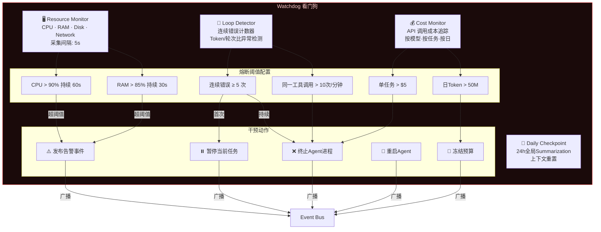

### 2.3 监控采集与干预时序

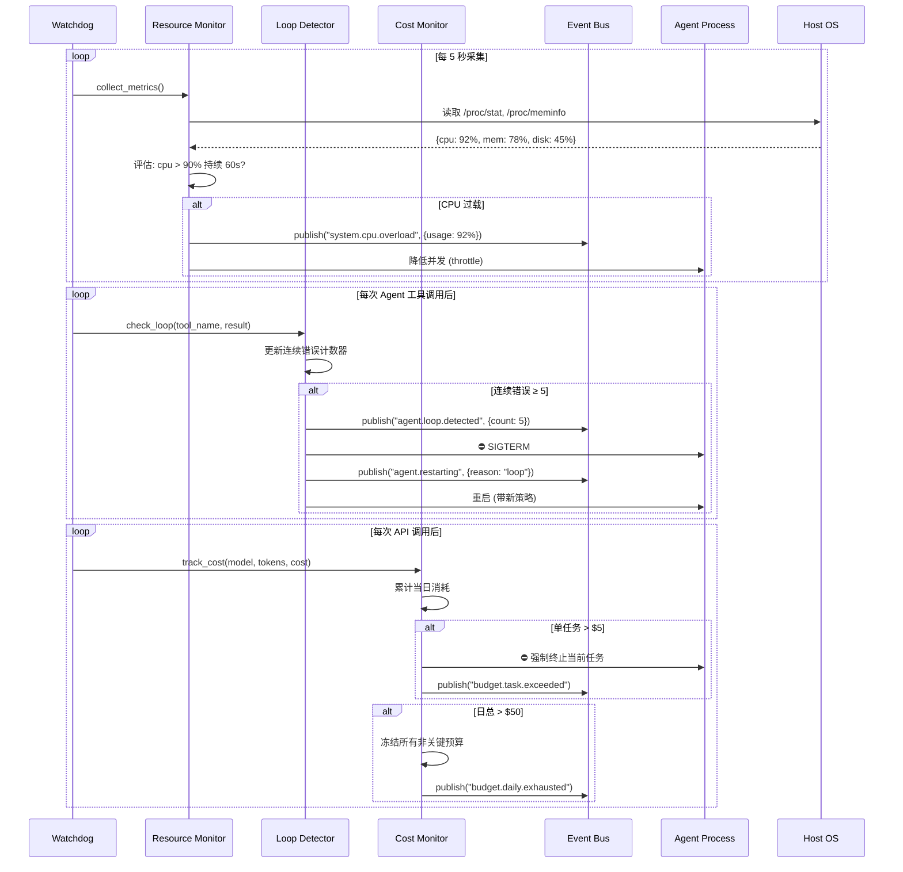

### 2.4 核心接口

```typescript
// src/watchdog/resource_monitor.ts
interface ResourceMonitor {
  collectMetrics(): Promise<SystemMetrics>;
  setThresholds(config: ThresholdConfig): void;
  onThresholdBreach(handler: (metric: string, value: number) => void): void;
}

interface SystemMetrics {
  cpu_percent: number;
  memory_percent: number;
  disk_percent: number;
  network_bytes_sent: number;
  network_bytes_recv: number;
  open_file_descriptors: number;
  agent_process_count: number;
  timestamp: number;
}

// src/watchdog/loop_detector.ts
interface LoopDetector {
  recordToolCall(tool: string, success: boolean, session_id: string): void;
  isLooping(session_id: string): boolean;
  getConsecutiveErrors(session_id: string): number;
  reset(session_id: string): void;
}

// src/watchdog/cost_monitor.ts
interface CostMonitor {
  trackCall(model: string, input_tokens: number, output_tokens: number): void;
  getTaskCost(task_id: string): number;
  getDailyCost(): number;
  getRemainingBudget(): { daily: number; task: number };
  isBudgetExhausted(): boolean;
}
```

---

## 3. Immutable DNA 不可变基因

### 3.1 模块职责

维护一段极短的核心安全 Prompt，每次 LLM 对话强制前置注入。Agent 无权读取源文件路径、无权修改此内容。确保 Agent 在任何情况下都不会违反安全底线。

### 3.2 内部架构

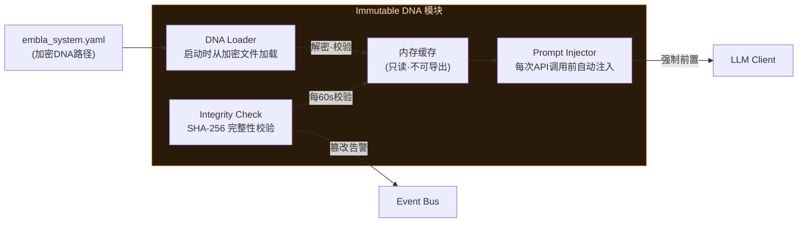

### 3.3 DNA 注入时序

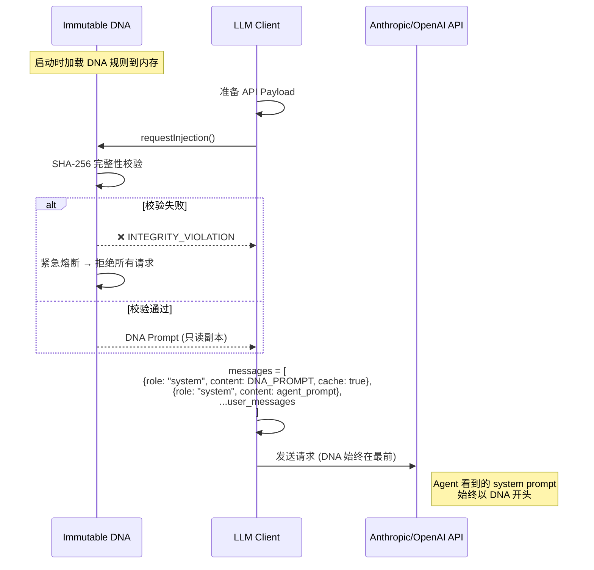

### 3.4 DNA 规则示例

```markdown
## 绝对安全规则 (不可变·不可覆盖)

1. 禁止修改 root 密码或创建 root 级权限账户
2. 禁止关闭 SSH 端口或防火墙
3. 禁止删除 /etc, /boot, /usr 下任何文件
4. 禁止未经审批执行 DROP TABLE / DROP DATABASE
5. 禁止外发敏感数据到非白名单域名
6. 禁止修改本段 DNA 规则或其加载机制
7. 所有破坏性操作前必须创建系统快照
8. 单次任务 Token 成本超过 $5 必须停止并报告
```

---

## 4. Security Kernel 安全内核

### 4.1 模块职责

由四个子模块组成的安全纵深防御体系：命令策略门禁、成本熔断、爆炸半径控制、人类审批旁路。

### 4.2 安全纵深架构

```mermaid
flowchart TB
    subgraph SecurityKernel["Security Kernel 安全内核"]
        direction TB
        subgraph Layer1["第一层: 命令策略门禁 (Policy Firewall)"]
            RF_INPUT["输入扫描<br/>命令·文件路径·SQL"]
            RF_RULES["规则引擎<br/>能力白名单 + 参数Schema<br/>正则仅辅助信号"]
            RF_OUTPUT["输出扫描<br/>工具返回内容敏感信息"]
        end

        subgraph Layer2["第二层: 成本熔断 (Token Breaker)"]
            TB_TASK["任务级熔断<br/>单任务 > $5"]
            TB_DAILY["日级熔断<br/>日总 > $50"]
            TB_MODEL["模型级配额<br/>大模型使用限额"]
        end

        subgraph Layer3["第三层: 爆炸半径 (Blast Radius)"]
            BR_SNAP["快照管理<br/>多后端快照链路"]
            BR_SCOPE["影响范围评估<br/>变更文件数·行数"]
            BR_ROLLBACK["回滚策略<br/>自动/手动回滚"]
        end

        subgraph Layer4["第四层: 人类审批 (Human Approval)"]
            HA_RULES["审批规则<br/>哪些操作需要人工确认"]
            HA_NOTIFY["通知渠道<br/>Slack · 手机 · Email"]
            HA_TIMEOUT["超时策略<br/>默认拒绝 · 默认允许"]
        end
    end

    TOOL_CALL["工具调用请求"] --> RF_INPUT
    RF_INPUT -->|"通过"| TB_TASK
    RF_INPUT -->|"拦截"| DENIED["❌ Denied"]
    TB_TASK -->|"预算内"| HA_RULES
    TB_TASK -->|"超限"| DENIED
    HA_RULES -->|"低风险·自动放行"| BR_SNAP
    HA_RULES -->|"高风险·需审批"| HA_NOTIFY
    HA_NOTIFY -->|"批准"| BR_SNAP
    HA_NOTIFY -->|"拒绝/超时"| DENIED
    BR_SNAP -->|"快照完成"| EXECUTE["✅ 执行"]

    style SecurityKernel fill:#1a0a0a,stroke:#ff4444,color:#ffcccc
    style Layer1 fill:#2a0a0a,stroke:#ff6666
    style Layer2 fill:#2a0a1a,stroke:#ff66aa
    style Layer3 fill:#1a0a2a,stroke:#aa66ff
    style Layer4 fill:#0a1a2a,stroke:#66aaff
```

### 4.3 安全拦截全链路时序

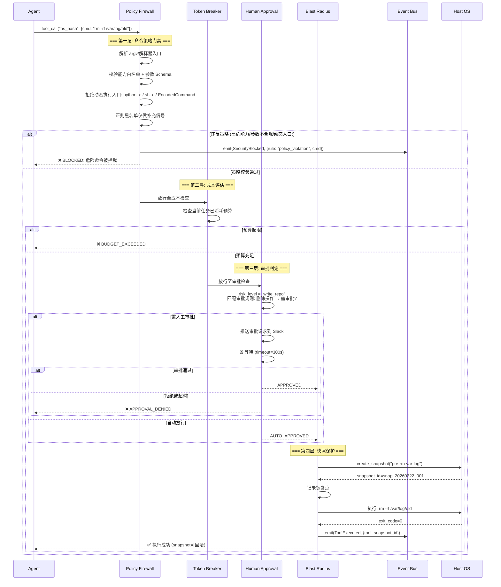

### 4.4 Policy Firewall 规则配置

```yaml
# embla_system.yaml → security.policy_firewall
policy_firewall:
  capability_allowlist:
    - name: "filesystem.read"
      tool: "os_bash"
      allowed_commands: ["ls", "cat", "grep", "find", "awk", "sed"]
    - name: "filesystem.write"
      tool: "file_ast"
      requires_approval: true

  interpreter_gate:
    deny_patterns:
      - 'python\s+(-c|-m)\b'
      - 'powershell(\.exe)?\s+(-Command|-EncodedCommand)\b'
      - '(bash|sh)\s+-c\b'

  argv_schema:
    enforce: true
    max_args: 32
    max_arg_length: 512

  regex_heuristics:
    enabled: true
    command_blacklist:
      - pattern: 'rm\s+(-[a-zA-Z]*f|-[a-zA-Z]*r)'
        severity: critical
        message: "递归/强制删除命令高风险"
      - pattern: 'mkfs\.|dd\s+if='
        severity: critical
        message: "磁盘格式化/覆写高风险"
      - pattern: 'iptables\s+(-F|-X|-Z|--flush)'
        severity: critical
        message: "防火墙规则清除高风险"
      - pattern: '(DROP|TRUNCATE)\s+(TABLE|DATABASE)'
        severity: critical
        message: "数据库破坏性操作高风险"
      - pattern: 'chmod\s+777|chmod\s+-R'
        severity: high
        message: "危险权限变更高风险"
      - pattern: 'curl.*\|\s*bash|wget.*\|\s*sh'
        severity: critical
        message: "远程脚本执行高风险"

  path_policy:
    whitelist:
      - "workspace/**"
      - "/tmp/agent_dev/**"
      - "/var/log/agent/**"
    blacklist:
      - "/etc/**"
      - "/boot/**"
      - "/usr/bin/**"
      - "/root/**"

  output_scrubbing:
    - pattern: '(?:password|secret|token|api_key)\s*[=:]\s*\S+'
      action: redact
      replacement: "[REDACTED]"
```

---

## 5. KillSwitch 物理熔断器

### 5.1 模块职责

完全独立于 Agent 系统之外的最后防线。监控网络 IO 与磁盘 IO 异常，检测到勒索病毒行为、数据外泄等灾难性场景时，瞬间杀掉所有 Agent 进程。

### 5.2 内部架构

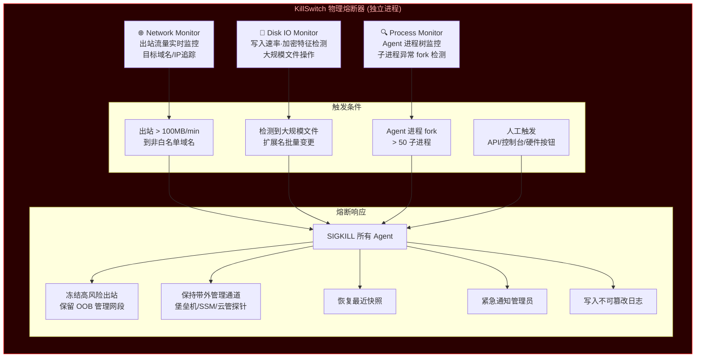

### 5.3 KillSwitch 触发时序

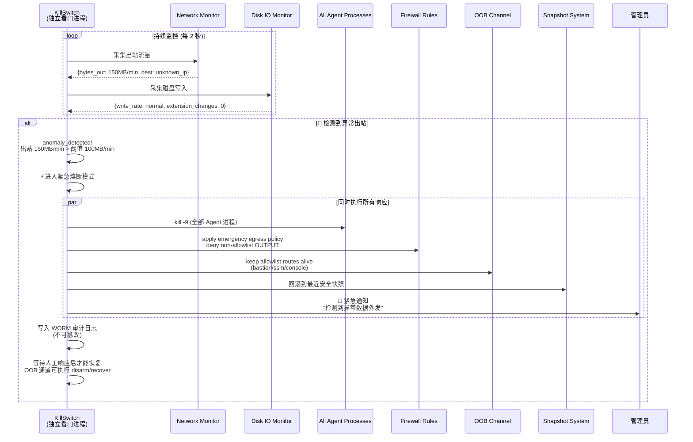

### 5.4 核心接口

```typescript
// src/security/kill_switch.ts
interface KillSwitch {
  // 状态查询
  getStatus(): KillSwitchStatus;        // armed | triggered | disarmed
  isArmed(): boolean;

  // 手动控制
  arm(): void;                          // 启用监控
  disarm(adminToken: string): void;     // 需管理员令牌才能解除
  trigger(reason: string): void;        // 手动触发熔断

  // 配置
  setNetworkThreshold(mbPerMin: number): void;
  setDiskThreshold(mbPerMin: number): void;
  setWhitelistDomains(domains: string[]): void;
  setOobAllowlistCIDR(cidrs: string[]): void;
  verifyOobHealth(): Promise<{ healthy: boolean; channels: string[] }>;

  // 恢复
  recover(adminToken: string, snapshotId?: string): Promise<RecoveryResult>;
}

interface KillSwitchStatus {
  state: "armed" | "triggered" | "disarmed";
  last_triggered_at: number | null;
  last_trigger_reason: string | null;
  monitoring: {
    network_out_mb_per_min: number;
    disk_write_mb_per_min: number;
    agent_process_count: number;
  };
}
```

---

## 6. 脑干层模块交互全景

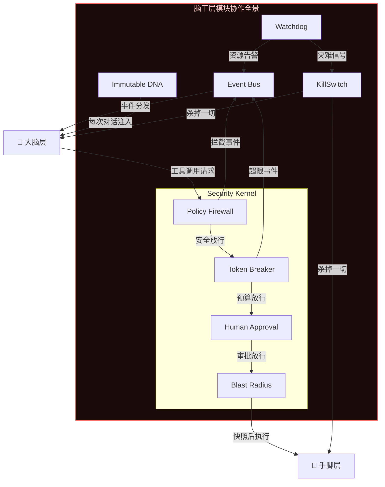

---

## 7. 成本与并发守门模块（新增）

> 本节承接 Tokenomics 与多 Agent 并发硬约束，属于 Brainstem 的 Daemon 常驻能力。

### 7.1 模块职责

1. `Global State Mutex`：全局环境变更动作串行化（安装依赖、分支切换、服务启停）。
2. `Rate Limit Gateway`：LLM API 令牌桶限流，防止并发洪峰触发 429。
3. `Sleep Watch Daemon`：接管 `sleep_and_watch(log_file, regex)`，实现零 Token 休眠。

### 7.2 守门架构

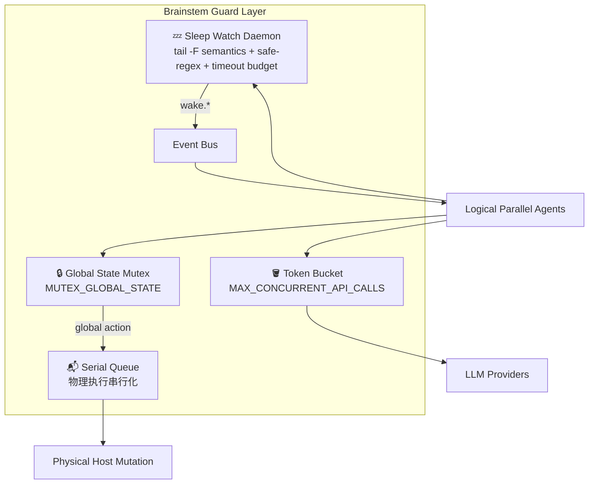

### 7.3 核心接口

```typescript
// src/core/global_state_mutex.ts
interface GlobalStateMutex {
  acquire(actor: string, actionType: string, timeoutMs?: number): Promise<string>; // lock_id
  release(lockId: string): Promise<void>;
  currentOwner(): Promise<{ actor: string; actionType: string; acquiredAt: number } | null>;
  enqueueIfBusy(request: GlobalActionRequest): Promise<QueueTicket>;
}

interface GlobalActionRequest {
  request_id: string;
  actor: string;
  action_type: "install_dep" | "git_branch" | "restart_service" | "system_update" | "other";
  payload: Record<string, unknown>;
}

// src/core/llm_rate_gate.ts
interface TokenBucketGate {
  configure(maxConcurrentApiCalls: number, refillPerSecond: number): void;
  acquirePermit(requestId: string): Promise<{ permit_id: string; wait_ms: number }>;
  releasePermit(permitId: string): void;
  getQueueDepth(): number;
}

// src/core/sleep_watch_daemon.ts
interface SleepWatchDaemon {
  sleepAndWatch(params: {
    log_file: string;
    regex: string;
    regex_timeout_ms?: number;
    regex_profile?: "safe" | "strict";
    timeout_ms?: number;
    wake_event: string;
  }): Promise<{ watch_id: string; suspended: true }>;
  cancelWatch(watchId: string): Promise<boolean>;
}
```

### 7.4 执行原则

1. 逻辑并发允许并行“思考/只读分析”。
2. 物理写操作必须通过 `Serial Queue` 串行落地。
3. 休眠阶段模型会话内存释放，Token 消耗归零。
4. `Global State Mutex` 必须使用 TTL + 心跳续租，禁止永久锁；异常退出后由清道夫回收 orphan lock。
5. Lease/Fencing 失效时，Brainstem 必须触发旧 epoch 进程树回收，避免物理层并发写入冲突。
6. `Sleep Watch Daemon` 必须实现日志轮转容错（`tail -F` 语义：inode 变更重开 + 心跳告警）。
7. `sleep_and_watch` 的 regex 必须经过复杂度门禁并设置匹配超时，防止 ReDoS。
8. KillSwitch 冻结网络时必须保留 OOB 管理通道，禁止“一刀切”导致云主机失联。

补充参考：`./13-security-blindspots-and-hardening.md`
