# 11 - 大脑层模块详细架构 (Brain Layer Modules)

> **定位**：大脑层是 Omni-Operator 的认知中枢，负责推理、记忆、路由和状态管理。属于工作空间层中的高级逻辑区域。

---

## 1. Meta-Agent 元控节点

### 1.1 模块职责

全天候运行的主进程，拥有最高认知权限。负责目标反思、任务拆解、子 Agent 派发与全局策略调整。是整个系统的"总指挥"。

### 1.2 内部架构

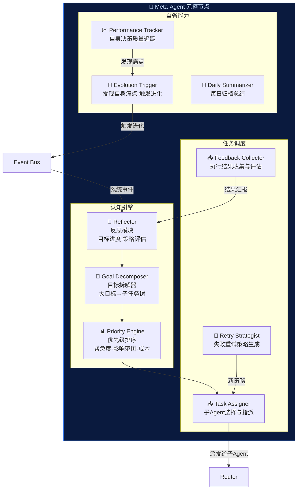
```mermaid
flowchart TB
    subgraph MetaAgent["👑 Meta-Agent 元控节点"]
        direction TB
        subgraph Cognition["认知引擎"]
            REFLECT["🤔 Reflector<br/>反思模块<br/>目标进度·策略评估"]
            DECOMPOSE["🧩 Goal Decomposer<br/>目标拆解器<br/>大目标→子任务树"]
            PRIORITIZE["📊 Priority Engine<br/>优先级排序<br/>紧急度·影响范围·成本"]
        end

        subgraph Dispatch["任务调度"]
            ASSIGN["📤 Task Assigner<br/>子Agent选择与指派"]
            FEEDBACK["📥 Feedback Collector<br/>执行结果收集与评估"]
            RETRY["🔄 Retry Strategist<br/>失败重试策略生成"]
        end

        subgraph SelfAware["自省能力"]
            PERF["📈 Performance Tracker<br/>自身决策质量追踪"]
            EVOLVE_TRIGGER["🔬 Evolution Trigger<br/>发现自身痛点·触发进化"]
            DAILY_SUM["📅 Daily Summarizer<br/>每日归档总结"]
        end
    end

    EB["Event Bus"] -->|"系统事件"| REFLECT
    REFLECT --> DECOMPOSE
    DECOMPOSE --> PRIORITIZE
    PRIORITIZE --> ASSIGN
    ASSIGN -->|"派发给子Agent"| ROUTER["Router"]
    FEEDBACK -->|"结果汇报"| REFLECT
    RETRY -->|"新策略"| ASSIGN
    PERF -->|"发现痛点"| EVOLVE_TRIGGER
    EVOLVE_TRIGGER -->|"触发进化"| EB

    style MetaAgent fill:#0a1a3e,stroke:#4488ff,color:#cce0ff
```

### 1.3 目标拆解与反思时序

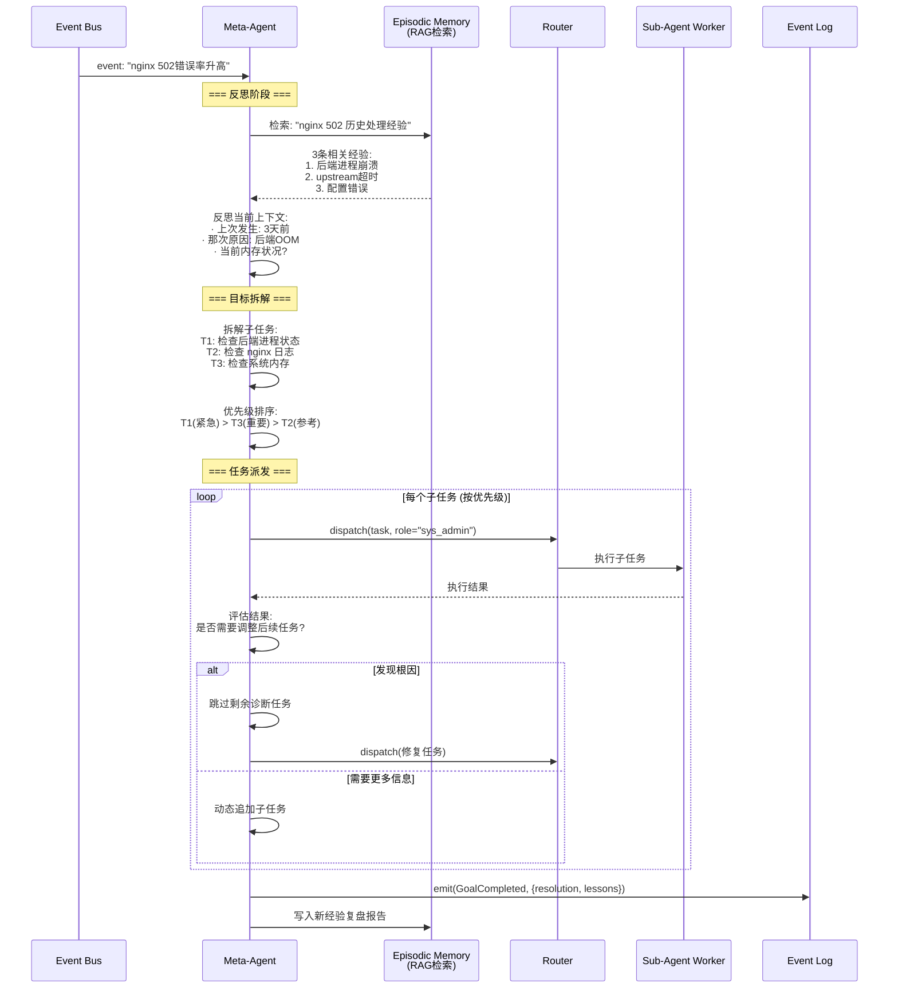
```mermaid
sequenceDiagram
    participant EB as Event Bus
    participant META as Meta-Agent
    participant EM as Episodic Memory<br/>(RAG检索)
    participant ROUTER as Router
    participant WORKER as Sub-Agent Worker
    participant EL as Event Log

    EB->>META: event: "nginx 502错误率升高"

    Note over META: === 反思阶段 ===
    META->>EM: 检索: "nginx 502 历史处理经验"
    EM-->>META: 3条相关经验:<br/>1. 后端进程崩溃<br/>2. upstream超时<br/>3. 配置错误

    META->>META: 反思当前上下文:<br/>· 上次发生: 3天前<br/>· 那次原因: 后端OOM<br/>· 当前内存状况?

    Note over META: === 目标拆解 ===
    META->>META: 拆解子任务:<br/>T1: 检查后端进程状态<br/>T2: 检查 nginx 日志<br/>T3: 检查系统内存

    META->>META: 优先级排序:<br/>T1(紧急) > T3(重要) > T2(参考)

    Note over META: === 任务派发 ===
    loop 每个子任务 (按优先级)
        META->>ROUTER: dispatch(task, role="sys_admin")
        ROUTER->>WORKER: 执行子任务
        WORKER-->>META: 执行结果

        META->>META: 评估结果:<br/>是否需要调整后续任务?

        alt 发现根因
            META->>META: 跳过剩余诊断任务
            META->>ROUTER: dispatch(修复任务)
        else 需要更多信息
            META->>META: 动态追加子任务
        end
    end

    META->>EL: emit(GoalCompleted, {resolution, lessons})
    META->>EM: 写入新经验复盘报告
```

### 1.4 核心接口

```typescript
// workspace/agents/meta_agent.ts
interface MetaAgent {
  // 目标管理
  acceptGoal(goal: Goal): Promise<TaskTree>;
  decomposeGoal(goal: Goal): Promise<SubTask[]>;
  prioritize(tasks: SubTask[]): SubTask[];

  // 反思与策略
  reflect(context: ReflectionContext): Promise<ReflectionResult>;
  generateRetryStrategy(failure: TaskFailure): Promise<RetryStrategy>;

  // 调度
  dispatch(task: SubTask): Promise<void>;
  collectFeedback(taskId: string, result: TaskResult): void;

  // 自省
  evaluatePerformance(window: TimeWindow): PerformanceReport;
  triggerEvolution(painPoint: PainPoint): void;
  dailySummarize(): Promise<DailySummary>;
}

interface SubTask {
  task_id: string;
  parent_goal_id: string;
  description: string;
  target_role: "sys_admin" | "developer" | "researcher";
  priority: number;           // 1=最高
  estimated_complexity: "low" | "medium" | "high" | "epic";
  dependencies: string[];     // 前置任务 ID
  context_files: string[];
  success_criteria: string;
}
```

---

## 2. Router 路由控制器

### 2.1 模块职责

接收 Meta-Agent 派发的子任务，选择合适的 Agent 角色（sys_admin / developer / researcher）、LLM 模型（Haiku / Sonnet）和工具集。

### 2.2 内部架构

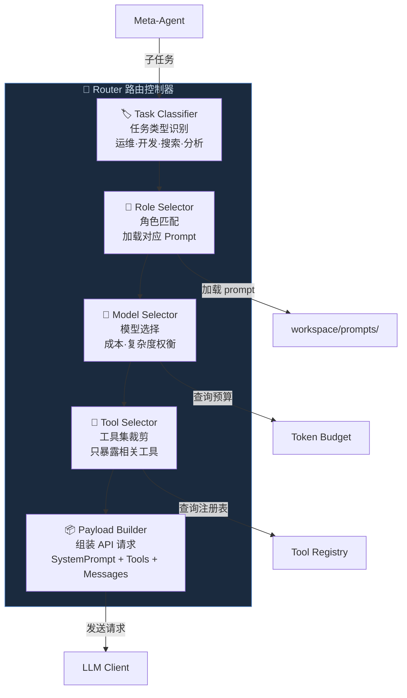
```mermaid
flowchart TB
    subgraph Router["🔀 Router 路由控制器"]
        direction TB
        CLASSIFY["🏷️ Task Classifier<br/>任务类型识别<br/>运维·开发·搜索·分析"]
        ROLE_SEL["👤 Role Selector<br/>角色匹配<br/>加载对应 Prompt"]
        MODEL_SEL["🤖 Model Selector<br/>模型选择<br/>成本·复杂度权衡"]
        TOOL_SEL["🔧 Tool Selector<br/>工具集裁剪<br/>只暴露相关工具"]
        PAYLOAD["📦 Payload Builder<br/>组装 API 请求<br/>SystemPrompt + Tools + Messages"]
    end

    META["Meta-Agent"] -->|"子任务"| CLASSIFY
    CLASSIFY --> ROLE_SEL
    ROLE_SEL -->|"加载 prompt"| PROMPTS["workspace/prompts/"]
    ROLE_SEL --> MODEL_SEL
    MODEL_SEL -->|"查询预算"| BUDGET["Token Budget"]
    MODEL_SEL --> TOOL_SEL
    TOOL_SEL -->|"查询注册表"| REGISTRY["Tool Registry"]
    TOOL_SEL --> PAYLOAD
    PAYLOAD -->|"发送请求"| LLM["LLM Client"]

    style Router fill:#1a2a3e,stroke:#5588cc,color:#ccddee
```

### 2.3 路由决策时序

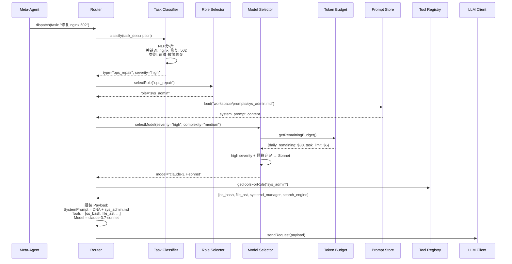
```mermaid
sequenceDiagram
    participant META as Meta-Agent
    participant RT as Router
    participant CLASS as Task Classifier
    participant ROLE as Role Selector
    participant MODEL as Model Selector
    participant BUDGET as Token Budget
    participant PROMPT as Prompt Store
    participant TOOL as Tool Registry
    participant LLM as LLM Client

    META->>RT: dispatch(task: "修复 nginx 502")

    RT->>CLASS: classify(task_description)
    CLASS->>CLASS: NLP分析:<br/>关键词: nginx, 修复, 502<br/>类别: 运维·故障修复
    CLASS-->>RT: type="ops_repair", severity="high"

    RT->>ROLE: selectRole("ops_repair")
    ROLE-->>RT: role="sys_admin"
    RT->>PROMPT: load("workspace/prompts/sys_admin.md")
    PROMPT-->>RT: system_prompt_content

    RT->>MODEL: selectModel(severity="high", complexity="medium")
    MODEL->>BUDGET: getRemainingBudget()
    BUDGET-->>MODEL: {daily_remaining: $30, task_limit: $5}
    MODEL->>MODEL: high severity + 预算充足 → Sonnet
    MODEL-->>RT: model="claude-3.7-sonnet"

    RT->>TOOL: getToolsForRole("sys_admin")
    TOOL-->>RT: [os_bash, file_ast, systemd_manager, search_engine]

    RT->>RT: 组装 Payload:<br/>SystemPrompt = DNA + sys_admin.md<br/>Tools = [os_bash, file_ast, ...]<br/>Model = claude-3.7-sonnet

    RT->>LLM: sendRequest(payload)
```

### 2.4 路由规则矩阵

| 任务类型 | 默认角色 | 默认模型 | 工具集 |
|----------|----------|----------|--------|
| 运维诊断 | sys_admin | Sonnet | os_bash, systemd, search |
| 代码修复 | developer | Sonnet | file_ast, os_bash, git, CLI Adapter |
| 信息搜索 | researcher | Haiku | search_engine, headless_browser |
| 日常巡检 | sys_admin | Haiku | os_bash, systemd |
| 安全审计 | sys_admin | Sonnet | os_bash, search, file_ast |
| 自我优化 | developer | Sonnet | file_ast, register_tool, update_prompt |

---

## 3. LLM Client 多模型客户端

### 3.1 模块职责

封装所有 LLM API 调用，支持 Anthropic / OpenAI / Google 多模型路由，实现 Prompt Caching、自动重试、流式输出解析。

### 3.2 内部架构

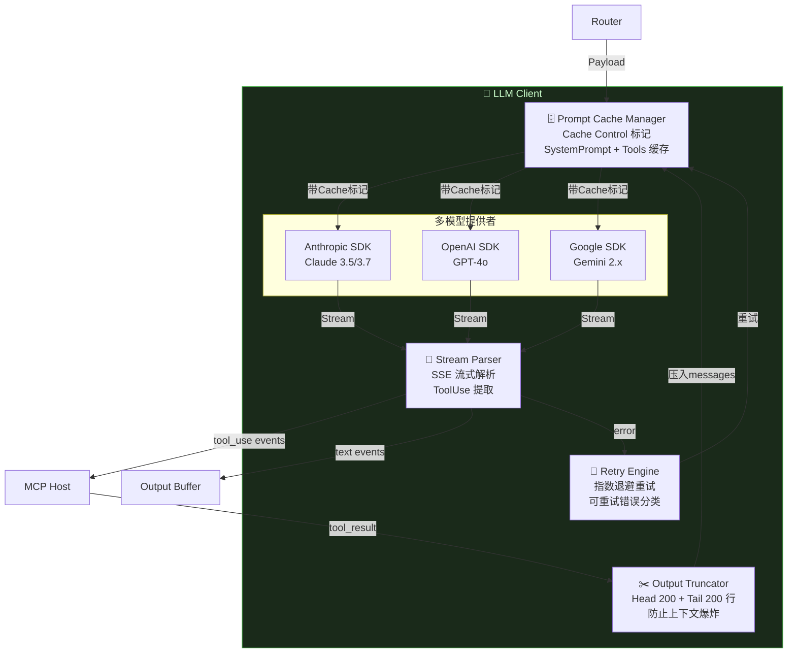
```mermaid
flowchart TB
    subgraph LLMClient["🤖 LLM Client"]
        direction TB
        CACHE["🗄️ Prompt Cache Manager<br/>Cache Control 标记<br/>SystemPrompt + Tools 缓存"]
        RETRY["🔄 Retry Engine<br/>指数退避重试<br/>可重试错误分类"]
        STREAM["📡 Stream Parser<br/>SSE 流式解析<br/>ToolUse 提取"]
        TRUNCATE["✂️ Output Truncator<br/>Head 200 + Tail 200 行<br/>防止上下文爆炸"]

        subgraph Providers["多模型提供者"]
            ANTHRO["Anthropic SDK<br/>Claude 3.5/3.7"]
            OPENAI["OpenAI SDK<br/>GPT-4o"]
            GOOGLE["Google SDK<br/>Gemini 2.x"]
        end
    end

    ROUTER["Router"] -->|"Payload"| CACHE
    CACHE -->|"带Cache标记"| ANTHRO & OPENAI & GOOGLE
    ANTHRO & OPENAI & GOOGLE -->|"Stream"| STREAM
    STREAM -->|"tool_use events"| MCP["MCP Host"]
    STREAM -->|"text events"| OUTPUT["Output Buffer"]
    STREAM -->|"error"| RETRY
    RETRY -->|"重试"| CACHE

    MCP -->|"tool_result"| TRUNCATE
    TRUNCATE -->|"压入messages"| CACHE

    style LLMClient fill:#1a2a1a,stroke:#44aa44,color:#ccffcc
```

### 3.3 Prompt Caching 与请求时序

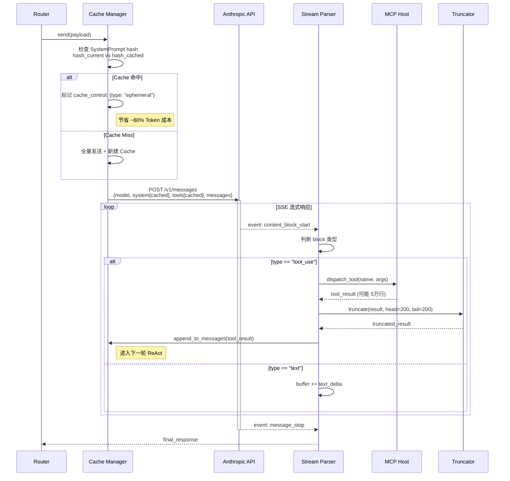
```mermaid
sequenceDiagram
    participant RT as Router
    participant CACHE as Cache Manager
    participant API as Anthropic API
    participant STREAM as Stream Parser
    participant MCP as MCP Host
    participant TRUNC as Truncator

    RT->>CACHE: send(payload)

    CACHE->>CACHE: 检查 SystemPrompt hash<br/>hash_current vs hash_cached
    alt Cache 命中
        CACHE->>CACHE: 标记 cache_control: {type: "ephemeral"}
        Note right of CACHE: 节省 ~80% Token 成本
    else Cache Miss
        CACHE->>CACHE: 全量发送 + 新建 Cache
    end

    CACHE->>API: POST /v1/messages<br/>{model, system[cached], tools[cached], messages}
    activate API

    loop SSE 流式响应
        API-->>STREAM: event: content_block_start
        STREAM->>STREAM: 判断 block 类型

        alt type == "tool_use"
            STREAM->>MCP: dispatch_tool(name, args)
            MCP-->>STREAM: tool_result (可能 5万行)
            STREAM->>TRUNC: truncate(result, head=200, tail=200)
            TRUNC-->>STREAM: truncated_result
            STREAM->>CACHE: append_to_messages(tool_result)
            Note right of CACHE: 进入下一轮 ReAct
        else type == "text"
            STREAM->>STREAM: buffer += text_delta
        end
    end

    API-->>STREAM: event: message_stop
    deactivate API
    STREAM-->>RT: final_response
```

---

## 4. 三维记忆系统

### 4.1 Working Memory 短期记忆

当前任务的对话上下文，采用滑动窗口 + 自动截断机制。


```mermaid
flowchart TB
    subgraph WM["📋 Working Memory"]
        direction TB
        WINDOW["滑动窗口<br/>最新 N 轮对话保留"]
        TOKEN_CTR["Token 计数器<br/>实时统计上下文长度"]
        THRESHOLD["阈值检测器<br/>80K Token → 触发 GC"]
    end

    LLM["LLM Client"] -->|"每轮对话"| WINDOW
    WINDOW --> TOKEN_CTR
    TOKEN_CTR -->|"> 80K"| GC["GC Engine"]
    GC -->|"压缩后回注"| WINDOW

    style WM fill:#1a2a3e,stroke:#5588cc
```

### 4.2 Episodic Memory 长期经验库

每次 Agent 成功解决难题，强制生成复盘报告并向量化存储。遇到类似问题时优先检索经验库。


```mermaid
flowchart TB
    subgraph EM["📚 Episodic Memory"]
        direction TB
        REPORTER["复盘报告生成器<br/>LLM 自动生成 Markdown"]
        EMBEDDER["向量化引擎<br/>text → embedding(dim=1536)"]
        INDEXER["索引管理器<br/>ChromaDB upsert/delete"]
        RETRIEVER["RAG 检索器<br/>相似度搜索 + 重排"]
        DEDUP["去重器<br/>防止重复经验"]
    end

    TASK_DONE["任务完成"] -->|"成功案例"| REPORTER
    REPORTER -->|"Markdown 复盘"| EMBEDDER
    EMBEDDER -->|"向量"| INDEXER
    INDEXER -->|"写入"| CHROMA["ChromaDB"]

    QUERY["新问题查询"] --> RETRIEVER
    RETRIEVER -->|"检索"| CHROMA
    CHROMA -->|"Top-K 结果"| RETRIEVER
    RETRIEVER -->|"注入上下文"| LLM["LLM Client"]

    style EM fill:#2a1a3e,stroke:#8855cc
```

### 4.3 经验写入与检索时序

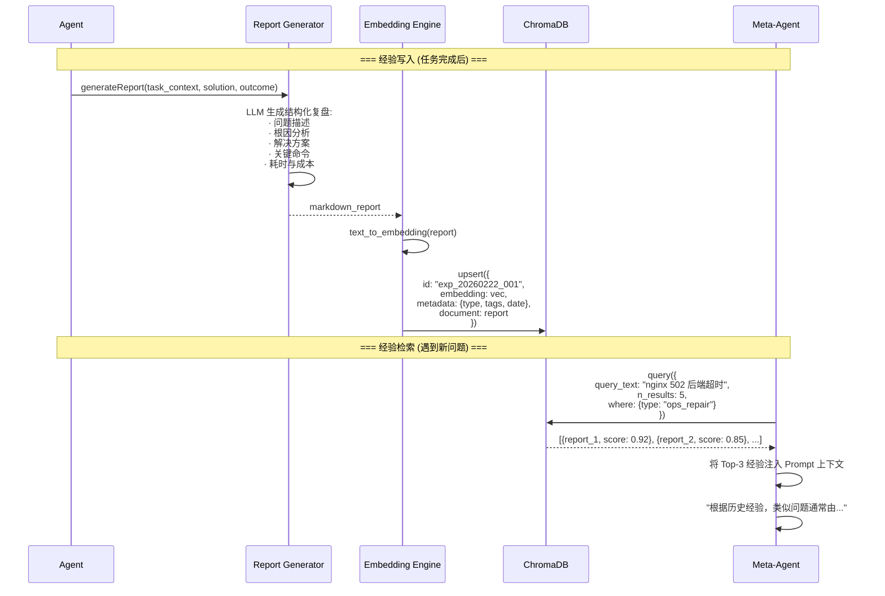
```mermaid
sequenceDiagram
    participant AGENT as Agent
    participant REPORT as Report Generator
    participant EMBED as Embedding Engine
    participant CHROMA as ChromaDB
    participant META as Meta-Agent

    Note over AGENT,META: === 经验写入 (任务完成后) ===

    AGENT->>REPORT: generateReport(task_context, solution, outcome)
    REPORT->>REPORT: LLM 生成结构化复盘:<br/>· 问题描述<br/>· 根因分析<br/>· 解决方案<br/>· 关键命令<br/>· 耗时与成本
    REPORT-->>EMBED: markdown_report

    EMBED->>EMBED: text_to_embedding(report)
    EMBED->>CHROMA: upsert({<br/>  id: "exp_20260222_001",<br/>  embedding: vec,<br/>  metadata: {type, tags, date},<br/>  document: report<br/>})

    Note over AGENT,META: === 经验检索 (遇到新问题) ===

    META->>CHROMA: query({<br/>  query_text: "nginx 502 后端超时",<br/>  n_results: 5,<br/>  where: {type: "ops_repair"}<br/>})
    CHROMA-->>META: [{report_1, score: 0.92}, {report_2, score: 0.85}, ...]

    META->>META: 将 Top-3 经验注入 Prompt 上下文
    META->>META: "根据历史经验，类似问题通常由..."
```

### 4.4 Semantic Graph 系统拓扑图

Agent 扫描服务器后自己绘制的"地图"，记录目录结构、端口占用、服务依赖关系。


```mermaid
flowchart TB
    subgraph SG["🗺️ Semantic Graph"]
        direction TB
        SCANNER["拓扑扫描器<br/>自动发现服务·端口·依赖"]
        GRAPH_DB["图存储<br/>JSON-Graph / Neo4j"]
        QUERY_ENG["图查询引擎<br/>路径查找·依赖分析"]
        VISUALIZER["拓扑可视化<br/>D3.js / Mermaid 输出"]
    end

    AGENT["Agent os_bash"] -->|"ss -tuln<br/>systemctl list-units<br/>docker ps"| SCANNER
    SCANNER -->|"构建图谱"| GRAPH_DB
    META["Meta-Agent"] -->|"查询依赖"| QUERY_ENG
    QUERY_ENG -->|"检索"| GRAPH_DB

    style SG fill:#1a2a2a,stroke:#44aaaa
```

### 4.5 拓扑扫描与更新时序

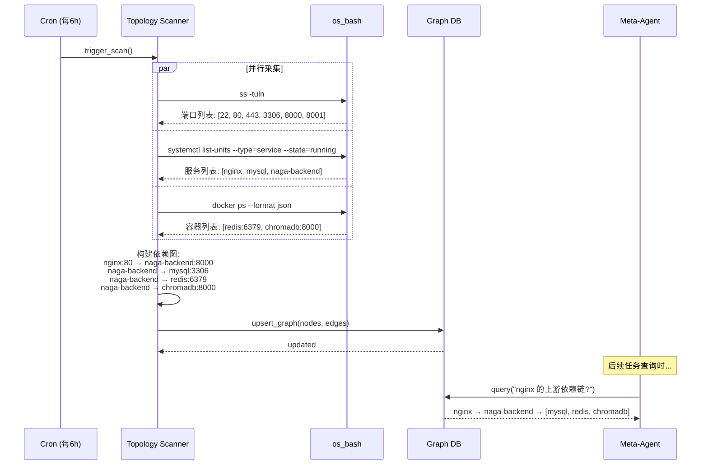
```mermaid
sequenceDiagram
    participant CRON as Cron (每6h)
    participant SCAN as Topology Scanner
    participant BASH as os_bash
    participant GRAPH as Graph DB
    participant META as Meta-Agent

    CRON->>SCAN: trigger_scan()

    par 并行采集
        SCAN->>BASH: ss -tuln
        BASH-->>SCAN: 端口列表: [22, 80, 443, 3306, 8000, 8001]
    and
        SCAN->>BASH: systemctl list-units --type=service --state=running
        BASH-->>SCAN: 服务列表: [nginx, mysql, naga-backend]
    and
        SCAN->>BASH: docker ps --format json
        BASH-->>SCAN: 容器列表: [redis:6379, chromadb:8000]
    end

    SCAN->>SCAN: 构建依赖图:<br/>nginx:80 → naga-backend:8000<br/>naga-backend → mysql:3306<br/>naga-backend → redis:6379<br/>naga-backend → chromadb:8000

    SCAN->>GRAPH: upsert_graph(nodes, edges)
    GRAPH-->>SCAN: updated

    Note over META: 后续任务查询时...
    META->>GRAPH: query("nginx 的上游依赖链?")
    GRAPH-->>META: nginx → naga-backend → [mysql, redis, chromadb]
```

---

## 5. GC Engine 上下文垃圾回收

### 5.1 模块职责

当 Working Memory 的 Token 数超过阈值时，自动压缩历史、归档到长期记忆、瘦身当前上下文。

### 5.2 GC 策略架构


```mermaid
flowchart TB
    subgraph GCEngine["♻️ GC Engine"]
        direction TB
        DETECTOR["阈值检测器<br/>Token > 80K → 触发"]
        SELECTOR["GC 目标选择器<br/>选择哪些对话轮次回收"]
        COMPRESSOR["压缩器<br/>调用 Haiku 生成摘要"]
        ARCHIVER["归档器<br/>写入 ChromaDB + SQLite"]
        INJECTOR["摘要注入器<br/>压缩后注入上下文头部"]
    end

    WM["Working Memory"] -->|"Token > 80K"| DETECTOR
    DETECTOR --> SELECTOR
    SELECTOR -->|"选中前50轮"| COMPRESSOR
    COMPRESSOR -->|"300字摘要"| ARCHIVER
    ARCHIVER --> INJECTOR
    INJECTOR -->|"splice + unshift"| WM

    style GCEngine fill:#2a2a1a,stroke:#aaaa44
```

### 5.3 GC 执行详细时序

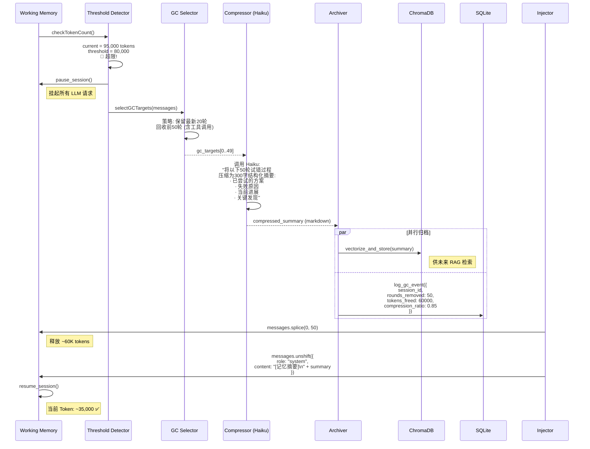
```mermaid
sequenceDiagram
    participant WM as Working Memory
    participant DET as Threshold Detector
    participant SEL as GC Selector
    participant COMP as Compressor (Haiku)
    participant ARCH as Archiver
    participant CHROMA as ChromaDB
    participant SQL as SQLite
    participant INJ as Injector

    WM->>DET: checkTokenCount()
    DET->>DET: current = 95,000 tokens<br/>threshold = 80,000<br/>🔴 超限!

    DET->>WM: pause_session()
    Note right of WM: 挂起所有 LLM 请求

    DET->>SEL: selectGCTargets(messages)
    SEL->>SEL: 策略: 保留最新20轮<br/>回收前50轮 (含工具调用)
    SEL-->>COMP: gc_targets[0..49]

    COMP->>COMP: 调用 Haiku:<br/>"将以下50轮试错过程<br/>压缩为300字结构化摘要:<br/>· 已尝试的方案<br/>· 失败原因<br/>· 当前进展<br/>· 关键发现"
    COMP-->>ARCH: compressed_summary (markdown)

    par 并行归档
        ARCH->>CHROMA: vectorize_and_store(summary)
        Note right of CHROMA: 供未来 RAG 检索
    and
        ARCH->>SQL: log_gc_event({<br/>  session_id,<br/>  rounds_removed: 50,<br/>  tokens_freed: 60000,<br/>  compression_ratio: 0.85<br/>})
    end

    INJ->>WM: messages.splice(0, 50)
    Note right of WM: 释放 ~60K tokens
    INJ->>WM: messages.unshift({<br/>  role: "system",<br/>  content: "[记忆摘要]\n" + summary<br/>})

    WM->>WM: resume_session()
    Note right of WM: 当前 Token: ~35,000 ✅
```

---

## 6. State Machine 与 Lease/Fencing

### 6.1 状态机详细转移图

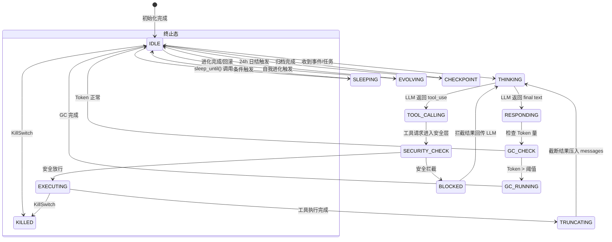
```mermaid
stateDiagram-v2
    [*] --> IDLE: 初始化完成

    IDLE --> THINKING: 收到事件/任务
    THINKING --> TOOL_CALLING: LLM 返回 tool_use
    THINKING --> RESPONDING: LLM 返回 final text
    TOOL_CALLING --> SECURITY_CHECK: 工具请求进入安全层
    SECURITY_CHECK --> EXECUTING: 安全放行
    SECURITY_CHECK --> BLOCKED: 安全拦截
    BLOCKED --> THINKING: 拦截结果回传 LLM
    EXECUTING --> TRUNCATING: 工具执行完成
    TRUNCATING --> THINKING: 截断结果压入 messages
    RESPONDING --> GC_CHECK: 检查 Token 量
    GC_CHECK --> GC_RUNNING: Token > 阈值
    GC_CHECK --> IDLE: Token 正常
    GC_RUNNING --> IDLE: GC 完成

    IDLE --> SLEEPING: sleep_until() 调用
    SLEEPING --> IDLE: 条件触发

    IDLE --> EVOLVING: 自我进化触发
    EVOLVING --> IDLE: 进化完成/回滚

    IDLE --> CHECKPOINT: 24h 日结触发
    CHECKPOINT --> IDLE: 归档完成

    state "终止态" as Terminal {
        IDLE --> KILLED: KillSwitch
        EXECUTING --> KILLED: KillSwitch
    }
```

### 6.2 Lease/Fencing 防脑裂时序

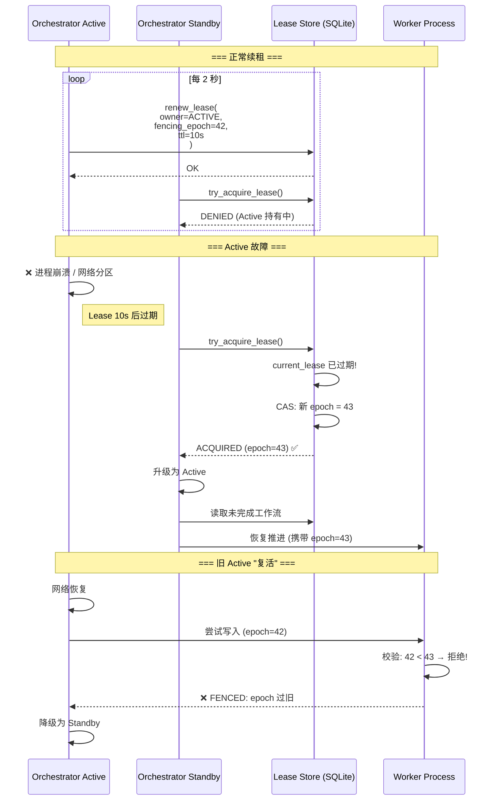
```mermaid
sequenceDiagram
    participant ACTIVE as Orchestrator Active
    participant STANDBY as Orchestrator Standby
    participant LEASE as Lease Store (SQLite)
    participant WORKER as Worker Process

    Note over ACTIVE,WORKER: === 正常续租 ===

    loop 每 2 秒
        ACTIVE->>LEASE: renew_lease(<br/>  owner=ACTIVE,<br/>  fencing_epoch=42,<br/>  ttl=10s<br/>)
        LEASE-->>ACTIVE: OK

        STANDBY->>LEASE: try_acquire_lease()
        LEASE-->>STANDBY: DENIED (Active 持有中)
    end

    Note over ACTIVE,WORKER: === Active 故障 ===
    ACTIVE->>ACTIVE: ❌ 进程崩溃 / 网络分区
    Note right of ACTIVE: Lease 10s 后过期

    STANDBY->>LEASE: try_acquire_lease()
    LEASE->>LEASE: current_lease 已过期!
    LEASE->>LEASE: CAS: 新 epoch = 43
    LEASE-->>STANDBY: ACQUIRED (epoch=43) ✅

    STANDBY->>STANDBY: 升级为 Active
    STANDBY->>LEASE: 读取未完成工作流
    STANDBY->>WORKER: 恢复推进 (携带 epoch=43)

    Note over ACTIVE,WORKER: === 旧 Active "复活" ===
    ACTIVE->>ACTIVE: 网络恢复
    ACTIVE->>WORKER: 尝试写入 (epoch=42)
    WORKER->>WORKER: 校验: 42 < 43 → 拒绝!
    WORKER-->>ACTIVE: ❌ FENCED: epoch 过旧
    ACTIVE->>ACTIVE: 降级为 Standby
```

---

## 7. Daily Checkpoint 日结归档

### 7.1 日结流程时序

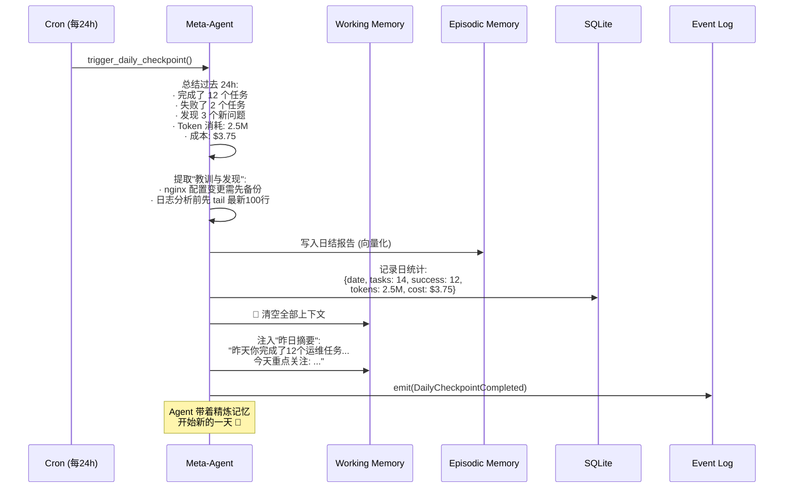
```mermaid
sequenceDiagram
    participant CRON as Cron (每24h)
    participant META as Meta-Agent
    participant WM as Working Memory
    participant EM as Episodic Memory
    participant SQL as SQLite
    participant EL as Event Log

    CRON->>META: trigger_daily_checkpoint()

    META->>META: 总结过去 24h:<br/>· 完成了 12 个任务<br/>· 失败了 2 个任务<br/>· 发现 3 个新问题<br/>· Token 消耗: 2.5M<br/>· 成本: $3.75
    META->>META: 提取"教训与发现":<br/>· nginx 配置变更需先备份<br/>· 日志分析前先 tail 最新100行

    META->>EM: 写入日结报告 (向量化)

    META->>SQL: 记录日统计:<br/>{date, tasks: 14, success: 12,<br/> tokens: 2.5M, cost: $3.75}

    META->>WM: 🧹 清空全部上下文
    META->>WM: 注入"昨日摘要":<br/>"昨天你完成了12个运维任务...<br/>今天重点关注: ..."

    META->>EL: emit(DailyCheckpointCompleted)

    Note over META: Agent 带着精炼记忆<br/>开始新的一天 🌅
```

---

## 8. 大脑层模块交互全景

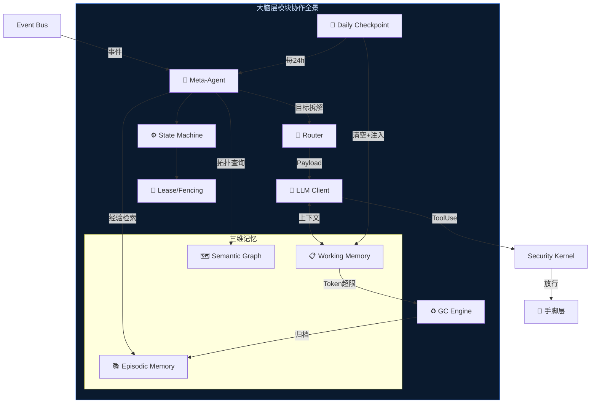
```mermaid
flowchart TB
    subgraph Brain["大脑层模块协作全景"]
        META["👑 Meta-Agent"]
        RT["🔀 Router"]
        LLM["🤖 LLM Client"]

        subgraph Memory["三维记忆"]
            WM["📋 Working Memory"]
            EM["📚 Episodic Memory"]
            SG["🗺️ Semantic Graph"]
        end

        GC["♻️ GC Engine"]
        SM["⚙️ State Machine"]
        LF["🔐 Lease/Fencing"]
        DC["📅 Daily Checkpoint"]
    end

    %% 认知流
    EB["Event Bus"] -->|"事件"| META
    META -->|"目标拆解"| RT
    RT -->|"Payload"| LLM
    LLM -->|"ToolUse"| SEC["Security Kernel"]
    SEC -->|"放行"| TOOLS["🦾 手脚层"]

    %% 记忆流
    LLM <-->|"上下文"| WM
    META -->|"经验检索"| EM
    META -->|"拓扑查询"| SG
    WM -->|"Token超限"| GC
    GC -->|"归档"| EM

    %% 状态管理
    SM --> LF
    META --> SM

    %% 日结
    DC -->|"每24h"| META
    DC -->|"清空+注入"| WM

    style Brain fill:#0a1a2e,stroke:#4488ff,color:#cce0ff
```
