# 12 - 手脚层模块详细架构 (Limbs Layer Modules)

> **定位**：手脚层是 Omni-Operator 的执行末端，所有能力以 MCP (Model Context Protocol) 形式挂载，支持热插拔和动态注册。

---

## 1. MCP Host 与 Tool Registry

### 1.1 模块职责

MCP 协议宿主服务端，负责工具的注册/发现/调度/生命周期管理。所有工具统一通过 MCP 协议暴露给 LLM。

### 1.2 内部架构

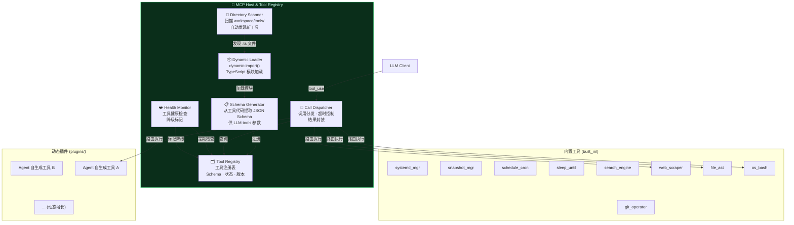

### 1.3 工具注册与热加载时序

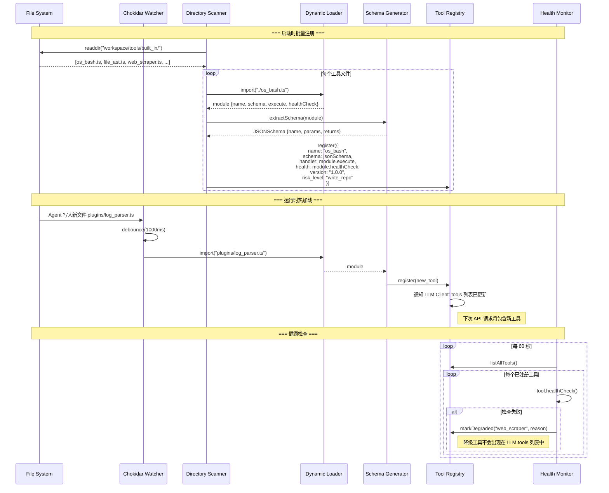

### 1.4 工具标准接口

```typescript
// workspace/tools/tool_interface.ts
interface MCPTool {
  // 元数据
  name: string;
  description: string;
  version: string;
  risk_level: "read_only" | "write_repo" | "deploy" | "secrets" | "self_modify";

  // Schema (自动转为 LLM tools 参数)
  inputSchema: JSONSchema;
  outputSchema: JSONSchema;

  // 执行
  execute(args: Record<string, unknown>, ctx: ToolContext): Promise<ToolResult>;

  // 生命周期
  healthCheck(): Promise<HealthStatus>;
  initialize?(): Promise<void>;
  cleanup?(): Promise<void>;
}

interface ToolContext {
  call_id: string;
  trace_id: string;
  session_id: string;
  fencing_epoch: number;
  timeout_ms: number;
  budget_remaining: number;
  caller_role: string;
}

interface ToolResult {
  success: boolean;
  output: string;             // 可能被截断
  exit_code?: number;
  files_changed?: string[];
  duration_ms: number;
  truncated: boolean;
  raw_length?: number;
}
```

---

## 2. os_bash 系统命令执行器

### 2.1 模块职责

带超时、输出截断、安全校验的 Bash/Shell 命令执行器。Agent 所有系统操作的基础能力。

### 2.2 执行流程架构

```mermaid
flowchart TB
    subgraph OsBash["⌨️ os_bash 工具"]
        direction TB
        VALIDATE["参数校验<br/>命令非空 · 合法字符"]
        SECURITY["安全预检<br/>调用 Regex Firewall"]
        SPAWN["进程管理<br/>child_process.spawn<br/>设定 timeout / cwd / env"]
        STREAM["输出采集<br/>stdout + stderr 实时读取<br/>内存上限 10MB"]
        TRUNCATE["智能截断<br/>Head 200行 + Tail 200行<br/>中间标注 [TRUNCATED N lines]"]
        FORMAT["结果封装<br/>exit_code + truncated_output"]
    end

    LLM["LLM tool_use"] -->|"cmd, timeout, cwd"| VALIDATE
    VALIDATE --> SECURITY
    SECURITY -->|"放行"| SPAWN
    SECURITY -->|"拦截"| ERROR["❌ Security Denied"]
    SPAWN --> STREAM
    STREAM --> TRUNCATE
    TRUNCATE --> FORMAT
    FORMAT -->|"tool_result"| LLM

    style OsBash fill:#1a2a1a,stroke:#44aa44
```

### 2.3 执行与截断时序

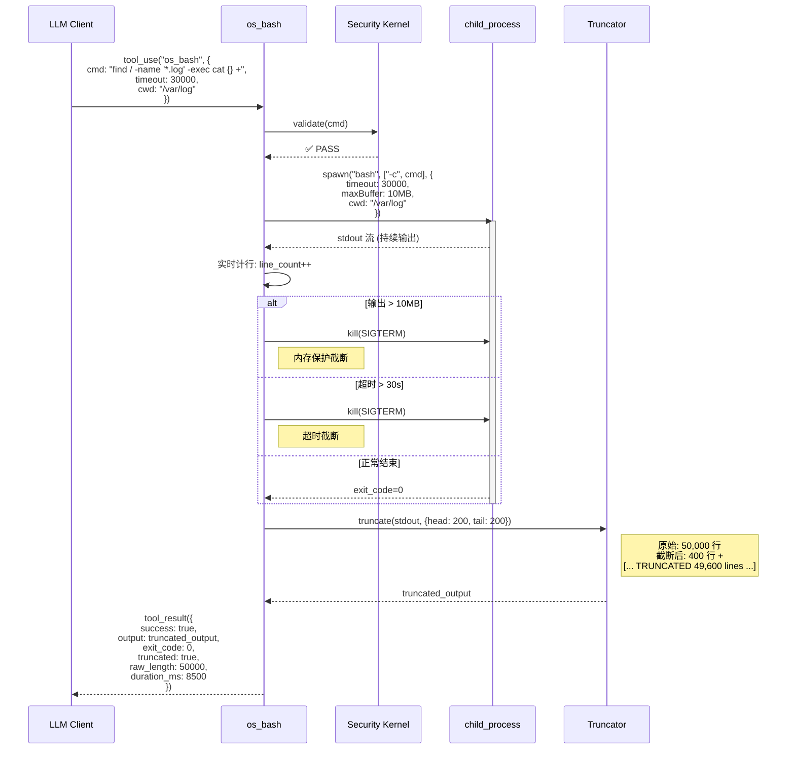

---

## 3. file_ast AST 精确代码编辑器

### 3.1 模块职责

基于 AST（抽象语法树）精准修改代码，而非危险的全量覆盖。支持按函数/类/行范围的精确替换。

### 3.2 编辑流程架构

```mermaid
flowchart TB
    subgraph FileAST["🔧 file_ast 工具"]
        direction TB
        PARSE["AST 解析器<br/>TypeScript: ts-morph<br/>Python: ast / LibCST<br/>Markdown: mdast"]
        LOCATE["定位器<br/>按函数名 · 类名 · 行号<br/>精确定位修改目标"]
        PATCH["补丁引擎<br/>AST 级别精确替换<br/>保持格式化"]
        VALIDATE["变更校验<br/>语法检查 · 类型检查<br/>diff 生成"]
        WRITE["原子写入<br/>tmp写入 → rename<br/>防止部分写入"]
    end

    LLM["LLM tool_use"] -->|"file, target, patch"| PARSE
    PARSE --> LOCATE
    LOCATE --> PATCH
    PATCH --> VALIDATE
    VALIDATE -->|"✅ 语法正确"| WRITE
    VALIDATE -->|"❌ 语法错误"| ERROR["返回错误详情"]
    WRITE --> DIFF["返回 diff 结果"]

    style FileAST fill:#2a2a1a,stroke:#aaaa44
```

### 3.3 精确编辑时序

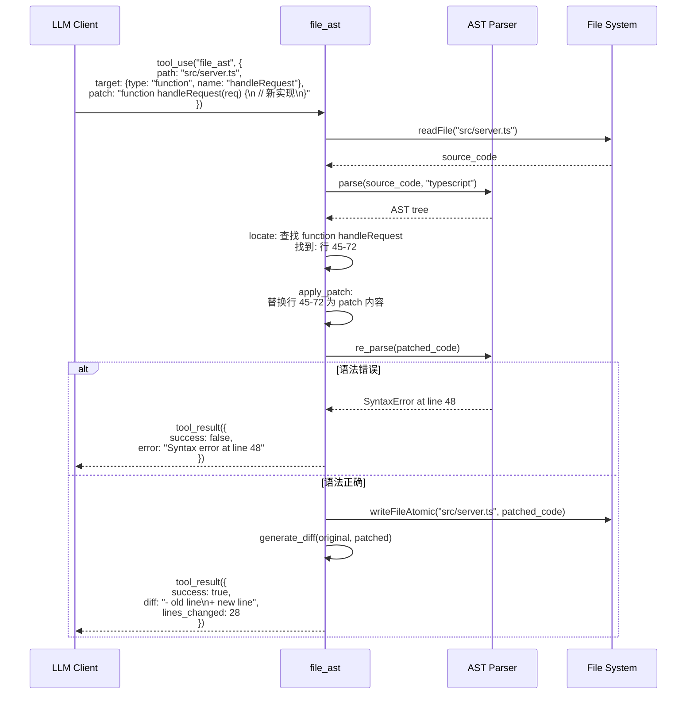

---

## 4. search_engine 搜索引擎

### 4.1 模块职责

接入 Google / Tavily API 搜索最新资讯，帮助 Agent 获取错误解决方案和最新文档。

### 4.2 搜索与结果处理时序

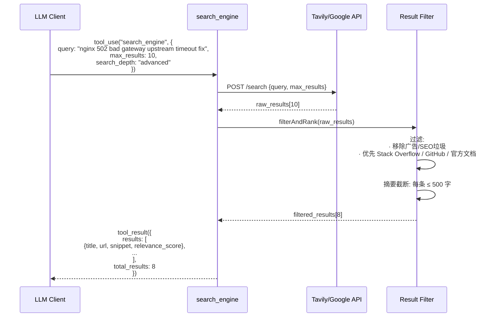

---

## 5. headless_browser 无头浏览器

### 5.1 模块职责

内置 Playwright 驱动的无头浏览器，Agent 可直接浏览官方文档、点击网页按钮、截图取证。

### 5.2 浏览器操作时序

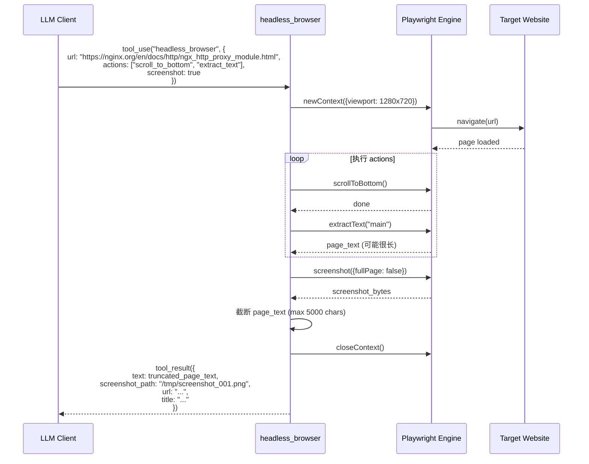

---

## 6. sleep_until / schedule_cron 时空控制工具

### 6.1 模块职责

让 Agent 能够挂起自身等待特定条件或时间，以及设定定期巡检任务。这是长程自主运行的关键能力。

### 6.2 条件休眠架构

```mermaid
flowchart TB
    subgraph Chronos["⏰ 时空控制工具"]
        direction TB
        subgraph SleepUntil["sleep_until"]
            S_TIME["时间条件<br/>sleep_until('2026-03-01 08:00')"]
            S_EVENT["事件条件<br/>sleep_until('log.error出现')"]
            S_METRIC["指标条件<br/>sleep_until('CPU > 90%')"]
            S_COMBO["组合条件<br/>sleep_until('Error OR 30min')"]
        end

        subgraph Cron["schedule_cron"]
            C_PATROL["巡检任务<br/>'0 */6 * * *' 每6h"]
            C_BACKUP["备份任务<br/>'0 3 * * *' 每天3点"]
            C_HEALTH["健康检查<br/>'*/5 * * * *' 每5min"]
        end

        WATCHER["条件监控器<br/>EventBus 订阅 + 轮询"]
    end

    S_EVENT -->|"订阅"| EB["Event Bus"]
    S_METRIC -->|"轮询"| WD["Watchdog Metrics"]
    WATCHER -->|"条件满足"| WAKE["唤醒 Agent"]
    C_PATROL & C_BACKUP & C_HEALTH -->|"定时触发"| EB

    style Chronos fill:#1a1a2e,stroke:#6666ff
```

### 6.3 条件休眠时序

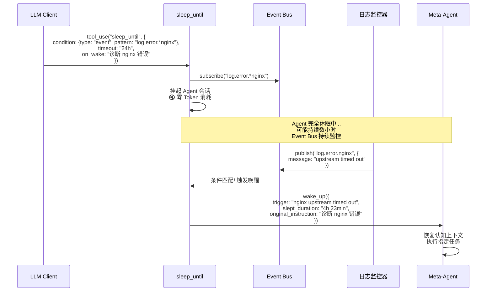

---

## 7. Self-Evolution 自我进化工具集

### 7.1 模块职责

允许 Agent 读取/修改子 Agent 的提示词，以及自己编写新工具并注册。

### 7.2 自我进化工具架构

```mermaid
flowchart TB
    subgraph SelfEvo["🧬 自我进化工具集"]
        direction TB
        READ_P["📖 read_my_prompt<br/>读取指定角色的 Prompt"]
        UPDATE_P["✏️ update_my_prompt<br/>修改 Prompt 内容"]
        REG_TOOL["🔌 register_new_tool<br/>Agent 编写并注册新工具"]

        subgraph SafeGuards["安全护栏"]
            DNA_CHECK["DNA 保护<br/>禁止修改 immutable_dna.md"]
            DIFF_REVIEW["变更审查<br/>修改前后 diff 记录"]
            VERSION["版本管理<br/>Git 提交每次变更"]
            ROLLBACK["回滚能力<br/>任何时候可 revert"]
        end
    end

    READ_P -->|"读取"| PROMPTS["workspace/prompts/*.md"]
    UPDATE_P -->|"写入"| PROMPTS
    UPDATE_P -->|"校验"| DNA_CHECK
    UPDATE_P -->|"记录"| DIFF_REVIEW
    UPDATE_P -->|"提交"| VERSION
    REG_TOOL -->|"写入"| PLUGINS["workspace/tools/plugins/"]
    REG_TOOL -->|"触发"| LOADER["MCP Dynamic Loader"]

    style SelfEvo fill:#2e1a2e,stroke:#aa44aa
```

### 7.3 Prompt 修改时序

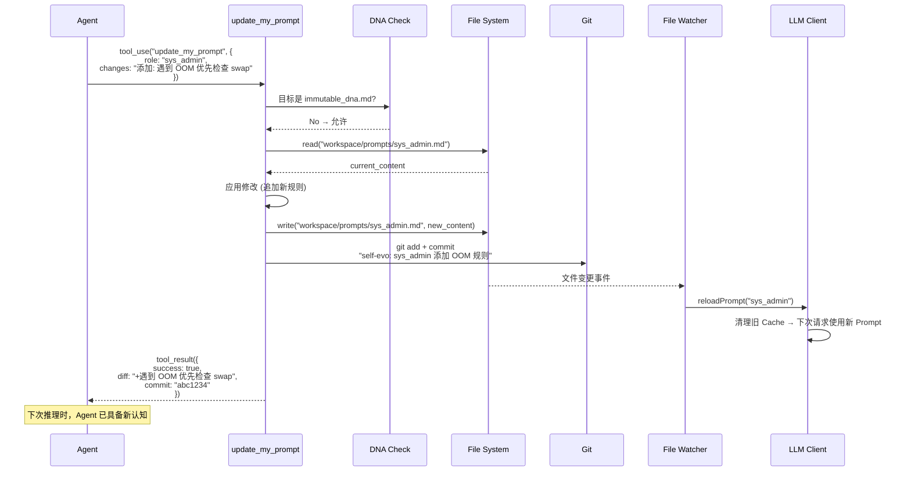

### 7.4 动态工具注册时序

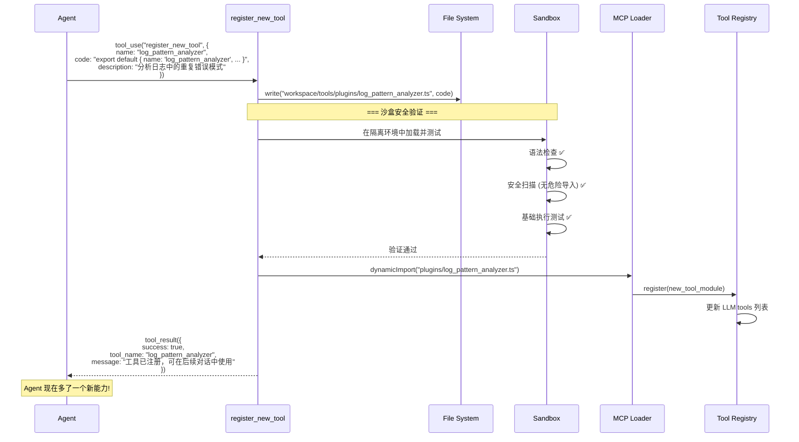

---

## 8. CLI Adapter 外部 Agent CLI 适配层

### 8.1 模块职责

统一封装 Codex CLI / Claude Code / Gemini CLI 的调用接口，包含选择策略、实时监控、停滞检测。承接现有 `autonomous/tools/cli_adapter.py` 架构。

### 8.2 CLI 适配层架构

```mermaid
flowchart TB
    subgraph CLILayer["🔗 CLI Adapter Layer"]
        direction TB
        SELECTOR["CLI Selector<br/>选择最优 CLI<br/>可用性·任务匹配·负载"]
        ADAPTER["Unified Adapter<br/>统一接口封装<br/>subprocess 管理"]
        MONITOR["Execution Monitor<br/>实时监控 stdout<br/>停滞检测 · 进度估算"]

        subgraph CLIs["支持的 CLI"]
            CODEX["Codex CLI<br/>codex --full-auto"]
            CLAUDE["Claude Code<br/>claude -p --dangerously-skip-permissions"]
            GEMINI["Gemini CLI<br/>gemini -p"]
        end

        subgraph Monitoring["监控维度"]
            M_STDOUT["stdout 输出流<br/>10s 采样"]
            M_GIT["git status<br/>文件变更检测"]
            M_STALL["停滞检测<br/>5min 无输出告警"]
            M_PROGRESS["进度估算<br/>基于输出模式"]
        end
    end

    DISPATCHER["Dispatcher"] -->|"任务规格"| SELECTOR
    SELECTOR -->|"选择 CLI"| ADAPTER
    ADAPTER -->|"启动进程"| CODEX & CLAUDE & GEMINI
    ADAPTER -->|"启动监控"| MONITOR
    MONITOR --> M_STDOUT & M_GIT & M_STALL & M_PROGRESS

    style CLILayer fill:#2e1a3e,stroke:#8855cc
```

### 8.3 CLI 选择与执行时序

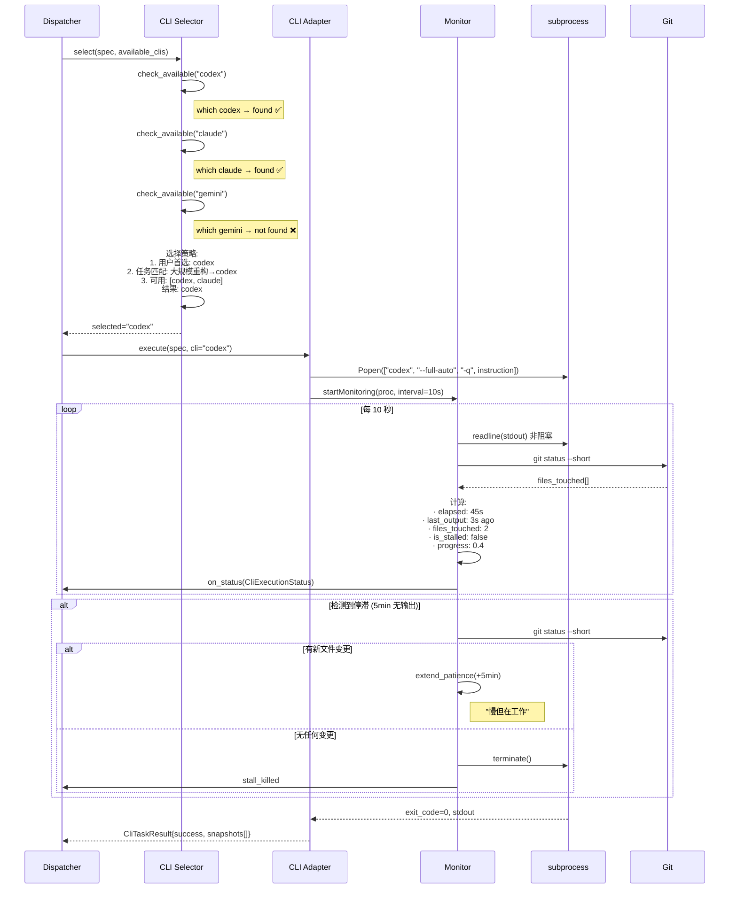

---

## 9. snapshot_manager 快照管理器

### 9.1 模块职责

在每次重大修改前强制创建系统/文件快照，支持一键回滚。

### 9.2 快照操作时序

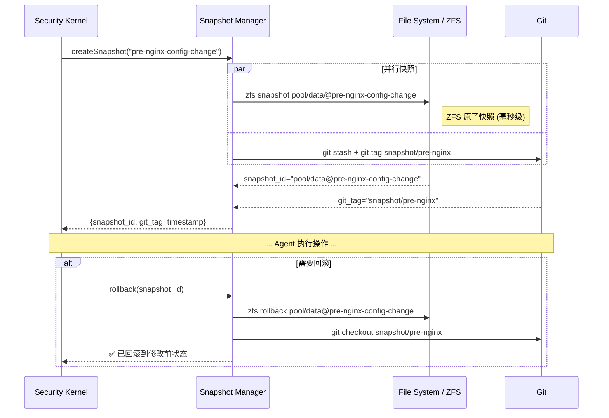

---

## 10. 手脚层模块交互全景

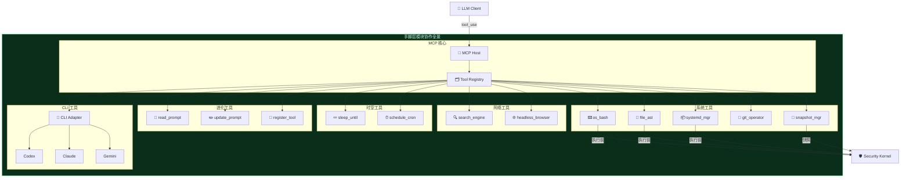
