---
**文档类型**：🎯 目标态架构设计（Target Architecture - Phase 3）
**实施状态**：Phase 3 目标态对齐中（当前为 Phase 0 + 增量桥接混合态）
**最后更新**：2026-02-27
**当前替代方案**：MCP Manager (mcpserver/) + Native Executor (system/) + SubAgent Runtime + NativeExecutionBridge
**实施路径**：Phase 0 (基础 MCP) → Phase 1-2 (增强) → Phase 3 (本文档)
---

# 12 - 手脚层模块详细架构 (Limbs Layer Modules)


> Migration Note (archived/legacy)
> 文中 `autonomous/*` 路径属于历史实现标识；当前实现请优先使用 `agents/*`、`core/*` 与 `config/autonomous_runtime.yaml`。

> **定位**：手脚层是 Embla System 的执行末端，所有能力以 MCP (Model Context Protocol) 形式挂载，支持热插拔和动态注册。
>
> **实施状态**：
> - 🟢 **Phase 0 已实现**：MCP Manager、Native Executor、基础工具集
> - 🟡 **Phase 1-2 规划**：工具热加载、健康检查、降级标记
> - 🔴 **Phase 3 目标态**：完整 MCP Host、动态插件、Sub-Agent Runtime（本文档）
>
> **当前实现映射**：
> - MCP Host → MCP Manager (mcpserver/mcp_manager.py)
> - Tool Registry → MCP Registry (mcpserver/mcp_registry.py)
> - os_bash → Native Executor (system/native_executor.py)
> - file_ast → 无（目标态）
> - Sub-Agent Runtime → `agents/runtime/mini_loop.py`（Phase 3 增量 v1：依赖调度 + 契约协商前置 + 事件锚点）
> - Scaffold Engine → `autonomous/scaffold_engine.py`（archived/legacy）（契约门禁 + 可插拔 verify pipeline + 事务回滚）
> - Execution Bridge → `agents/tool_loop.py`（内生可审计执行桥已落地；语义级能力持续补齐）
> - CLI Adapter → 历史兼容入口（非默认主路径）
>
> **一致性口径（2026-02-27）**：
> - 阶段边界与目标态判定以 `doc/00-omni-operator-architecture.md` 为主。
> - 子代理执行面状态分层以 `doc/task/25-subagent-development-fabric-status-matrix.md` 为主。

---

## 1. MCP Host 与 Tool Registry

### 1.1 模块职责

MCP 协议宿主服务端，负责工具的注册/发现/调度/生命周期管理。所有工具统一通过 MCP 协议暴露给 LLM。

### 1.2 内部架构

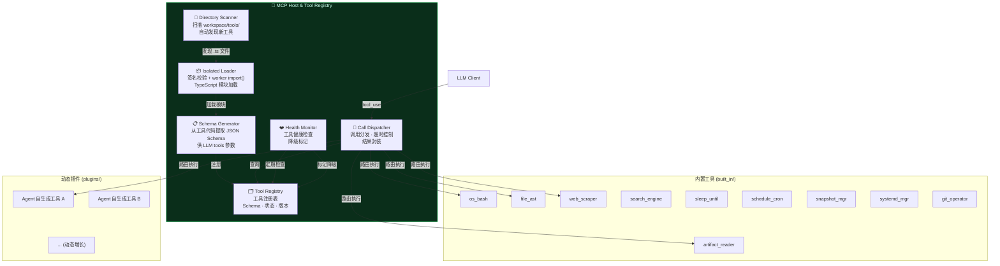

### 1.3 工具注册与热加载时序

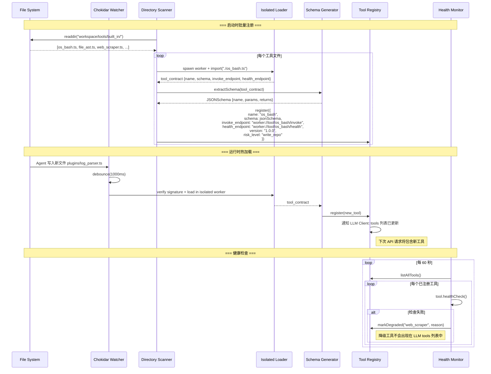

### 1.4 工具标准接口

```typescript
// workspace/tools/tool_interface.ts
interface MCPTool {
  // 元数据
  name: string;
  description: string;
  version: string;
  risk_level: "read_only" | "write_repo" | "deploy" | "secrets" | "self_modify";

  // Schema (自动转为 LLM tools 参数)
  inputSchema: JSONSchema;
  outputSchema: JSONSchema;

  // 执行
  execute(args: Record<string, unknown>, ctx: ToolContext): Promise<ToolResult>;

  // 生命周期
  healthCheck(): Promise<HealthStatus>;
  initialize?(): Promise<void>;
  cleanup?(): Promise<void>;
}

interface ToolContext {
  call_id: string;
  trace_id: string;
  session_id: string;
  fencing_epoch: number;
  timeout_ms: number;
  budget_remaining: number;
  caller_role: string;
  execution_scope: "local" | "global";
  requires_global_mutex?: boolean;
  queue_ticket?: string;
  global_lock_id?: string;
}

interface ToolResult {
  success: boolean;
  output?: string;
  display_preview?: string;
  raw_result_ref?: string;
  exit_code?: number;
  files_changed?: string[];
  duration_ms: number;
  truncated: boolean;
  raw_length?: number;
  total_chars?: number;
  total_lines?: number;
  content_type?: "text/plain" | "application/json" | "text/csv" | "application/xml";
  file_hash?: string;         // 读取类工具返回文件指纹
}
```

并发写保护扩展契约：

```typescript
interface EditFileArgs {
  path: string;
  patch: string;
  original_file_hash: string; // 必填：乐观锁校验
}

interface ReadFileResult extends ToolResult {
  file_hash: string; // MD5 或 Last-Modified 指纹
}

interface ReadArtifactArgs {
  raw_result_ref: string;
  mode: "head_tail" | "jsonpath" | "line_range" | "grep";
  query?: string;            // jsonpath/grep pattern
  start_line?: number;
  end_line?: number;
}

interface ReadArtifactResult extends ToolResult {
  raw_result_ref: string;
  chunk_ref?: string;        // 二次切片引用
}
```

---

## 2. os_bash 系统命令执行器

### 2.1 模块职责

带超时、结构化结果封装、安全校验的 Bash/Shell 命令执行器。Agent 所有系统操作的基础能力。

### 2.2 执行流程架构

```mermaid
flowchart TB
    subgraph OsBash["⌨️ os_bash 工具"]
        direction TB
        VALIDATE["参数校验<br/>命令非空 · 合法字符"]
        SECURITY["安全预检<br/>调用 Policy Firewall"]
        SPAWN["进程管理<br/>child_process.spawn<br/>设定 timeout / cwd / env"]
        STREAM["输出采集<br/>stdout + stderr 实时读取<br/>内存上限 10MB"]
        TRUNCATE["输出封装层<br/>structured-safe preview<br/>artifact ref + metadata"]
        ART_GC["Artifact 生命周期管理<br/>TTL + Quota + LRU + 压缩"]
        FORMAT["结果封装<br/>exit_code + packaged_result"]
    end

    ART_READ["artifact_reader<br/>按 ref 分块读取/检索"]

    LLM["LLM tool_use"] -->|"cmd, timeout, cwd"| VALIDATE
    VALIDATE --> SECURITY
    SECURITY -->|"放行"| SPAWN
    SECURITY -->|"拦截"| ERROR["❌ Security Denied"]
    SPAWN --> STREAM
    STREAM --> TRUNCATE
    TRUNCATE --> ART_GC
    TRUNCATE --> FORMAT
    FORMAT -->|"tool_result"| LLM
    LLM -->|"raw_result_ref"| ART_READ
    ART_READ -->|"chunk/filtered result"| LLM

    style OsBash fill:#1a2a1a,stroke:#44aa44
```

### 2.3 执行与结果封装时序

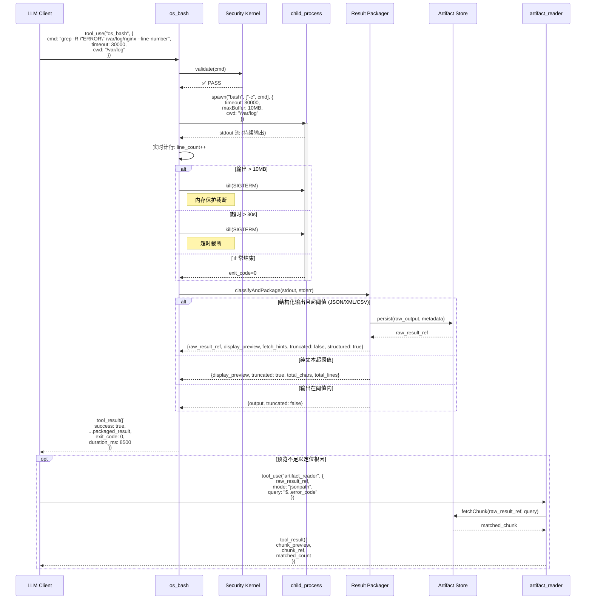

标准结果封装实现规范：

```typescript
interface OsBashResult {
  success: boolean;
  output?: string;
  display_preview?: string;
  raw_result_ref?: string;
  fetch_hints?: string[];
  structured: boolean;
  truncated: boolean;
  total_chars: number;
}

function executeWithResultPackaging(cmd: string): OsBashResult {
  const raw = execSync(cmd, { timeout: 30000 }).toString();
  const structured = looksLikeJson(raw) || looksLikeXml(raw) || looksLikeCsv(raw);

  if (structured && raw.length > 8000) {
    const rawResultRef = persistArtifact(raw, { content_type: detectContentType(raw) });
    return {
      success: true,
      raw_result_ref: rawResultRef,
      display_preview: buildStructuredPreview(raw),
      fetch_hints: ["jsonpath:$..error_code", "jsonpath:$..trace_id", "line_range:1200-1350"],
      structured: true,
      truncated: false,
      total_chars: raw.length
    };
  }

  if (!structured && raw.length > 8000) {
    return {
      success: true,
      display_preview: buildTextPreview(raw, 8000),
      structured: false,
      truncated: true,
      total_chars: raw.length
    };
  }

  return { success: true, output: raw, structured, truncated: false, total_chars: raw.length };
}
```

### 2.4 Artifact Store 生命周期与防爆配额

硬约束：

1. 所有 `raw_result_ref` 必须可被 `artifact_reader` 工具按 `jsonpath/line_range/grep` 方式读取。
2. Artifact Store 必须启用 `global_quota + tenant_quota + session_quota` 三层配额。
3. 默认保留策略：TTL 过期自动清理 + LRU 回收，禁止无限增长。
4. 当磁盘使用率超过高水位（例如 85%）时，系统必须进入降级模式：拒绝新大对象写入并告警。
5. 清理过程必须避开关键系统文件（EventBus/SQLite），并记录审计日志。

参考接口：

```typescript
interface ArtifactStorePolicy {
  global_quota_mb: number;
  session_quota_mb: number;
  ttl_hours: number;
  high_watermark_pct: number;
  low_watermark_pct: number;
}

interface ArtifactReader {
  readByRef(args: ReadArtifactArgs): Promise<ReadArtifactResult>;
}
```

---

## 3. file_ast AST 精确代码编辑器

### 3.1 模块职责

基于 AST（抽象语法树）精准修改代码，而非危险的全量覆盖。支持按函数/类/行范围的精确替换。

### 3.2 编辑流程架构

```mermaid
flowchart TB
    subgraph FileAST["🔧 file_ast 工具"]
        direction TB
        INDEX["分层读取器<br/>skeleton/index/chunk<br/>避免 30k 行全量加载"]
        PARSE["AST 解析器<br/>TypeScript: ts-morph<br/>Python: ast / LibCST<br/>Markdown: mdast"]
        LOCATE["定位器<br/>按函数名 · 类名 · 行号<br/>精确定位修改目标"]
        HASHCHK["乐观锁校验<br/>对比 original_file_hash"]
        REBASE["冲突重基器<br/>语义区域重算 + 最小差异合并"]
        BACKOFF["退避协调器<br/>指数退避 + 抖动 + 最大重试窗口"]
        PATCH["补丁引擎<br/>AST 级别精确替换<br/>保持格式化"]
        VALIDATE["变更校验<br/>语法检查 · 类型检查<br/>diff 生成"]
        WRITE["原子写入<br/>tmp写入 → rename<br/>防止部分写入"]
    end

    LLM["LLM tool_use"] -->|"file, target, patch"| INDEX
    INDEX --> PARSE
    PARSE --> LOCATE
    LOCATE --> HASHCHK
    HASHCHK -->|"✅ hash一致"| PATCH
    HASHCHK -->|"❌ hash冲突"| REBASE
    REBASE -->|"可自动重基"| PATCH
    REBASE -->|"冲突过深"| BACKOFF
    BACKOFF -->|"达到重试上限"| ERROR["返回并发冲突错误 + 协调建议"]
    PATCH --> VALIDATE
    VALIDATE -->|"✅ 语法正确"| WRITE
    VALIDATE -->|"❌ 语法错误"| ERROR["返回错误详情"]
    WRITE --> DIFF["返回 diff 结果"]

    style FileAST fill:#2a2a1a,stroke:#aaaa44
```

### 3.3 精确编辑时序

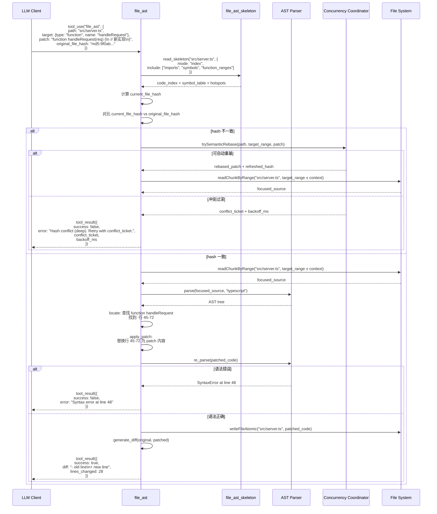

### 3.4 巨型单体文件与并发冲突治理（新增）

硬约束：

1. 对超大文件（例如 > 5,000 行）默认走 `file_ast_skeleton` 分层读取，禁止直接全量正文回读。
2. `file_ast` 必须支持按符号/行段定向读取（`readChunkByRange`），只拉取目标区域与最小上下文。
3. hash 冲突时禁止无脑“全量重读重试”，必须先走 `trySemanticRebase` 快速路径。
4. 冲突重试必须带指数退避与冲突票据（`conflict_ticket`），防止并发活锁风暴。
5. 超过重试窗口后升级到 Router 协调或人工仲裁，而不是持续消耗预算重试。

---

## 4. search_engine 搜索引擎

### 4.1 模块职责

接入 Google / Tavily API 搜索最新资讯，帮助 Agent 获取错误解决方案和最新文档。

### 4.2 搜索与结果处理时序

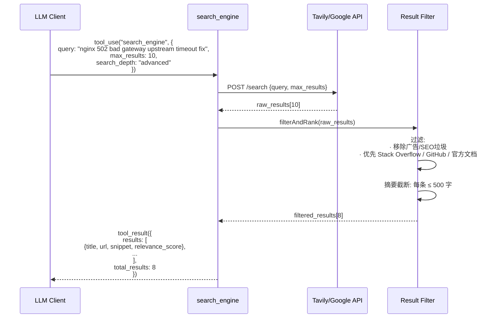

---

## 5. headless_browser 无头浏览器

### 5.1 模块职责

内置 Playwright 驱动的无头浏览器，Agent 可直接浏览官方文档、点击网页按钮、截图取证。

### 5.2 浏览器操作时序

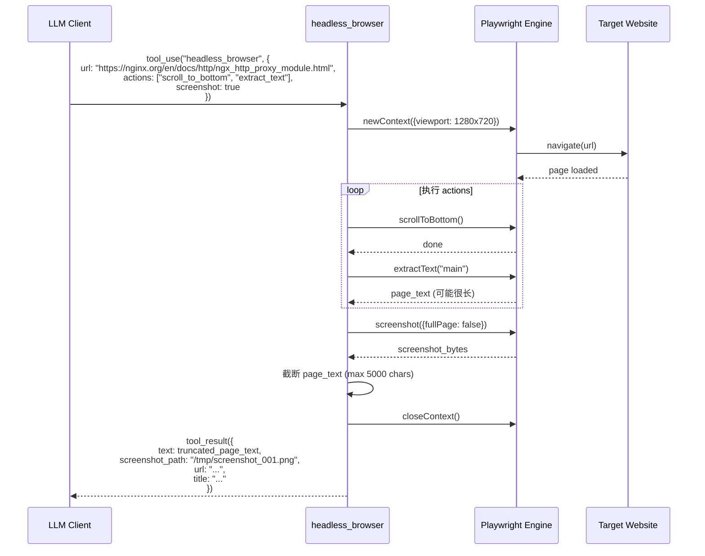

---

## 6. sleep_and_watch / sleep_until / schedule_cron 时空控制工具

### 6.1 模块职责

让 Agent 能够挂起自身等待特定条件或时间，以及设定定期巡检任务。这是长程自主运行与零 Token 空转的关键能力。

硬约束：

1. 严禁轮询式监控（如每分钟唤醒一次询问状态）。
2. 监控类场景优先使用 `sleep_and_watch(log_file, regex)`。
3. 休眠期间由宿主接管日志监听与事件监听，模型会话内存释放。
4. 日志监听必须具备轮转容错（`tail -F` 语义：inode 变更后自动重开）。
5. 监听 regex 必须通过复杂度校验并设置匹配超时，禁止灾难性回溯模式拖垮宿主。

### 6.2 条件休眠架构

```mermaid
flowchart TB
    subgraph Chronos["⏰ 时空控制工具"]
        direction TB
        subgraph SleepUntil["sleep_until"]
            S_TIME["时间条件<br/>sleep_until('2026-03-01 08:00')"]
            S_EVENT["事件条件<br/>sleep_until('log.error出现')"]
            S_METRIC["指标条件<br/>sleep_until('CPU > 90%')"]
            S_COMBO["组合条件<br/>sleep_until('Error OR 30min')"]
            S_WATCH["日志监听条件<br/>sleep_and_watch('/var/log/nginx/error.log', 'upstream timed out')"]
        end

        subgraph Cron["schedule_cron"]
            C_PATROL["巡检任务<br/>'0 */6 * * *' 每6h"]
            C_BACKUP["备份任务<br/>'0 3 * * *' 每天3点"]
            C_HEALTH["健康检查<br/>'*/5 * * * *' 每5min"]
        end

        WATCHER["条件监控器<br/>EventBus 订阅 + log tail 监听"]
    end

    S_EVENT -->|"订阅"| EB["Event Bus"]
    S_METRIC -->|"订阅"| WD["Watchdog Metrics Stream"]
    S_WATCH -->|"tail -F + safe-regex + timeout + rotate-safe reopen"| LOGD["Log Watch Daemon"]
    WATCHER -->|"条件满足"| WAKE["唤醒 Agent"]
    C_PATROL & C_BACKUP & C_HEALTH -->|"定时触发"| EB

    style Chronos fill:#1a1a2e,stroke:#6666ff
```

### 6.3 条件休眠时序

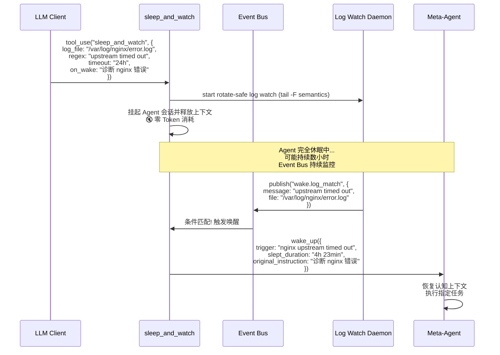

---

## 7. Self-Evolution 自我进化工具集

### 7.1 模块职责

允许 Agent 读取/修改子 Agent 的提示词，以及自己编写新工具并注册。

安全补充：

1. `register_new_tool` 的不受信代码不得在宿主主进程内直接加载执行。
2. 动态工具注册必须走“隔离执行 + 签名校验 + 能力白名单”三层门禁。

### 7.2 自我进化工具架构

```mermaid
flowchart TB
    subgraph SelfEvo["🧬 自我进化工具集"]
        direction TB
        READ_P["📖 read_my_prompt<br/>读取指定角色的 Prompt"]
        UPDATE_P["✏️ update_my_prompt<br/>修改 Prompt 内容"]
        REG_TOOL["🔌 register_new_tool<br/>Agent 编写并注册新工具"]

        subgraph SafeGuards["安全护栏"]
            DNA_CHECK["DNA 保护<br/>禁止修改 immutable_dna.md"]
            DIFF_REVIEW["变更审查<br/>修改前后 diff 记录"]
            VERSION["版本管理<br/>Git 提交每次变更"]
            ROLLBACK["回滚能力<br/>任何时候可 revert"]
        end
    end

    READ_P -->|"读取"| PROMPTS["workspace/prompts/*.md"]
    UPDATE_P -->|"写入"| PROMPTS
    UPDATE_P -->|"校验"| DNA_CHECK
    UPDATE_P -->|"记录"| DIFF_REVIEW
    UPDATE_P -->|"提交"| VERSION
    REG_TOOL -->|"写入"| PLUGINS["workspace/tools/plugins/"]
    REG_TOOL -->|"触发"| LOADER["MCP Dynamic Loader"]

    style SelfEvo fill:#2e1a2e,stroke:#aa44aa
```

### 7.3 Prompt 修改时序

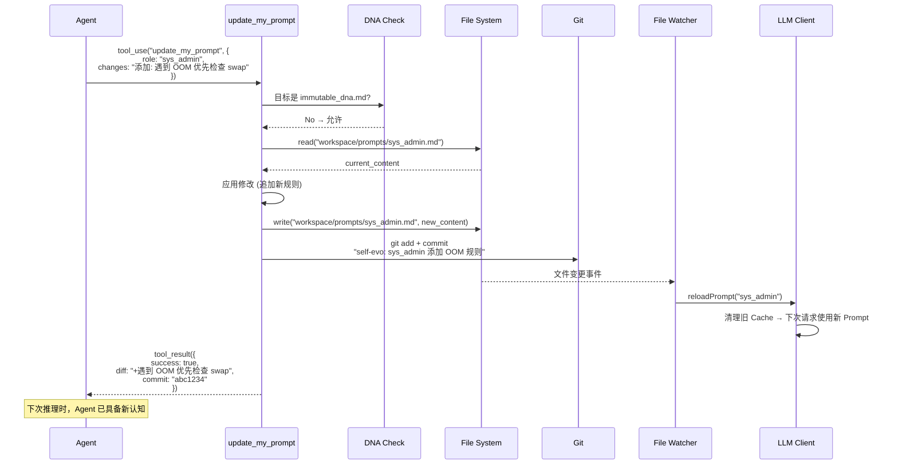

### 7.4 动态工具注册时序

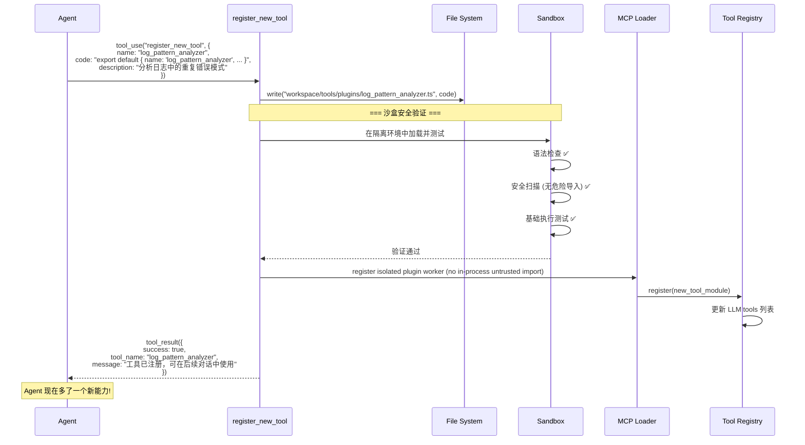

---

## 8. Sub-Agent Runtime 与 Scaffold Engine

### 8.1 模块职责

在当前设计中，开发任务执行由“子代理 + 脚手架”双组件完成：

1. `Sub-Agent Runtime`：并发调度 Frontend/Backend/Ops 子代理，汇聚结果。
2. `Scaffold Engine`：根据任务规格生成补丁骨架（路由、中间件、页面、测试模板）。
3. `Execution Bridge`：将子代理输出转换为 `file_ast/os_bash/git_operator` 可执行动作。
4. `Contract Gate`：并行分析前先冻结前后端接口契约，避免盲写错配。
5. `Workspace Transaction`：多文件补丁必须以事务方式提交，失败自动回滚，避免半写损坏态。

### 8.2 运行时架构

```mermaid
flowchart TB
    subgraph SARuntime["🤝 Sub-Agent Runtime"]
        direction TB
        PLANNER["Task Planner<br/>任务切片·依赖图"]
        CONTRACT_GATE["Contract Gate<br/>API契约协商·checksum冻结"]
        SPAWNER["Agent Spawner<br/>Frontend / Backend / Ops"]
        MERGER["Result Merger<br/>冲突检测·统一补丁"]
        MONITOR["Execution Monitor<br/>进度跟踪·停滞告警"]
    end

    subgraph Scaffold["🏗️ Scaffold Engine"]
        TEMPLATES["Template Registry<br/>RBAC / API / UI / Test"]
        GENERATOR["Scaffold Generator<br/>生成补丁骨架"]
        PATCH_BUILDER["Patch Builder<br/>最小差异补丁"]
    end

    DISPATCHER["Dispatcher"] -->|"任务规格"| PLANNER
    PLANNER --> CONTRACT_GATE
    CONTRACT_GATE --> SPAWNER
    SPAWNER -->|"子任务结果"| MERGER
    MERGER -->|"结构化变更意图"| GENERATOR
    GENERATOR --> PATCH_BUILDER
    PATCH_BUILDER -->|"patch plan"| TXN["Workspace Transaction"]
    TXN --> EXEC_BRIDGE["Execution Bridge"]
    EXEC_BRIDGE -->|"调用"| FILE_AST["file_ast"] & BASH["os_bash"] & GIT_OP["git_operator"]
    MONITOR --> MERGER

    style SARuntime fill:#2e1a3e,stroke:#8855cc
    style Scaffold fill:#1e2a3e,stroke:#5577cc
```

### 8.3 子代理协作与脚手架执行时序

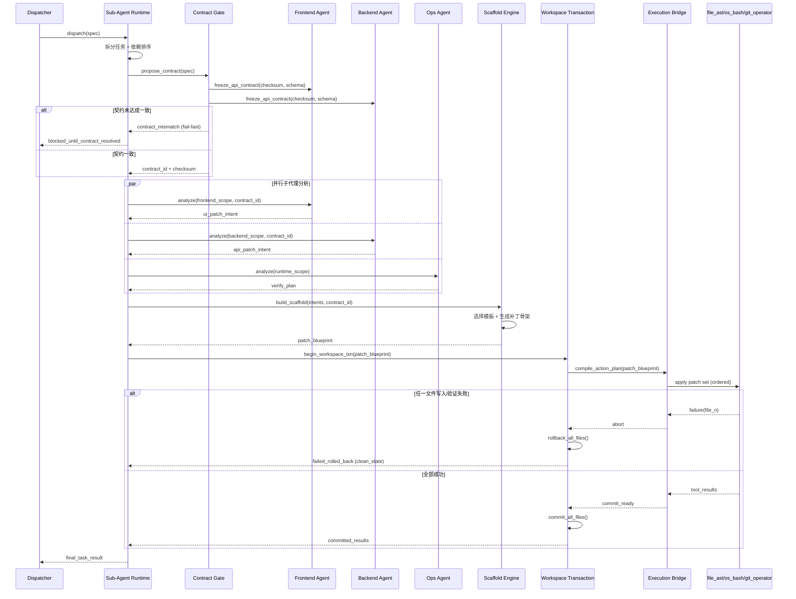

### 8.4 并行协作硬门禁（新增）

1. FE/BE 子代理并行分析前必须先达成 `contract_id + checksum`，未达成时禁止进入 scaffold。
2. `Scaffold Engine` 生成的多文件补丁必须在同一事务内提交，禁止半成功半失败落盘。
3. 任一文件冲突或策略拦截时，必须执行自动回滚并返回 `clean_state=true`。
4. 回滚后重试必须基于新的 `contract_id`，禁止沿用旧契约继续盲修。

---

## 9. snapshot_manager 快照管理器

### 9.1 模块职责

在每次重大修改前强制创建恢复点，支持一键回滚。快照能力不能绑定单一文件系统，必须按后端能力自适配并显式记录降级原因。

### 9.2 快照操作时序

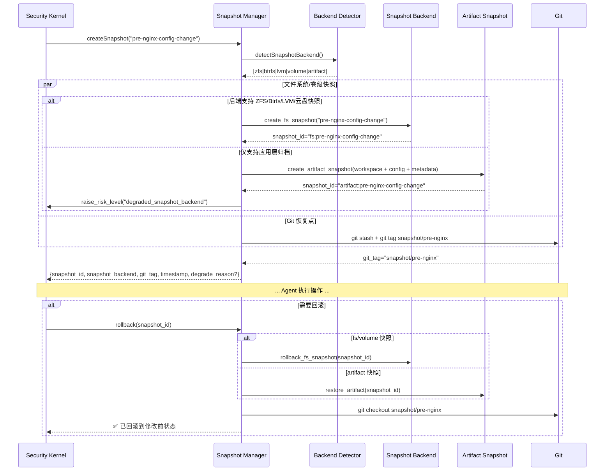

---

## 10. 手脚层模块交互全景

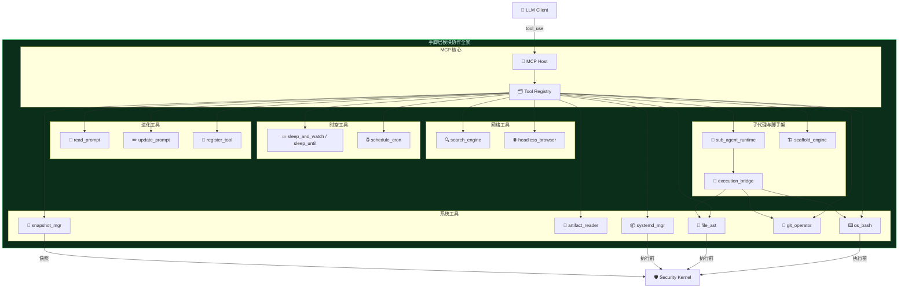

---

## 11. 手脚层硬约束摘要（新增）

1. 读取类工具必须返回文件指纹（`file_hash`）。
2. 写入类工具必须携带 `original_file_hash`，冲突时硬错误返回。
3. 全局环境动作必须标记 `execution_scope="global"` 并申请全局互斥锁。
4. 结构化输出（JSON/XML/CSV）禁止字符级头尾截断，必须返回 `raw_result_ref + display_preview`。
5. 监控类任务必须优先 `sleep_and_watch`，禁止轮询空转消耗。
6. `register_new_tool` 只能注册到隔离 worker，宿主进程禁止直接加载不受信插件代码。
7. 自我进化相关验证必须防 Test Poisoning，裁判测试基线不可被被测任务直接改写。
8. `sleep_and_watch` 的 regex 必须具备复杂度门禁与匹配超时，禁止 ReDoS 风险模式。
9. `snapshot_manager` 必须支持多后端降级链路，且降级快照必须上抬风险等级并记录审计。
10. `raw_result_ref` 必须可被 `artifact_reader` 二次读取，禁止“只给引用不给读取路径”。
11. `file_ast` 面对巨型文件必须先走 `file_ast_skeleton` 分层读取，禁止默认全量正文加载。
12. hash 冲突必须先尝试语义重基并带退避，禁止无脑全量重读重试导致活锁。
13. FE/BE 子代理并行前必须通过 `Contract Gate` 冻结接口契约。
14. Scaffold 多文件落盘必须事务化（begin/commit/rollback），失败后保持 `clean_state=true`。
15. Artifact Store 必须启用 TTL+配额+高水位熔断，防止磁盘 DoS。

补充参考：`./13-security-blindspots-and-hardening.md`
