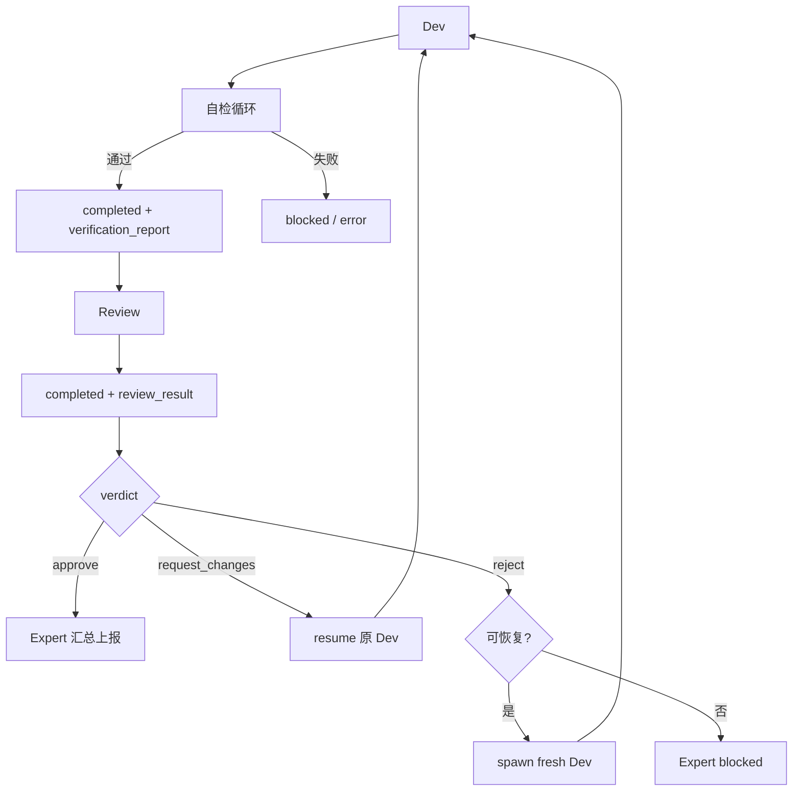

# 14 — Multi-Agent 协作架构

> 文档层级：`L0-ARCHITECTURE`  
> 版本：v1.0 | 2026-03-03  
> 前置依赖：[00-omni-operator-architecture](00-omni-operator-architecture.md) · [11-brain-layer-modules](11-brain-layer-modules.md)

---

## 1. 设计目标

在 Embla System 的三层架构（Brainstem / Brain / Limbs）之上，构建面向未来基座模型的多 Agent 协作系统。

**核心原则**：
- **框架只做管道，不做裁判**——不设 token/时间/调用硬限制，信任模型自主能力
- **双层隔离**——Shell（对外人格）与 Core（内核执行）完全分离
- **原子化 Prompt**——可自由组装、可自我进化的 Prompt 块
- **三层记忆**——MD 文件系统 + Shell L2 Graph RAG + Hierarchical RAG
- **统一路由契约**——运行时仅使用 `route_semantic(shell_readonly|shell_clarify|core_execution)`、`dispatch_to_core`、`core_execution_route(fast_track|standard)`，所有契约与观测字段同口径

---

## 2. 双层 Agent 模型

### 2.1 Shell Agent（外壳代理）

面向用户的交互层。负责拟人化对话、图谱记忆访问、自由路由决策。

| 维度 | 规格 |
|------|------|
| Prompt | 🔒 **Persona DNA**（不可变）—— 人格、语言风格、情感表达 |
| 记忆 | Neo4j 图谱（用户偏好、关系、风格）|
| 工具 | 只读工具集 + `dispatch_to_core` 路由工具 |
| 模型 | 主模型 |

**只读工具集**：

| 工具 | 说明 |
|------|------|
| `memory_read` | 阅读文档/代码/配置 |
| `memory_list` | 列出 L1 记忆文件 |
| `memory_grep` | 在 L1 记忆中做关键词/正则检索 |
| `get_system_status` | 脑干层 posture 快照 |
| `memory_search` | L1/L2 统一记忆检索 |
| `list_tasks` | 当前活跃任务进度 |
| `search_web` | 在线信息查询 |

**路由工具**：

```
dispatch_to_core(
    goal:              string                                  # 必填
    intent_type:       "development" | "ops" | "analysis"     # 可选，默认按路由推断
    target_repo:       "self" | "external"                    # 可选，默认 external
    context_summary:   string                                  # Shell 聚合的上下文摘要
    relevant_memories: string[]                                # Shell 检索到的相关记忆
    priority:          "low" | "normal" | "high"
)
```

Shell 通过 tool_calls 自由路由：自己能处理的就处理（闲聊、查状态、读文件），需要执行的任务调用 `dispatch_to_core` 转交。

> Shell 能**读取一切**，但**不能写入任何东西**。

### 2.2 Core Agent（核心代理）

核心决策引擎。负责一级任务分解、Expert 调度、最终汇总。

| 维度 | 规格 |
|------|------|
| Prompt | 🔒 **Values DNA**（不可变）—— 使命驱动力、自我优化动机、质量约束 |
| 职责 | Goal → 能力域大类分解（调用 LLM）；同时派发多个 Expert；汇总 Review 报告 |
| 模型 | 主模型 |

**一级分解输出**：

```json
{
  "goal_id": "g-001",
  "expert_assignments": [
    {"expert_type": "backend",  "scope": "...", "budget_tokens": 500000, "workspace_mode": "self"},
    {"expert_type": "testing",  "scope": "...", "budget_tokens": 200000, "depends_on": ["backend"]}
  ]
}
```

---

## 3. Agent 角色定义

### 3.1 Expert Agent（专家代理）

由 Core 按能力域 spawn。专精域包括：`backend` / `frontend` / `ops` / `testing` / `docs`。

| 职责 | 说明 |
|------|------|
| TaskBoard 规划 | 创建细致的任务板（MD + SQLite），声明文件所有权 |
| Dev 编排 | 创建多个 Dev Agent 并行执行 |
| 进度追踪 | 轮询子 Agent 状态，收集结果 |
| 通信中转 | Dev 间消息经 Expert 路由 |

### 3.2 Dev Agent（开发者代理）

由 Expert spawn 的执行者。

| 维度 | 规格 |
|------|------|
| 会话 | **独立 LLM 会话** + 裁剪后的工具子集 |
| Prompt | 原子化组装（角色块 + 技能块 + 风格块 + 经验注入）|
| 生命周期 | spawn → 执行 → 自检循环 → `report_to_parent(completed + verification_report)` → Waiting |
| 通信 | 通过 `report_to_parent` 主动上报；返修指令由 Expert `resume` 注入 |

`Dev` 在上报 `completed` 前必须完成自检循环：受影响测试、lint/类型检查、diff 自审，并输出结构化 `verification_report`（`tests` / `lint` / `diff_review` / `changed_files` / `risks`）。

### 3.3 Review Agent（审查代理）

由 Expert 在 Dev 自检完成后 spawn，作为**独立审查者**验证产出是否真的满足任务要求。

| 检查 | 方法 |
|------|------|
| **需求对齐** | 对照原始任务与 Dev 改动，逐条判断是否实现 |
| **代码质量** | 检查硬编码、异常吞没、TODO 遗留、资源泄漏等问题 |
| **回归风险** | 读取修改文件上下文，评估调用方影响与历史经验 |
| **测试覆盖** | 审核 Dev 的 `verification_report`，识别漏测边界 |
| **最终结论** | 输出 `review_result.verdict=approve/request_changes/reject` |

`Review` 通过 `report_to_parent(type="completed", review_result={...})` 提交结构化结论；Expert 仅以最终生效的审查结论决定是否对外汇总。

---

## 4. Prompt 架构

### 4.1 不可变 DNA 层

```
prompts/dna/
├── shell_persona.md     # Shell 人格（不可修改）
└── core_values.md       # Core 使命与价值观（不可修改）
```

### 4.2 原子化可编辑层

```
prompts/
├── roles/               # 角色定义块
├── skills/              # 技能描述块
├── styles/              # 输出风格块
└── rules/               # 规范约束块
```

**组装方式**：Expert spawn Dev 时从原子块池中挑选组装，并自动注入 L1 检索到的经验块。

**修改权限**：

| Agent | DNA | 角色/技能/风格/规则块 |
|-------|-----|---------------------|
| Core | ❌ 不可修改 | ✅ 可修改（受审批链约束）|
| Expert | ❌ | ✅ 域内块 |
| Dev/Review | ❌ | ⚠️ 仅可建议修改（通过 report_to_parent）|

---

## 5. 三层记忆系统

### 5.1 Layer 1: MD 文件系统记忆

Agent 自主读写的结构化 MD 文件。

```
memory/
├── working/session_{id}/     # 短期：上下文 · 发现 · 决策
├── episodic/                 # 中长期：经验复盘 + _index.md 标签索引
└── domain/                   # 长期：领域知识沉淀
```

- **注入**：Expert spawn Dev 时扫描 `_index.md`，按标签匹配，以路径列表注入
- **写回**：Dev/Review 完成后写入经验 MD + 更新 `_index.md`

### 5.2 Layer 2: Graph RAG（Shell 专属五元组图谱）

L2 仅服务于 Shell 聊天助手场景，承载用户偏好、关系、风格等会话级五元组记忆。

| 图谱类型 | 内容 | Canonical 入口 |
|---------|------|----------------|
| Shell 会话五元组 | 用户偏好 / 关系 / 风格 | `summer_memory/quintuple_graph.py` + `summer_memory/memory_manager.py` |

- **抽取方式**：Shell 每轮对话结束后，基于**当轮完整消息列表**抽取五元组。
- **门禁方式**：仅在 Shell 自行完成回答时写入；发生 Core handoff 的执行轮次不写入 L2。
- **召回方式**：Shell 通过 `memory_search` / `query_graph_by_keywords` 读取；Core 仅允许低权重查询。
- **边界说明**：`agents/memory/semantic_graph.py` 表示 **Tool-Result Topology**（`session/tool/artifact/topic`），不属于 L2 Graph RAG。

### 5.3 Layer 3: Hierarchical RAG

三级降维解决大文件/长文档上下文超限。

```
文件 → L1 摘要 (~200 tokens)
     → L2 函数/段落索引 (~50 tokens/条)
     → L3 原始 Chunk (~500 tokens/块, 按需加载)
```

- `.py` 文件 AST 切分，`.md` 按标题切分
- 摘要用次模型，索引向量化存入 ChromaDB/SQLite

### 5.4 访问矩阵

| Agent | L1 读 | L1 写 | L2 Graph | L3 Hierarchical |
|-------|-------|-------|----------|-----------------|
| Shell | ✅ | ❌ | ✅ 读写（每轮自动抽取 + 查询） | ❌ |
| Core | ✅ | ❌ | ⚠️ 低权重查询 | ❌ |
| Expert | ✅ | ❌ | ❌ | ❌ |
| Dev | ✅ | ✅ | ❌ | ✅ |
| Review | ✅ | ✅ | ❌ | ✅ |

---

## 6. 子 Agent 生命周期

### 6.1 设计哲学

> **框架只做管道，不做裁判。**  
> 不设 token/时间/调用硬限制。仅提供消息推送 + 状态轮询 + 硬生命周期操作。  
> 一切管理决策由上级 Agent 自主判断。  
> 唯一硬约束为安全边界（Policy Firewall · Approval Gate）。

### 6.2 状态机

```
[创建] ──→ Running ──→ Waiting ──→ Destroyed
              │  ↑          │  ↑
              │  └──────────┘  │
              │   (resume)     │
              └────────────────┘
                (terminate→wait→destroy)
```

| 状态 | 说明 |
|------|------|
| **Running** | 执行中，无框架限制，主动维护状态，可随时 `report_to_parent` |
| **Waiting** | 挂起，**会话历史完整保留**，等待父节点决策（返修/销毁）|
| **Destroyed** | 已销毁，资源释放 |

**关键**：子 Agent 完成后**不自杀**—— 上报完成 → 挂起 → 保留全部上下文 → 父节点审查后决定。

### 6.3 父节点工具（系统级硬操作）

| 工具 | 作用 |
|------|------|
| `spawn_child_agent` | 创建（角色 + 任务 + prompt 块 + 工具子集）|
| `poll_child_status` | 查看状态（事实数据，无判定）|
| `send_message_to_child` | 推送消息 |
| `resume_child_agent` | 恢复 Waiting 子 Agent（附新指令）|
| `terminate_child_agent` | 强制停止 → Waiting（不销毁）|
| `destroy_child_agent` | 销毁，释放资源 |

### 6.4 子节点工具

| 工具 | 作用 |
|------|------|
| `report_to_parent` | 主动上报（`completed` / `blocked` / `error` / `question`）|
| `read_parent_messages` | 读取父节点消息 |
| `update_my_task_status` | 更新 TaskBoard 状态 |

### 6.5 完成态与审查决策（运行时 canonical）

- `Dev completed` 必须附带 `verification_report`；缺失时完成态无效，子循环继续运行。
- `Review completed` 必须附带 `review_result`；其中 `verdict` 只能是 `approve` / `request_changes` / `reject`。
- `approve`：Expert 接受本轮产出并汇总上报。
- `request_changes`：Expert `resume` 原 Dev，附审查问题，Dev 返修后重新自检并再次进入 Review。
- `reject`：Expert 优先 `spawn` fresh Dev 做全新修复；若不可恢复、无任务可重跑、预算耗尽或 respawn 失败，则转为 `blocked`。

### 6.6 Review 生命周期



---

## 7. Agent 间通信

### 7.1 纵向通信（父↔子）

- 父→子：`send_message_to_child`
- 子→父：`report_to_parent`
- 父查子：`poll_child_status`

### 7.2 同级通信（Dev↔Dev）

运行时 canonical 口径：Dev **不建立绕过 Expert 的直接 P2P 会话**。如需同级交流，可使用 `send_message_to_agent` / `read_agent_messages`，但消息仍经 Expert 路由与监督，因此治理语义仍属于 Expert 协调。

- Dev 发现契约问题或依赖阻塞：优先通过 `report_to_parent(type="question" | "blocked")` 上报 Expert。
- 如需同级补充上下文：可发送 Expert 中转的 peer message，但不应自行形成脱离 Expert 的协商闭环。
- Expert 评估后，通过 `send_message_to_child` / `resume_child_agent` 下发更新后的 contract、返修意见或依赖变更。
- Review 不参与同级协商，只对 Dev 产出做独立审查。

所有跨 Dev 协调都必须可被 Expert 观察、复盘和终止。

---

## 8. TaskBoard

### 8.1 双层存储

| 层 | 格式 | 用途 |
|---|------|------|
| 展示层 | `task_board_{id}.md` | Agent 读写 · 人类可读 |
| 索引层 | `task_boards.db` (SQLite) | 状态查询 · 进度聚合 |

`update_task_status` 工具同时写两层，Agent 只感知 MD。

### 8.2 MD 格式

```markdown
# TaskBoard: tb-001 (backend)
> Expert: backend | Goal: g-001

## 📋 任务列表

- [x] t-001: AST 解析器 (@dev-α, ✅)
  - files: `file_ast.py`
  - acceptance: 解析 .py 定位函数/类
- [/] t-002: 乐观锁 (@dev-β, 🔄)
  - depends: t-001
- [ ] t-003: 冲突重基 (未分配)
```

---

## 9. 合并与冲突

### 9.1 Mode A: 用户仓库 (`external`)

| 策略 | 说明 |
|------|------|
| 分支 | 统一 feature 分支 |
| 文件锁 | TaskBoard 声明所有权 |
| 冲突 | 暂停上报 Expert |
| 合并 | 生成 PR/patch 交用户 |

### 9.2 Mode B: 自身框架 (`self`)

| 策略 | 说明 |
|------|------|
| 隔离 | 临时 clone 沙箱 |
| 验证 | 双轨测试 |
| 审批 | Audit Ledger + HITL |
| 原子性 | 全量 promote / 丢弃 |

### 9.3 冲突分级

| 级别 | 处理 |
|------|------|
| 轻微（行号偏移）| 自动 rebase |
| 中等（同文件不同函数）| Expert 修正分配或序列化 |
| 严重（同函数矛盾）| 冻结 Dev → Expert → Core |
