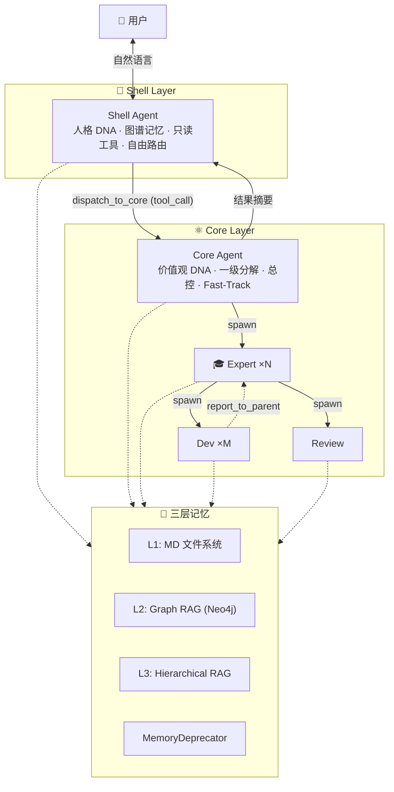
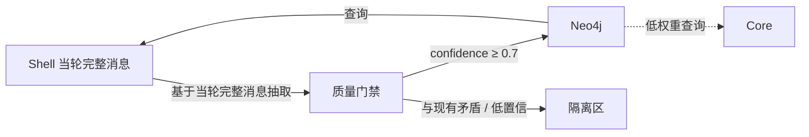
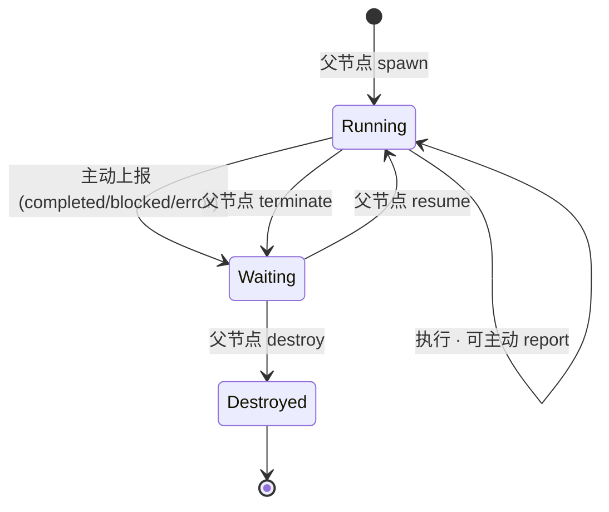
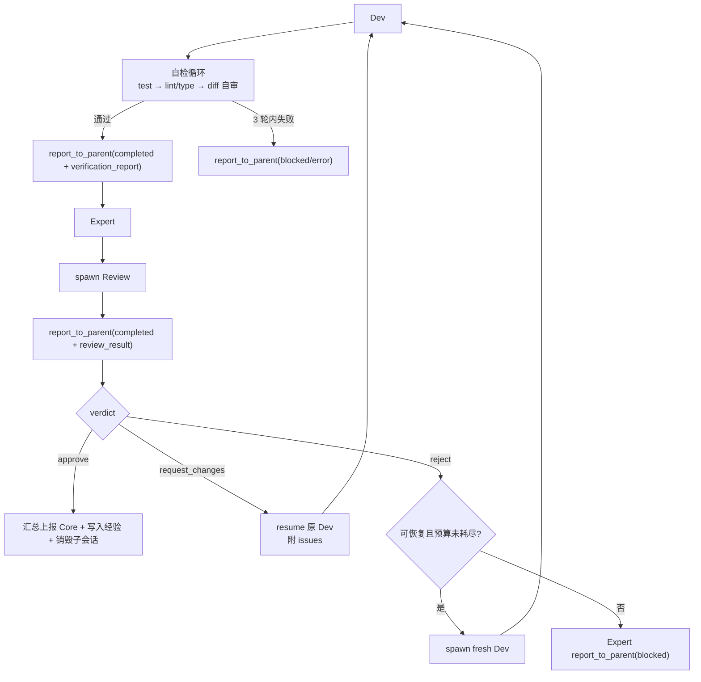
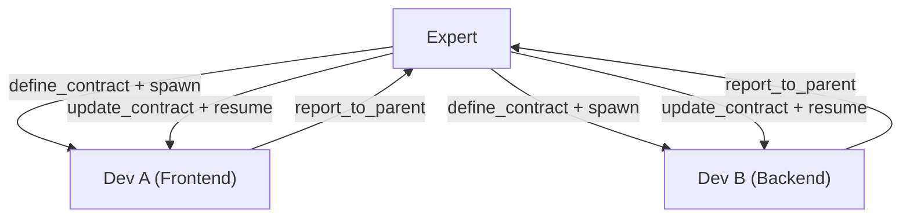

# 多 Agent 目标态架构设计（v6 — 最终整合版）

> 2026-03-07 | v6 + 工具最小注入 / Fast-Track 安全约束 / Review 生命周期收口 / L2 门禁细化

---

## 1. 架构总览



---

## 2. Shell / Core 职责

### Shell Agent

| 维度 | 设计 |
|------|------|
| **Prompt** | 🔒 **Persona DNA（不可变）** |
| **记忆** | Neo4j 图谱（用户偏好、关系、风格）|
| **路由** | 自己能处理就处理，否则 `dispatch_to_core` |

**工具集**：`memory_read` · `memory_list` · `memory_grep` · `memory_search` · `get_system_status` · `list_tasks` · `search_web` · **`dispatch_to_core`**

> Shell 能**读取一切**，但**不能写入任何东西**。

### Core Agent

| 维度 | 设计 |
|------|------|
| **Prompt** | 🔒 **Values DNA（不可变）** |
| **职责** | 一级分解；同时派发多个 Expert；汇总 |
| **Fast-Track** | `complexity_hint=trivial` 时直接执行，不 spawn Expert |

---

## 3. Fast-Track 短路机制 ⚡

```
Shell 判断复杂度 → dispatch_to_core(complexity_hint="trivial")
Core 收到 trivial → 直接用 native_call 执行 → 返回结果
```

| 路径 | 适用场景 | LLM 轮次 |
|------|---------|----------|
| **Fast-Track** | 单文件/单行/typo/配置修改 | 2 (Shell→Core) |
| **标准路径** | 多文件修改、需审查 | 4+ |
| **复杂路径** | 跨域协作、多 Expert 并行 | 5+ |

### Fast-Track 安全硬约束 🔒

**框架代码层**强制约束，无论 Shell 传什么 `complexity_hint`：

| 约束 | 规则 | 违反时 |
|------|------|--------|
| **禁止命令执行** | `run_command/exec_shell` 不可用 | 自动升级到标准路径 |
| **保护路径** | `core/security/`、`system/dna/`、`.env`、`config.json` 不可写 | 自动升级 |
| **规模限制** | 单文件 ≤ 10 行改动 | 自动升级 |
| **禁止配置修改** | `write_config/delete_file` 不可用 | 自动升级 |

> 物理层面不可能通过 Fast-Track 执行 `iptables -F` 或修改 DNA 文件。

---

## 4. Prompt 架构：不可变 DNA + 原子化组装

```
prompts/
├── dna/                          # 🔒 不可变
│   ├── shell_persona.md
│   └── core_values.md
├── roles/                        # 🧩 原子化
│   ├── backend_expert.md
│   └── code_reviewer.md
├── skills/
│   └── python_ast.md
├── styles/
│   └── code_with_tests.md
└── rules/
    └── conventional_commit.md
```

- Expert spawn Dev 时**自由挑选原子块**组装 prompt + 自动注入相关经验
- **Core** 可修改所有原子块（受审批链约束）
- **Expert** 可修改自己域内的技能/风格块
- **Dev/Review** 只能**建议修改**（`report_to_parent`）

---

## 5. 三层记忆系统

### 5.1 Layer 1: MD 文件系统记忆

```
memory/
├── working/                   # 短期，随任务生灭
│   └── session_{id}/
├── episodic/                  # 中长期，跨任务复用
│   ├── exp_20260303_修复配置竞态.md
│   └── _index.md
├── domain/                    # 长期，领域知识沉淀
│   ├── python_ast_patterns.md
│   └── _index.md
└── .deprecated/               # 软删除归档
    └── monolith_api_patterns.md
```

### 5.2 Layer 2: Graph RAG（Shell 专属 + 会话级抽取）

L2 图谱**仅服务于 Shell 层的聊天助手场景**（用户偏好、关系、风格召回），不用于编码 Agent 结构。



#### 抽取方式：会话级（非后台管道）

Shell 每轮对话后，基于**当轮完整消息列表**用自身 LLM 抽取五元组。不依赖独立的次模型管道。

> 与 ChatGPT persistent memory、Character.ai Chat Memories、MemGPT/Letta Core Memory 的抽取方式一致。
>
> 运行时 canonical 口径：`summer_memory/quintuple_graph.py` = **Shell L2 Graph RAG**；`agents/memory/semantic_graph.py` = **Tool-Result Topology**（执行拓扑，非 Shell L2）。

#### 置信度打分：四信号加权

```
置信度 = 0.4·文本锚定 + 0.2·结构匹配 + 0.3·双提取共识 + 0.1·图谱一致性
```

| 信号 | 方法 | 成本 |
|------|------|------|
| **文本锚定** | 主/客/关系词能否在原文中定位 | 零（字符串匹配）|
| **结构匹配** | 实体类型和关系是否符合预定义 schema | 零（规则匹配）|
| **双提取共识** | 两次独立抽取结果是否一致 | +1x Token（仅可疑项触发）|
| **图谱一致性** | 与已有节点/边是否矛盾或重复 | 零（图查询）|

**成本优化**：80% 五元组用信号 1+2 即可决策（零额外 Token），仅 20% 可疑项触发双提取。

#### 记忆衰减与废弃

| 触发事件 | 触发者 | 废弃范围 |
|---------|--------|---------|
| 重大重构 | 未来扩展：Dev 上报结构化重构事件（当前 runtime 未单独暴露 `major_refactor` type） | affected scope 的 L1+L2 |
| 文件删除 | Dev 执行 `git rm` | 对应文件的 L1 经验 + L2 节点 |
| 依赖升级 | Dev 修改 dependencies | 旧版本相关域知识 |
| 架构变更 | Core 级别决策 | 旧决策关联的所有域知识 |
| 被动衰减 | 后台 cron | `last_seen > 90d AND access_count < 3` |

> **废弃 ≠ 删除**。标记 `deprecated=true` + 默认过滤，可显式 `include_deprecated=True` 查看。

### 5.3 Layer 3: Hierarchical RAG

```
大文件 (6000行)
 ├─ L1 摘要 (~200 tokens)
 ├─ L2 索引 (~50 tokens/条)
 └─ L3 Chunk (~500 tokens/块)
```

### 5.4 记忆访问矩阵

| Agent | L1 读 | L1 写 | L2 Graph | L3 Hierarchical |
|-------|-------|-------|----------|------------------|
| Shell | ✅ | ❌ | ✅ 读写（每轮自动抽取 + 查询） | ❌ |
| Core | ✅ | ❌ | ⚠️ 低权重查询 | ❌ |
| Expert | ✅ 扫描索引 | ❌ | ❌ | ❌ |
| Dev | ✅ | ✅ 精准编辑 | ❌ | ✅ 检索 |
| Review | ✅ | ✅ 精准编辑 | ❌ | ✅ 检索 |

---

## 6. 记忆精准编辑工具集

### 四层工具

| 层 | 工具 | 作用 |
|----|------|------|
| **L0 文件级** | `memory_read/write/list/delete` | 基础 CRUD |
| **L1 搜索** | `memory_grep/search/index` | 正则+语义定位 |
| **L2 编辑** | `memory_patch/insert/append/replace` | diff 级精准编辑（乐观锁）|
| **L3 结构化** | `memory_deprecate/tag/link` | 废弃标记、标签、引用 |

#### memory_patch（核心工具）

```python
memory_patch(
    path="domain/python_ast_patterns.md",
    edits=[{
        "start_line": 15, "end_line": 20,
        "old_content": "原文...",   # 乐观锁：不匹配则 ConflictError
        "new_content": "新文...",
    }],
)
```

### 权限矩阵

| 工具 | Shell | Core | Expert | Dev | Review | Deprecator |
|------|-------|------|--------|-----|--------|------------|
| `read/list/grep/search` | ✅ | ✅ | ✅ | ✅ | ✅ | ✅ |
| `write` | ❌ | ❌ | ❌ | ✅ | ✅ | ❌ |
| `patch/insert/append/replace` | ❌ | ❌ | ❌ | ✅ | ✅ | ✅ |
| `delete` | ❌ | ❌ | ❌ | ❌ | ❌ | ✅ (软) |
| `deprecate` | ❌ | ✅ | ❌ | ❌ | ❌ | ✅ |
| `tag/link` | ❌ | ❌ | ✅ | ✅ | ✅ | ✅ |

### 动态 Tool Profile（最小注入）

13 个工具 schema ~2000 tokens，对小模型是负担。Expert spawn Dev 时按任务类型选择预设 profile，只注入所需子集：

| Profile | 工具子集 | 适用场景 |
|---------|---------|----------|
| `refactor` | `read, grep, patch, tag` | 代码重构 |
| `new_doc` | `write, append, tag, link` | 新建文档 |
| `bugfix` | `read, grep, patch` | Bug 修复 |
| `review` | `read, grep, tag, deprecate` | 代码审查 |
| `cleanup` | `read, grep, replace, delete` | 清理归档 |
| `custom` | Expert 显式列出 | 特殊场景 |

```python
spawn_child_agent(
    role="dev",
    tool_profile="refactor",  # 只注入 4 个工具而非 13 个
)
```

---

## 7. 子 Agent 生命周期

### 状态机



### 父节点工具

| 工具 | 作用 |
|------|------|
| `spawn_child_agent` | 创建（角色 + 任务 + prompt 块 + tool_profile）|
| `poll_child_status` | 查看状态 |
| `send_message_to_child` | 推送消息 |
| `resume/terminate/destroy_child_agent` | 生命周期控制 |
| `define_contract` | 定义跨 Dev 的接口契约（JSON schema）|
| `update_contract` | 根据 Dev 上报修改契约并通知相关 Dev |

### 子节点工具

| 工具 | 作用 |
|------|------|
| `report_to_parent` | 上报（`completed` / `blocked` / `error` / `question`）|
| `read_parent_messages` | 读取父节点消息 |
| `update_my_task_status` | 更新 TaskBoard |

### 完成态契约（运行时 canonical）

- `Dev` 只有在**自检循环通过**后才能调用 `report_to_parent(type="completed")`。
- `Dev completed` 必须携带结构化 `verification_report`，至少包含：
  - `tests`
  - `lint`
  - `diff_review`
  - `changed_files`
  - `risks`
- `Review` 只有在完成独立审查后才能调用 `report_to_parent(type="completed")`。
- `Review completed` 必须携带结构化 `review_result`，其中 `verdict` 只能是：
  - `approve`
  - `request_changes`
  - `reject`

### Review 生命周期（最终口径）



### Review 结论分支

| `review_result.verdict` | Expert 动作 | 运行时语义 |
|-------------------------|-------------|-----------|
| `approve` | 接受本轮产出，汇总上报 Core | 该 Expert 的最终 review gate 通过 |
| `request_changes` | `resume` 原 Dev，附 `issues` / `suggestions` | Dev 必须重新自检，再次进入 Review |
| `reject` | 优先 `spawn` fresh Dev；若不可恢复、无任务可重跑、预算耗尽或 respawn 失败，则上报 `blocked` | 旧实现不直接通过，只有最终恢复成功后才算通过 |

- `request_changes` 与中间态 `reject` 都属于**中间审查结果**，不会直接作为最终通过结果写入汇总门禁。
- `review_results` 的聚合口径只记录**每个 Expert 最终生效的审查结论**；如果中途经历过返修或可恢复重做，最终仍以后一次 `approve` 或最终 `reject` 为准。

---

## 8. Agent 间通信：Expert 协调模式

Dev 之间**不直接通信**。所有跨 Dev 协调由 Expert 统一管理。



### 跨 Dev 协作流程

```
1. Expert 分析需求 → 定义 API contract (JSON schema)
2. Expert spawn Dev A: "按此 contract 实现前端"  (contract 作为任务上下文)
3. Expert spawn Dev B: "按此 contract 实现后端"  (同一 contract)
4. Dev A/B 各自独立执行
5. 如果 Dev A 发现 contract 问题:
   → report_to_parent(type="contract_issue", detail="birthDate 应改为 birth_date")
6. Expert 评估 → update_contract → resume Dev B 通知变更
7. 两个 Dev 完成 → Expert 汇总验证
```

### 为什么不用 P2P

| 考量 | P2P | Expert 协调 |
|------|-----|------------|
| 复杂度 | 高（双通道 + Summarizer + finalize） | 低（已有 report/resume 机制）|
| 可控性 | Expert 失去控制力 | Expert 全程掌控 |
| 行业验证 | 无竞品实现 | Claude Code / Manus 均采用 |
| Token 成本 | Dev↔Dev 对话额外开销 | 仅 report + resume |

> Expert 看得到全局（两个域），两个 Dev 只看到自己的域。让全局视角者做协调，是更优的架构决策。

---

## 9. TaskBoard：MD + SQLite

| 层 | 格式 | 用途 |
|---|------|------|
| 展示层 | `task_board_{id}.md` | Agent 读写、人类可读 |
| 索引层 | `task_boards.db` (SQLite) | 状态查询、进度聚合 |

---

## 10. 合并与冲突

| Mode A: 用户仓库 | Mode B: 自身框架 |
|------------------|------------------|
| feature 分支 + 文件锁 | 临时沙箱 clone |
| 冲突暂停上报 Expert | 双轮验证 + 审批链 |
| 生成 PR 交用户 | 原子 promote/丢弃 |

---

## 11. 与现有代码映射

| 目标态 | 现有基础 | 改造 |
|--------|---------|------|
| Shell Agent | `apiserver/`（`route_semantic=shell_readonly` 首层入口） | +persona DNA +只读工具 |
| Core Agent | `agents/meta_agent.py` | +values DNA +Fast-Track（安全硬约束）|
| Expert Agent | `autonomous/subagent_runtime.py` | +TaskBoard +contract 管理 +tool profile |
| Dev / Review | 新建 | 迷你 tool-loop +精准编辑工具 |
| L1 MD 记忆 | `agents/memory/episodic_memory.py` | +精准编辑工具 +乐观锁 |
| L2 Graph RAG | `summer_memory/quintuple_graph.py` | +Shell 会话级抽取 +门禁 +衰减 |
| Tool-Result Topology | `agents/memory/semantic_graph.py` | +执行拓扑索引（session/tool/artifact/topic），非 Shell L2 |
| L3 Hierarchical | 新建 | AST 切分 +摘要 +chunk |
| 记忆工具集 | `agents/shell_tools.py` | 13 工具 + 6 个 profile 预设 |
| MemoryDeprecator | `agents/memory/memory_agents.py` | +事件触发 +L2 联动标记 |
| Prompt 原子块 | `system/prompt_registry.py` | 改文件系统 +组装引擎 |
| Mailbox | `core/event_bus/topic_bus.py` | +inbox topic |
| 安全审批 | `core/security/` | 已就绪 ✅ |
