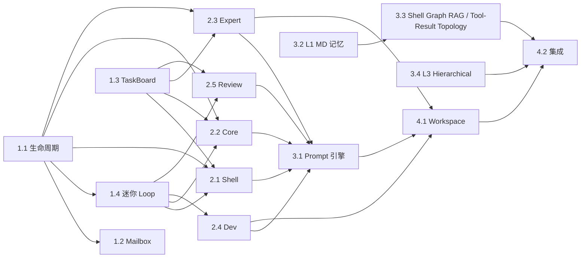

# WS30 — Multi-Agent 协作系统实现任务拆解

> 对标文档：[Multi Agent Target Architecturev2.1.md](../Multi%20Agent%20Target%20Architecturev2.1.md)  
> 创建日期：2026-03-03
> 统一口径说明：实现与验收统一使用 `Shell/Core/Expert/Dev/Review` 与 `route_semantic(shell_readonly|shell_clarify|core_execution)`、`dispatch_to_core`、`core_execution_route(fast_track|standard)` 语义。

---

## Phase 1: 基础设施（止血 + 管道层）

### 1.1 Agent 生命周期运行时

> 优先级：🔴 P0 | 预估：2 WS | 前置：无

- [ ] **定义 Agent 运行时协议**
  - [ ] `AgentSession` 数据类：session_id, status(Running/Waiting/Destroyed), prompt_blocks, tool_subset, parent_id, created_at
  - [ ] `AgentSessionStore`：内存 + SQLite 持久化，支持 session 挂起/恢复
  - [ ] 会话上下文序列化/反序列化（LLM messages list → JSON → 恢复）
  - 目标文件：`agents/runtime/agent_session.py`

- [ ] **实现父节点工具集**
  - [ ] `spawn_child_agent`：创建 session + 启动迷你 tool-loop
  - [ ] `poll_child_status`：从 SessionStore 读取状态
  - [ ] `send_message_to_child`：写入 child inbox (EventBus topic)
  - [ ] `resume_child_agent`：注入新指令 → 状态从 Waiting → Running
  - [ ] `terminate_child_agent`：设置中断标志 → 状态 → Waiting
  - [ ] `destroy_child_agent`：清理 session + 释放资源
  - 目标文件：`agents/runtime/parent_tools.py`

- [ ] **实现子节点工具集**
  - [ ] `report_to_parent`：写入 parent inbox + 自身状态 → Waiting
  - [ ] `read_parent_messages`：从 inbox 读取
  - [ ] `update_my_task_status`：同步 TaskBoard MD + SQLite
  - 目标文件：`agents/runtime/child_tools.py`

---

### 1.2 Agent Mailbox（基于 EventBus）

> 优先级：🔴 P0 | 预估：1 WS | 前置：1.1

- [ ] 在 `core/event_bus/topic_bus.py` 添加 `agent.{agent_id}.inbox` topic 支持
- [ ] 消息格式：`{from, to, content, timestamp, seq}`
- [ ] 消息持久化（SQLite，复用 event_store 机制）
- [ ] 同级消息 Expert 中转路由逻辑
- 目标文件：`agents/runtime/mailbox.py` + `core/event_bus/` 扩展

---

### 1.3 TaskBoard 引擎（MD + SQLite）

> 优先级：🔴 P0 | 预估：1 WS | 前置：无

- [ ] SQLite schema：tasks 表 (task_id, board_id, title, status, assigned_to, depends_on, files, updated_at)
- [ ] MD 读写引擎：解析/生成 checkbox-list 格式
- [ ] MD↔SQLite 双向同步逻辑
- [ ] 工具：`create_task_board` / `read_task_board` / `update_task_status` / `query_tasks`
- 目标文件：`agents/runtime/task_board.py`

---

### 1.4 迷你 Tool-Loop

> 优先级：🔴 P0 | 预估：2 WS | 前置：1.1

- [ ] 从 `agents/tool_loop.py` 提取核心 ReAct 循环为独立模块
- [ ] 迷你 loop 支持：独立 LLM 会话、可裁剪工具集、中断标志检查
- [ ] 集成 child_tools（report/read_messages/update_status）
- [ ] 集成 agent_messages (peer communication)
- 目标文件：`agents/runtime/mini_loop.py`

---

## Phase 2: Agent 角色实现

### 2.1 Shell Agent 改造

> 优先级：🟡 P1 | 预估：2 WS | 前置：Phase 1

- [ ] 从 `apiserver/api_server.py` Shell 首轮路由环提取 Shell 逻辑
- [ ] 加载 `prompts/dna/shell_persona.md` 不可变人格
- [ ] 注入只读工具集 (`memory_read`, `memory_list`, `memory_grep`, `memory_search`, `get_system_status`, `list_tasks`, `search_web`)
- [ ] 实现 `dispatch_to_core` 工具
- [ ] 集成 Neo4j 图谱查询（复用 summer_memory）
- 目标文件：`agents/shell_agent.py`

---

### 2.2 Core Agent 改造

> 优先级：🟡 P1 | 预估：1.5 WS | 前置：Phase 1

- [ ] 改造 `agents/meta_agent.py`：一级分解调用 LLM（次模型），保留启发式作 fallback
- [ ] 加载 `prompts/dna/core_values.md` 不可变价值观
- [ ] 多 Expert 并行派发逻辑 (使用 spawn_child_agent)
- [ ] 汇总 Review 报告 → 传递回 Shell
- 目标文件：`agents/core_agent.py` (新) + `agents/meta_agent.py` (改造)

---

### 2.3 Expert Agent

> 优先级：🟡 P1 | 预估：2 WS | 前置：1.1 + 1.3

- [ ] Expert 角色定义：接受 Core 分配的 scope → 创建 TaskBoard
- [ ] TaskBoard 细致规划逻辑（LLM 调用，按文件依赖拆分 task）
- [ ] Dev spawn 编排：依赖图分析 → 确定并行度 → spawn 多个 Dev
- [ ] Dev 状态轮询 + 结果收集
- [ ] TaskBoard 全部完成 → spawn Review Agent
- [ ] 同级 Dev 消息中转路由
- 目标文件：`agents/expert_agent.py`

---

### 2.4 Dev Agent

> 优先级：🟡 P1 | 预估：1 WS | 前置：1.4

- [ ] Dev Shell：接收 task + prompt_blocks → 启动 mini_loop
- [ ] 原子化 prompt 加载与组装
- [ ] L1 经验自动注入（Expert spawn 时检索 _index.md）
- [ ] 完成后自动写回经验 MD + update_my_task_status + report_to_parent(completed)
- 目标文件：`agents/dev_agent.py`

---

### 2.5 Review Agent

> 优先级：🟡 P1 | 预估：1 WS | 前置：1.3, 1.4

- [ ] 三重检查实现：
  - [ ] 完整性：读 TaskBoard → 检查全部 task 状态
  - [ ] 一致性：git diff → 对比 TaskBoard file_targets
  - [ ] 正确性：运行测试
- [ ] 输出审查报告（通过/打回/部分通过 + 问题列表）
- 目标文件：`agents/review_agent.py`

---

## Phase 3: Prompt 与记忆系统

### 3.1 原子化 Prompt 引擎

> 优先级：🟡 P1 | 预估：1 WS | 前置：Phase 2

- [ ] Prompt 块发现与加载（扫描 prompts/ 目录）
- [ ] 组装引擎：blocks[] → 拼接为完整 system prompt
- [ ] DNA 保护：拦截对 dna/ 目录的修改
- [ ] `update_prompt_block` / `create_prompt_block` 工具（按层级授权）
- 目标文件：`agents/runtime/prompt_engine.py`

---

### 3.2 L1 — MD 文件系统记忆

> 优先级：🟡 P1 | 预估：1 WS | 前置：无

- [ ] `memory/` 目录结构初始化 (working / episodic / domain)
- [ ] `_index.md` 索引生成与标签匹配检索
- [ ] 经验 MD 自动写入模板
- [ ] 列表式提取与返回接口
- 目标文件：`agents/memory/md_file_memory.py`

---

### 3.3 L2 — Shell Graph RAG / Tool-Result Topology 对齐

> 优先级：🟠 P2 | 预估：2 WS | 前置：3.2

- [ ] 保持 `summer_memory/quintuple_graph.py` 作为 Shell L2 五元组图谱 canonical 存储
- [ ] Shell 每轮对话后按当轮完整消息列表抽取五元组（非独立后台次模型管道）
- [ ] 向量化 + Neo4j 向量索引（用于 L2 召回）
- [ ] `memory_search` / `query_knowledge_graph` 对接 Shell L2 图谱
- [ ] `agents/memory/semantic_graph.py` 明确为 Tool-Result Topology，继续服务 agentic loop / forensic 查询
- 目标文件：`summer_memory/quintuple_graph.py`、`agents/memory/semantic_graph.py`

---

### 3.4 L3 — Hierarchical RAG

> 优先级：🟠 P2 | 预估：2 WS | 前置：无

- [ ] 三级索引构建器（摘要 → 函数/段落索引 → chunk）
- [ ] AST 切分器 (.py) + 标题切分器 (.md)
- [ ] 摘要生成（次模型）
- [ ] 索引向量化存储 (ChromaDB/SQLite)
- [ ] `explore_large_file` 工具（summary/index/chunk 三级查询）
- [ ] 增量索引更新（文件变更触发重建）
- 目标文件：`agents/memory/hierarchical_rag.py`

---

## Phase 4: 合并冲突与集成

### 4.1 Workspace 双模策略

> 优先级：🟠 P2 | 预估：1.5 WS | 前置：Phase 2

- [ ] Mode A (external)：feature 分支 + 文件锁 + PR 生成
- [ ] Mode B (self)：沙箱 clone + 双轨测试 + Audit Ledger + Approval Gate
- [ ] 冲突检测与分级处理（轻/中/严重）
- [ ] `workspace_transaction.py` 扩展
- 目标文件：`agents/runtime/workspace_manager.py`

---

### 4.2 端到端集成

> 优先级：🟠 P2 | 预估：2 WS | 前置：Phase 2 + 3

- [ ] Shell → Core → Expert → Dev/Review 全链路打通
- [ ] `main.py` ServiceManager 集成 Agent 运行时
- [ ] apiserver 路由适配（`core_execution` 接入 Core Agent）
- [ ] 前端 TaskBoard 展示
- [ ] 全链路冒烟测试
---

## 依赖关系总览

## 工作量估算

| Phase | 内容 | 估算 |
|-------|------|------|
| Phase 1 | 基础设施 | 6 WS |
| Phase 2 | Agent 角色 | 7.5 WS |
| Phase 3 | Prompt + 记忆 | 6 WS |
| Phase 4 | 集成 | 3.5 WS |
| **合计** | | **~23 WS** |
