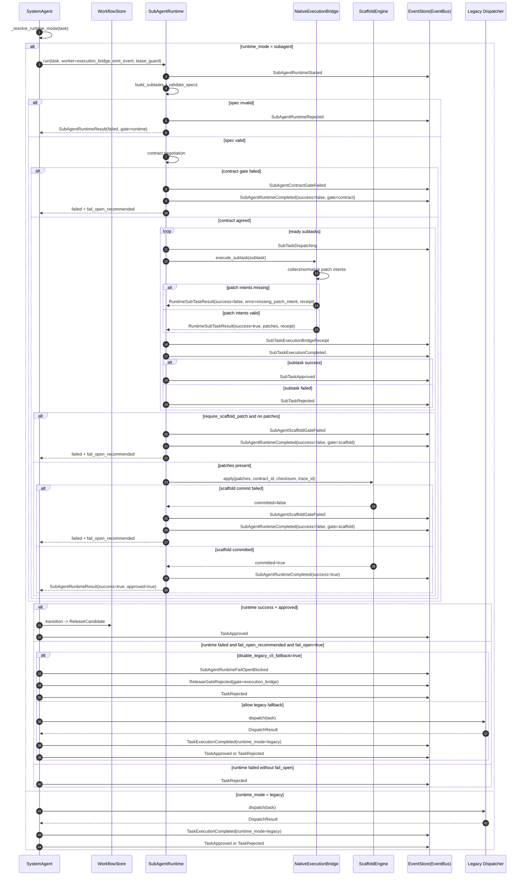
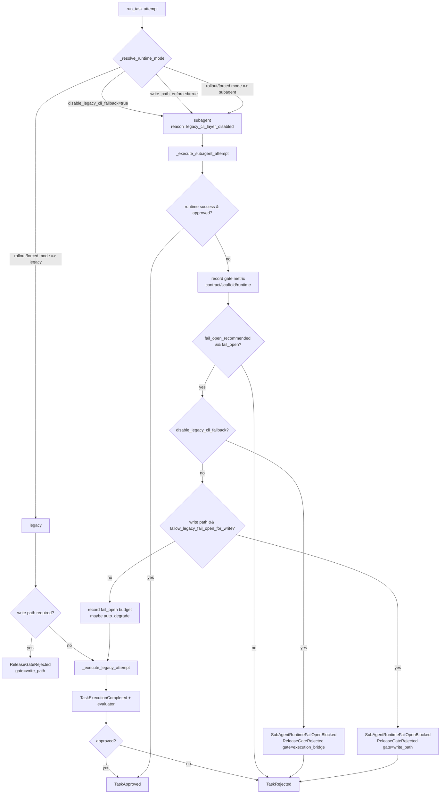

# Sub-Agent 内生执行链路图谱（时序 + Gate 决策）

最后更新：2026-02-27  
适用范围：`modifier/naga` 分支当前实现（WS22/WS28 增量）  
目标：用于排障与 onboarding，快速回答“当前子代理是怎么跑的、在哪个 gate 被拒绝、为什么没有回落到 CLI”。

## 1. 代码锚点

- 调度入口：`autonomous/system_agent.py:684`
- 运行时编排：`autonomous/tools/subagent_runtime.py:93`
- 内生执行桥：`autonomous/tools/execution_bridge.py:48`
- 运行模式决策：`autonomous/system_agent.py:1033`
- 旧 CLI 执行路径（兼容）：`autonomous/system_agent.py:645`
- 当前配置（默认禁用 legacy 回退）：`autonomous/config/autonomous_config.yaml:54`

## 2. 事件时序图（主链路）



## 3. Gate 决策图（运行模式 + 失败处理）



## 4. 事件对照（排障优先看）

| 事件 | 含义 | 常见定位结论 |
| --- | --- | --- |
| `SubTaskExecutionBridgeReceipt` | 子任务执行桥审计回执（bridge_id/changed_paths/patch_count） | 内生桥是否产出可审计证据 |
| `SubTaskExecutionCompleted` | 子任务执行完成主事件 | 新主语义事件（报表应优先读这个） |
| `TaskExecutionCompleted` | 任务级执行完成事件（含 `runtime_mode/executor`） | 报表错误率/延迟应统一读取该事件 |
| `SubAgentScaffoldGateFailed` | Scaffold 提交失败或缺补丁 | 常见于 patch intent 缺失/冲突 |
| `SubAgentRuntimeFailOpenBlocked` | fail-open 被策略阻断 | 当前配置禁用 legacy 回退时必看 |
| `ReleaseGateRejected` | 发布门禁拒绝统一出口 | 看 `gate` 字段快速分类（contract/scaffold/runtime/write_path/execution_bridge） |

## 5. 最小排障路径

1. 先看近期事件是否出现关键链路：

```bash
rg -n "SubTaskExecutionBridgeReceipt|SubTaskExecutionCompleted|TaskExecutionCompleted|SubAgentScaffoldGateFailed|SubAgentRuntimeFailOpenBlocked|ReleaseGateRejected" logs/autonomous/events.jsonl
```

2. 若出现 `SubAgentRuntimeFailOpenBlocked`，检查是否因禁用 legacy 回退：

```bash
rg -n "disable_legacy_cli_fallback" autonomous/config/autonomous_config.yaml autonomous/system_agent.py
```

3. 若出现 `missing_scaffold_patch_intents` 或 `execution_bridge_missing_patch_intent`，检查任务 `metadata.subtasks[*].patches` 或 `metadata.patch_intents` 是否存在。

4. 报表和告警链路应统一读取：
- 子任务级：`SubTaskExecutionCompleted`
- 任务级：`TaskExecutionCompleted`

## 6. Onboarding 建议顺序（30 分钟）

1. 阅读本文件两张图，先建立执行主链路模型。  
2. 对照源码阅读 4 个函数：
- `_resolve_runtime_mode`：`autonomous/system_agent.py:1033`
- `_execute_subagent_attempt`：`autonomous/system_agent.py:684`
- `SubAgentRuntime.run`：`autonomous/tools/subagent_runtime.py:93`
- `NativeExecutionBridge.execute_subtask`：`autonomous/tools/execution_bridge.py:55`
3. 跑定向回归：

```bash
.venv/bin/pytest -q \
  autonomous/tests/test_execution_bridge_native_ws28_013.py \
  autonomous/tests/test_system_agent_execution_bridge_cutover_ws28_013.py \
  autonomous/tests/test_subagent_runtime_eventbus_ws21_003.py
```
