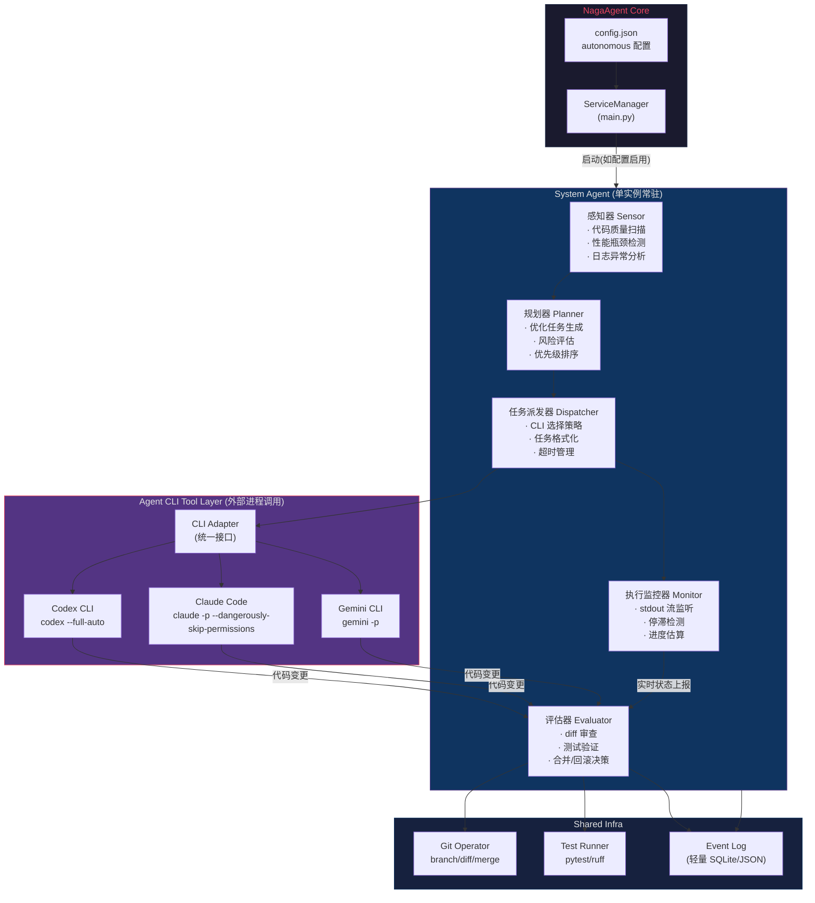
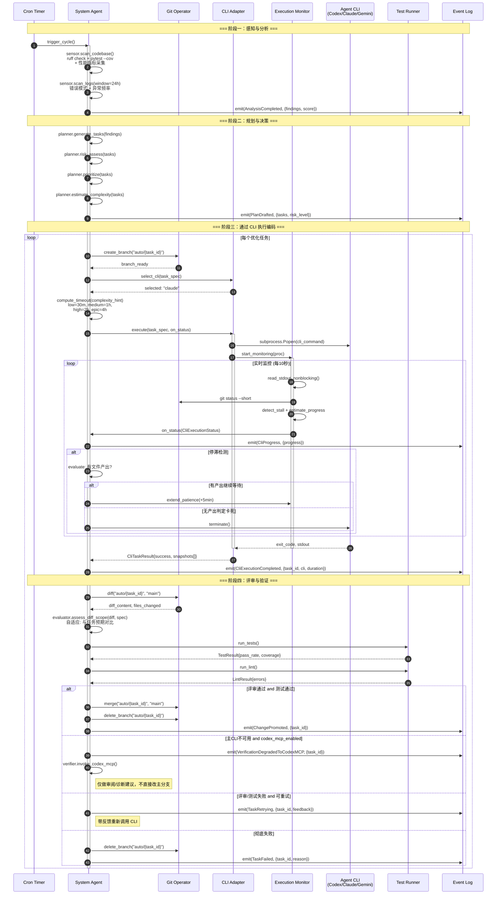
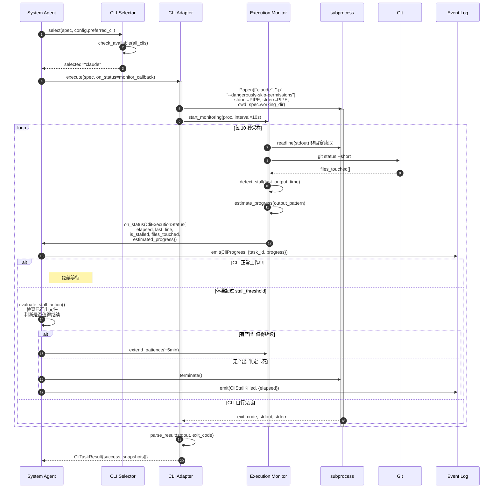
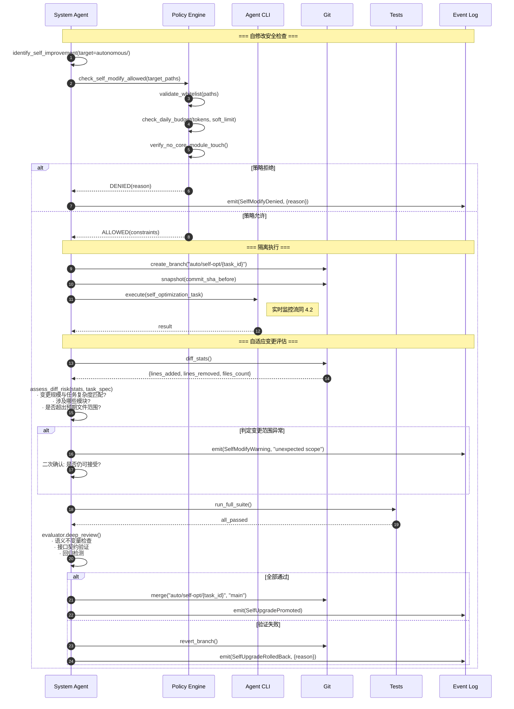
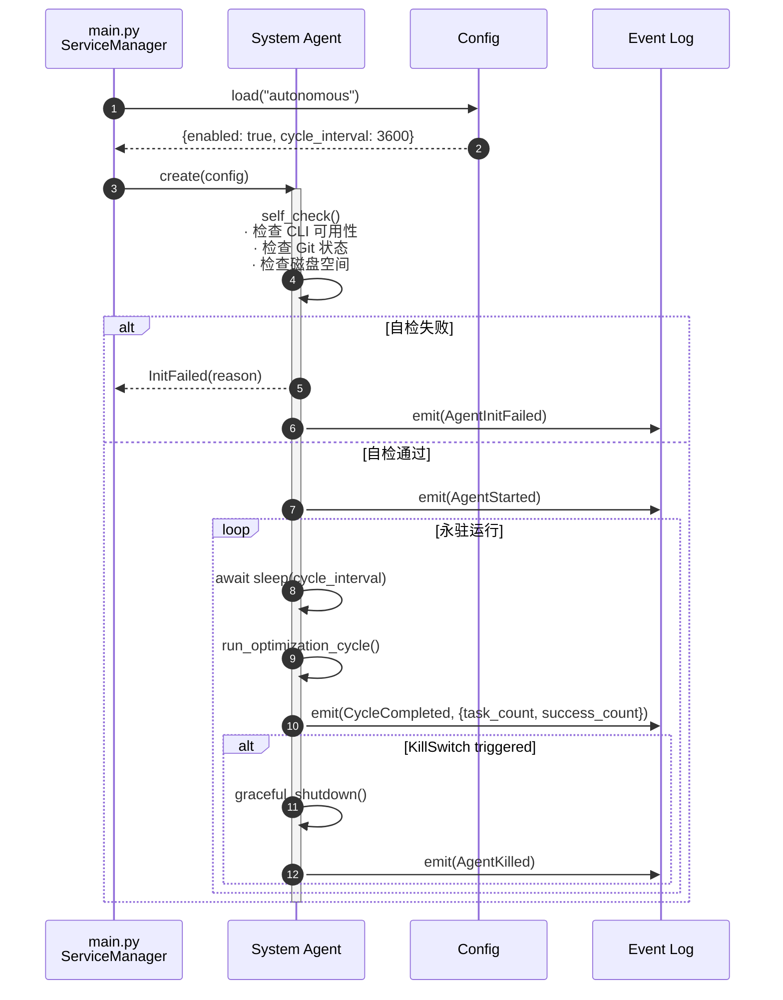
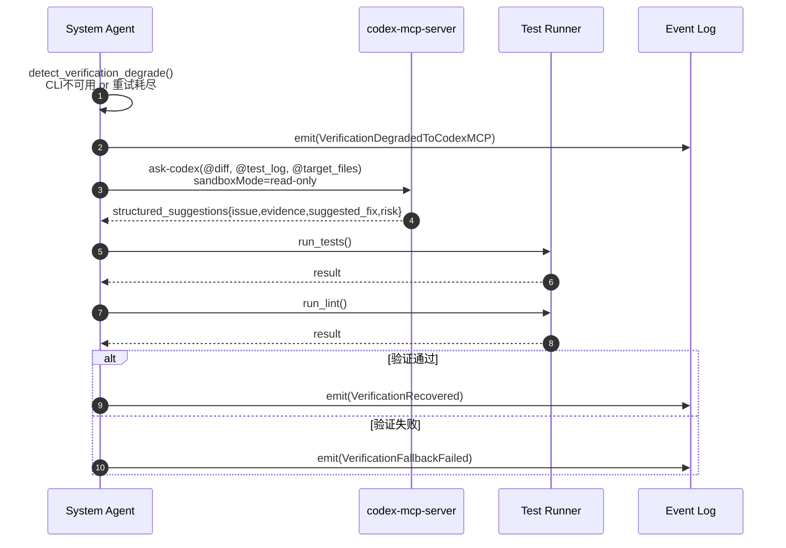
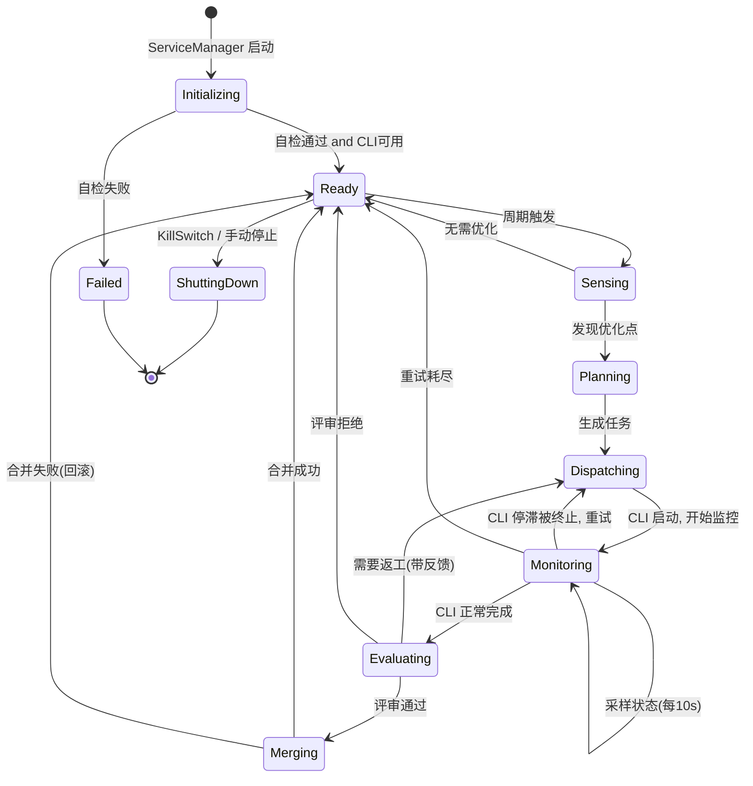

# NagaAgent 多Agent自治架构设计文档（修订版）

> **核心变更**：MVP 阶段采用 **单 System Agent + 外部 Agent CLI 工具** 模型。
> 编码工作由 System Agent 通过 Codex CLI / Claude Code / Gemini CLI 以工具调用形式完成，不引入独立的 Coding Agent。
> **文档定位**：本文是 `doc/07-autonomous-agent-sdlc-architecture.md` 的 Phase 0（MVP）实施稿，目标态约束以 07 文档为准。

---

## 1. 现有文档审阅摘要

### 1.1 现有架构四面体

| 平面 | 职责 | 文档引用 |
|------|------|----------|
| **控制面** | 编排、策略、质量门禁 | [§5 总体架构](file:///E:/Programs/NagaAgent/doc/07-autonomous-agent-sdlc-architecture.md#L68) |
| **执行面** | 沙箱执行、工具调用、测试 | [§12 工具执行治理](file:///E:/Programs/NagaAgent/doc/07-autonomous-agent-sdlc-architecture.md#L441) |
| **记忆面** | 事件溯源、投影裁决 | [§9 数据模型](file:///E:/Programs/NagaAgent/doc/07-autonomous-agent-sdlc-architecture.md#L273) |
| **运维面** | 可观测、评测、审计 | [§15 可观测](file:///E:/Programs/NagaAgent/doc/07-autonomous-agent-sdlc-architecture.md#L523) |

### 1.2 Gap Analysis

| Gap | 说明 | 本文解决方式 |
|-----|------|-------------|
| 多Agent通信 | 文档定义角色，未定义通信协议 | System Agent 直接调用 CLI 工具，无需 Agent 间通信 |
| 自我优化闭环 | 缺少对自身代码的分析→优化→验证 | System Agent 感知→规划→CLI执行→评审闭环 |
| Agent生命周期 | 缺少注册/心跳/升级 | MVP 单实例，随 ServiceManager 管理 |
| 编码执行模式 | 执行面抽象但无具体实现路径 | **Agent CLI 作为工具调用**（核心创新） |

---

## 2. MVP 架构：System Agent + Agent CLI Tools

### 2.1 架构总览



### 2.2 核心设计决策

> [!IMPORTANT]
> **为什么不在 MVP 引入独立 Coding Agent？**

| 因素 | 独立 Coding Agent | Agent CLI 工具调用 |
|------|-------------------|-------------------|
| 开发成本 | 需实现完整 Agent 框架 + 消息总线 | 仅需 CLI 适配器 (subprocess) |
| 编码能力 | 需从零构建 LLM→代码 管线 | **直接复用** Codex/Claude/Gemini 成熟能力 |
| 模型选择弹性 | 绑定单一模型 | 多模型竞争，择优使用 |
| 安全隔离 | 需自建沙箱 | CLI 自带沙箱 (Codex sandbox, Claude permissions) |
| 可维护性 | 大量自有代码 | 外部工具持续演进，自身代码极少 |

---

## 3. Agent CLI 统一适配器

### 3.1 适配器接口定义

```python
# autonomous/tools/cli_adapter.py

@dataclass
class CliTaskSpec:
    """发送给 Agent CLI 的任务规格"""
    task_id: str
    instruction: str          # 自然语言任务描述
    working_dir: str          # 工作目录
    target_files: list[str]   # 允许修改的文件/目录白名单
    context_files: list[str]  # 参考上下文文件
    timeout_seconds: int = 0  # 0 = 自适应(由System Agent决策), >0 = 硬上限
    complexity_hint: str = "medium"  # low/medium/high/epic - 影响超时预估

@dataclass
class CliExecutionStatus:
    """CLI 实时执行状态（由监控器产出）"""
    elapsed_seconds: float
    last_stdout_line: str
    stdout_line_count: int
    is_stalled: bool          # 超过 stall_threshold 无新输出
    files_touched: list[str]  # 通过 git status 实时检测
    estimated_progress: float # 0.0 ~ 1.0, 基于输出模式推断

@dataclass
class CliTaskResult:
    """Agent CLI 执行结果"""
    task_id: str
    cli_name: str             # "codex" | "claude" | "gemini"
    exit_code: int
    stdout: str
    stderr: str
    files_changed: list[str]  # git diff 检测到的变更文件
    duration_seconds: float
    success: bool
    execution_snapshots: list[CliExecutionStatus]  # 过程中采样的状态快照

class AgentCliAdapter(ABC):
    """Agent CLI 统一适配器基类"""

    @abstractmethod
    async def execute(self, spec: CliTaskSpec,
                      on_status: Callable[[CliExecutionStatus], None] = None
                      ) -> CliTaskResult:
        """执行编码任务，支持实时状态回调"""

    @abstractmethod
    async def check_available(self) -> bool:
        """检测该 CLI 是否已安装可用"""
```

### 3.2 三大 CLI 调用方式

| CLI | 非交互命令 | 关键参数 |
|-----|-----------|---------|
| **Codex CLI** | `codex --approval-mode full-auto -q "instruction"` | `--full-auto` 无需确认 |
| **Claude Code** | `claude -p "instruction" --dangerously-skip-permissions` | `-p` 非交互管道模式 |
| **Gemini CLI** | `gemini -p "instruction"` | `-p` 非交互管道模式 |
| **Codex MCP**（验证降级） | `ask-codex`（MCP Tool） | 建议 `sandboxMode=read-only`，仅用于 Verifying 阶段 |

> [!NOTE]
> 所有 CLI 调用都在 `auto/<task_id>` Git 分支上执行，变更隔离在分支内。

### 3.3 CLI 选择策略

```python
# autonomous/tools/cli_selector.py

class CliSelectionStrategy:
    """根据任务特性和可用性选择最优 CLI"""

    def select(self, spec: CliTaskSpec, available: list[str]) -> str:
        # 优先级（可配置）：
        # 1. 用户配置的首选 CLI
        # 2. 任务类型匹配（大规模重构 → Codex, 精细修改 → Claude）
        # 3. 轮询负载均衡
        # 4. Fallback 到任意可用 CLI
        ...
```

### 3.4 验证阶段降级：Codex MCP

当主 CLI 不可用或验证阶段重试耗尽时，Verifier 进入降级路径，调用已安装的 `codex-mcp-server`。

触发条件：
1. `check_available()` 失败（CLI 未安装、不可执行或鉴权失败）。
2. 验证阶段任务达到 `cli_tools.max_retries` 仍失败。
3. 当前任务是“审阅/诊断/修复建议”，不要求直接写仓库。

降级执行：
1. 连接 MCP 服务：`codex-cli`（本地已安装）。
2. 调用工具：`ask-codex`，输入包含 `git diff`、失败测试日志、目标文件列表。
3. 推荐参数：`sandboxMode=read-only`、`approvalPolicy=on-failure`。
4. 输出结构化为：`issue`、`evidence`、`suggested_fix`、`risk`。
5. 降级结果必须经过本地 `run_tests + run_lint` 二次验证后才能晋升。

退出条件：
1. 结果可执行且验证通过：回到主流程继续评审与合并。
2. MCP 不可用或建议无效：进入 `TaskRetrying` 或 `TaskFailed`。

---

## 4. 核心时序图

### 4.1 自我优化主循环（System Agent + CLI Tools）



### 4.2 CLI 执行与实时监控流程



### 4.3 安全自修改与灰度验证



### 4.4 System Agent 完整生命周期



### 4.5 验证阶段降级时序（Codex MCP）



---

## 5. System Agent 状态机



---

## 6. 目录结构

```text
NagaAgent/
├── autonomous/                       # [NEW] 自治Agent框架
│   ├── __init__.py
│   ├── system_agent.py               # System Agent 主类
│   ├── sensor.py                     # 感知器
│   ├── planner.py                    # 规划器 (LLM辅助任务生成)
│   ├── evaluator.py                  # 评估器 (diff审查 + 测试验证)
│   ├── dispatcher.py                 # 任务派发器
│   ├── monitor.py                    # [NEW] CLI执行监控器
│   ├── tools/                        # CLI 工具层
│   │   ├── __init__.py
│   │   ├── cli_adapter.py            # 适配器基类 + 数据类
│   │   ├── codex_adapter.py          # Codex CLI 适配
│   │   ├── claude_adapter.py         # Claude Code 适配
│   │   ├── gemini_adapter.py         # Gemini CLI 适配
│   │   ├── cli_selector.py           # CLI 选择策略
│   │   ├── git_operator.py           # Git操作封装
│   │   └── test_runner.py            # 测试执行封装
│   ├── policy/                       # 策略
│   │   ├── gate_policy.yaml
│   │   └── self_modify_whitelist.yaml
│   ├── config/
│   │   └── autonomous_config.yaml    # 自治框架配置
│   └── event_log/                    # 轻量事件存储
│       └── event_store.py            # SQLite/JSON事件存储
├── doc/
│   ├── 07-autonomous-agent-sdlc-architecture.md
│   └── 架构与时序设计.md  # [NEW] 本文档
└── ...
```

---

## 7. 配置模板

```yaml
# autonomous/config/autonomous_config.yaml
autonomous:
  enabled: false                      # 默认关闭
  cycle_interval_seconds: 3600        # 优化周期(秒)

  cli_tools:
    preferred: "claude"               # 首选CLI
    fallback_order: ["codex", "gemini"]
    max_retries: 3

  cli_execution:
    # 超时策略: 自适应 + 可配硬上限
    timeout_mode: "adaptive"          # adaptive | fixed
    fixed_timeout_seconds: 7200       # fixed模式下的硬上限(2小时)
    adaptive:
      base_timeout_seconds: 1800     # 基础超时(30分钟)
      per_complexity:                 # 按任务复杂度乘数
        low: 1.0                      # 30分钟
        medium: 2.0                   # 1小时
        high: 4.0                     # 2小时
        epic: 8.0                     # 4小时
      max_timeout_seconds: 14400     # 绝对上限(4小时)
    monitoring:
      poll_interval_seconds: 10      # 状态采样间隔
      stall_threshold_seconds: 300   # 无输出超过此值判定停滞(5分钟)
      stall_max_extensions: 3        # 停滞后最多延长次数
      stall_extension_seconds: 300   # 每次延长时长(5分钟)

  budget:
    # 令牌预算: 软限制告警 + 硬限制熔断（与07文档一致）
    daily_token_soft_limit: 100000000   # 软限制(10M), 超出触发告警
    daily_token_hard_limit: 500000000   # 硬限制(50M), 超出停止本周期
    warn_on_exceed: true

  verification_fallback:
    enable_codex_mcp: true
    mcp_server_name: "codex-cli"
    tool_name: "ask-codex"
    trigger_on:
      cli_unavailable: true
      retry_exhausted: true
    sandbox_mode: "read-only"
    approval_policy: "on-failure"

  security:
    self_modify_whitelist:
      - "autonomous/"
      - "doc/"
      - "tests/"
    core_readonly:                     # 默认只读，特殊改动需走Gate审批
      - "main.py"
      - "apiserver/"
      - "system/config.py"
    diff_review_mode: "adaptive"      # adaptive | fixed
    fixed_max_diff_lines: 5000        # fixed模式下硬上限
    require_human_approval: false     # 是否需要人工确认合并

  git:
    branch_prefix: "auto/"
    auto_cleanup_branches: true

  event_log:
    backend: "sqlite"                 # sqlite | json_file
    retention_days: 90
```

---

## 8. 与现有代码集成

### 8.1 ServiceManager 扩展点

```diff
 # main.py - ServiceManager.start_all_servers()
+    # 启动自治Agent (如果配置启用)
+    if config.get("autonomous", {}).get("enabled", False):
+        from autonomous.system_agent import SystemAgent
+        self.system_agent = SystemAgent(config["autonomous"])
+        asyncio.create_task(self.system_agent.start())
```

### 8.2 与 TaskScheduler 集成

现有 [task_scheduler.py](file:///E:/Programs/NagaAgent/agentserver/task_scheduler.py) 提供任务管理和 LLM 压缩能力。System Agent 的规划器可复用其 LLM 调用基础设施。

---

## 9. 安全约束

### 9.1 不可协商的硬规则

| 规则 | 约束 |
|------|------|
| **白名单目录** | CLI 仅能修改 `self_modify_whitelist` 中的目录 |
| **核心模块受控改动** | [main.py](file:///E:/Programs/NagaAgent/main.py)、`apiserver/`、[system/config.py](file:///E:/Programs/NagaAgent/system/config.py) 默认不改；若确需改动，必须通过 Gate + 审计事件 + 回滚预案 |
| **Git 分支隔离** | 所有变更在 `auto/*` 分支，不直接写 `main` |
| **回滚保障** | 合并前 Git snapshot，失败时 `git revert` |
| **KillSwitch** | 配置项随时可关闭自治循环 |

### 9.2 自适应弹性约束

| 维度 | 策略 | 说明 |
|------|------|------|
| **变更规模** | System Agent **自主评估**，不设固定行数上限 | 根据任务复杂度和目标范围判断 diff 是否合理，异常放大时告警而非硬截断 |
| **Token 预算** | 每日 **100 万软限制 + 500 万硬限制** | 软限制告警，硬限制熔断，避免无限消耗 |
| **CLI 执行时间** | **自适应超时**：按任务复杂度 30min ~ 4h，System Agent 实时监控 | 停滞检测 + 智能续期，而非盲目截断 |
| **验证降级** | 主 CLI 不可用时切换到 Codex MCP `ask-codex` | 仅用于 Verifying 阶段，且默认 read-only |

### 9.3 CLI 执行监控机制

System Agent 在 CLI 执行期间**不是盲等**，而是主动监控：

| 监控维度 | 采集方式 | 决策依据 |
|----------|----------|----------|
| **stdout 输出流** | 非阻塞 readline，10s 采样 | 有新输出 = 正常工作 |
| **文件变更** | `git status --short` 定期检查 | 有新文件变更 = 正在产出 |
| **停滞检测** | 超过 5 分钟无任何新输出 | 触发停滞评估流程 |
| **进度估算** | 基于输出模式（日志关键词）推断 | 辅助超时决策 |

**停滞处理流程：**
1. 检测到停滞 → 检查 `git status`，若有新文件变更则视为"慢但在工作"，延长等待
2. 延长最多 3 次（每次 +5 分钟）
3. 若延长后仍无产出 → `terminate()` 并记录事件
4. 所有决策写入 Event Log，支持事后审阅

---

## 10. MVP 阶段里程碑（2 周，映射 07 文档的 Phase 0）

| 天 | 任务 | 产物 |
|----|------|------|
| D1-D2 | 实现 CLI Adapter 基类 + Claude 适配器 + Monitor | `autonomous/tools/` + `autonomous/monitor.py` |
| D3-D4 | 实现 Sensor (ruff + pytest 扫描) | `autonomous/sensor.py` |
| D5-D6 | 实现 Planner (LLM 辅助任务生成) | `autonomous/planner.py` |
| D7-D8 | 实现 Evaluator + Git Operator | `autonomous/evaluator.py` |
| D9-D10 | 实现 System Agent 主循环 + ServiceManager 集成 | `autonomous/system_agent.py` |
| D11-D12 | Codex + Gemini 适配器 | 完整 CLI 支持 |
| D13-D14 | 端到端测试 + 安全验证 | 可交付 MVP |

---

## Verification Plan

### Automated Tests
- `python -m pytest autonomous/tests/ -v`（新建单元测试）
- `ruff check autonomous/`（代码质量）
- 端到端：System Agent 启动→感知→生成任务→CLI 执行(含监控)→评审→合并
- 降级链路：模拟主 CLI 不可用，验证触发 `ask-codex` 并写入 `VerificationDegradedToCodexMCP`

### Manual Verification
- `autonomous.enabled=false` 时确认无额外进程
- `autonomous.enabled=true` 时确认 System Agent 启动并完成至少一次循环
- 验证 CLI 停滞检测：模拟长时间无输出，确认自动终止
- CLI 不可用时确认降级到 Codex MCP（`codex-cli` 服务 + `ask-codex`）
- 触发 KillSwitch 确认立即停止
